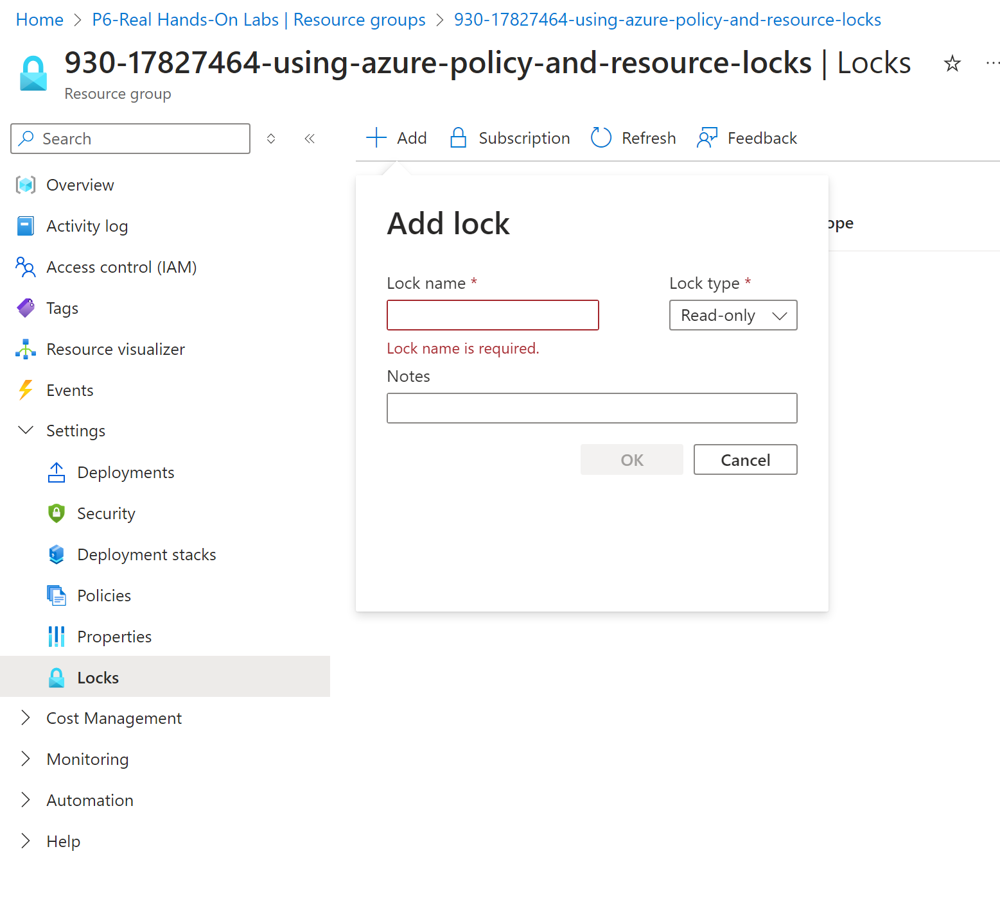

# Microsoft Azure Fundamentals (AZ-900): Azure Architecture and Services

* https://learn.acloud.guru/course/1e528a07-f8b1-414a-9e75-604ef030f3cd/overview
* 8.2 hours

# Microsoft Azure Fundamentals (AZ-900): Foundational Cloud Concepts

* https://learn.acloud.guru/course/83b086a9-7a1f-4798-9cc8-ce0ca2fda777/overview
* 2.5 hours

# describing cloud computing

## defining cloud computing

### misconceptions
* no singular cloud, many different providers, many services

### what is cloud computing
* cloud computing is the delivery of computing services over the internet to offer faster innovation, flexible resources and economies of scale.
  * pay only for cloud services you use
  * lowering operating costs

### breaking down cloud computing

* delivery
  * delivery of computer services
    * servers, storage, DBs, etc
    * accessing over the internet ("the cloud")
    * the services are on demand
* advantages
  * do things better and faster
    * server in an instant
    * scale up and down
    * greater flexibility
* cost efficiency
  * pay only what youy need
    * lower operating costs
    * greater efficiency
    * scale as business needs change
* so... what is the cloud:
  * multiple vendors
  * on-demand delivery of compute services over the internet
  * do things better and faster
  * pay only for what you need

## shared responsibility model

### why shared responsibility matters

* clarification of roles and responsibility of cloud provider versus customer
  * efficiency and convenience
  * data privacy
  * flexibility in responsibility
  * defined roles for accountability

### division of responsibility


## understanding cloud models

### what are cloud models?
* each have trade offs

### private cloud
* privately hosted for a single customer / cloud for one
  * self-service model
  * completely private (no outside access)
  * better security and privacy
  * your own hardware means high upfront cost
  * more responsibility in charge of hardware
  * less flexibility compare to public cloud
* refer to shared responsbility... refer to on-prem

### public cloud
* hosted by third party provider
  * available to anyone
  * no upfront investment
  * much more flexibility
  * vendor responsible for hardware
  * shared tenancy with other users (with some exceptions)

### hybrid cloud
* combine private with public cloud
  * private connectivity (VPN, ExpressRoute, etc)
  * run workloads in most appropriate location
  * maintain control in private cloud/on-premises
  * skills needed to maintain both environments

#### variations of hybrid
* public/private
* multi-cloud
* Azure Arc: extend azure management to non-azure resources

## the economy of cloud computing

### expense strategies at a glance
* CapEx: investments in fixed assets
  * investements in long term assets
  * large upfront investments
* OpEx: ongoing expenses for business operations
  * low or no upfront investment
  * pay as you go

### capital expenditures technology costs
* servers, data centers
* requires forecasting long-term needs/values
* tax deduction for upfront costs

### operating expenditures technology costs
* generally accepted as cloud model
* no upfront investments
* pay only for what is needed
* ongoing monthly/annual costs
* no need to forecast long-term needs/value

### OpEx and cloud computing
* cloud model == consumption based
  * pay based on immediate usage
  * low usage == low costs
  * can increase resources if needed

## exam tips: describing cloud computing
* know what the cloud is
  * on demand devlivery of compute services over the internet
  * compute, networking,  storage,
  * flexibility is a key advantage
* shared responsibility
  * ongoing, foundational topic
  * separateion of responsibility between vloud vendor and customers
  * different cloud services have different responsibilities
* cloud models
  * private cloud: single customer, high upfront costs
  * public cloud: available to everyuone, greater flexibility (pay as you go)
  * hybrid cloud: connect public and private workloads, flexible, more complexity
* capex/opex
  * capex: large upfront costs and forecasting expenses over years
  * opex: cloud model, consumption model (pay as you go)... no large upfront costs

# cloud service types

* "as a service" branding
* core cloud service types
  * IaaS... cloud vendor manages:
    * physical data center
    * network/cabling
    * physical servers
  * PaaS... cloud vendor manages:
    * physical data center
    * network/cabling
    * physical servers
    * OS
    * Development tools/database management/business analytics
  * SaaS... cloud vendor manages:
    * physical data center
    * network/cabling
    * physical servers
    * OS
    * Development tools/database management/business analytics
    * Hosted applications
* responsibility and flexibility
  * each type of core cloud service types, depends on the level of control you need

## infrastructure as a service
### summary
* basic computing infra
* greater customization/control
* pay for what you allocate
* more mgmt overhead

### what is IaaS?
* managed IT infrastucture
* cloud vendor responsibility:
  * physical data center, network/cabling, physical servers
* pay-as-you-go managed it infrastructure
  * provisioned an dmanaged over the internet
  * fundamental building block of all other cloud services
  * primarily made up of VMs (networking and OS)

### what is a VM
* virtual version of a physical computer (infrastructure)
  * has CPU/RAM, disk, networking, OS, network controls (firewall)
* behind the scenes:
  * single physical server (hypervisor) hosting multiple VMs
    * Hyper-V and VMware
    * You manage a single VM that is only for you.
    * VMs are completely isolated from each other

### what can a VM do
* same capabilities as a physical computer
  * run any computer software
  * max control and flexibility
  * provision instantly

### customer responsibility
* more control == more responisbilitiy
  * software/OS updates
  * user management
  * network access (firewalls)
* want to manage less stuff?  consider PaaS or SaaS options.

## platform as a service
* prepackaged cloud services
* emphasis on app deployment
* pay for what you use
* less mgmt overhead

### what is PaaS?
* PaaS... cloud vendor manages:
  * same underlyind IaaS: physical data center, network/cabling, physical servers
  * Also: OS, Development tools/database management/business analytics
* Managed development and deployment services
  * develop apps/solutions without managing infra.
  * cloud vendor focuses on infra, you focus on deving solutions
    * ex: software dev tools, managed RDBMS, analytics
* PaaS terms: "fully managed"

### less management overhead
* cloud vendor manages:
  * operating systems (updates, etc)
  * server infrastructure (disk storage)
  * software licenses/middleware
  * DB management
  * auto-scaling
  * more...
* cloud manages different components for different services.

### examples of PaaS cloud services
* managed databases
* software development tools and deployment tools (pipelines)
* web app deployment
* storage services
* business analytics
* security solutions

### serverless
* extreme version of PaaS
* typical PaaS requires some resource management
* serverless, all resource management is not the responsibility of customer
  * just runs code
  * don't worry about where it runs
  * chared only when code is running
* azure functions == serverless

### trade offs of PaaS vs. IaaS
* trade off for less management
  * less control over infra
    * pre packaged configs that fit (most) use cases
  * limited choice of tools
    * pre-defined toolsets/use cases
  * app compatibility for PaaS

## software as a service
* ready-to-use apps
* focus is on end-user experience
* pay for what you subscribe
* minimal mgmt overhead

### what is Saas?
* SaaS... cloud vendor manages:
  * IaaS: physical data center, network/cabling, physical servers
  * PaaS: OS, Development tools/database management/business analytics
  * SaaS: Hosted applications
* cloud based/hosted application
* subscription base pricing
* examples: email, office tools, CRMs, etc.
  * m365, zoom, salesforce, slack

### what is customer repsonsibility
* accounts and identities
  * auth requirements
* device management (which device access)
  * ensure device security
* info and data
  * protecting data access
  * access control

### relationship of Saas and IaaS/PaaS
* SaaS apps are power by IaaS/PaaS services
  * M365 --> Azure
  * Google Drive --> GCP
  * Slack --> AWS

### SaaS benefits
* complete softare solution
  * ready-to-go software
    * easy scaling
    * pre-confed and easy to use
  * accessed over internet (no hosting required)
  * easy licensing
    * subscription model

## introducing defense in depth

### what is defense in depth
* objective: slow or stop unauthorized data access
* acheived by Layered defense
* if one layer is breached, other layers can still stop attacks

### castle example
* multiple layers to protect the king
  * maybe a moat
  * then high walls
  * the gaurds on the walls
  * then pouring hot oil
  * the additional fortifications inside of the castle space

### understanding defense in depth layers
* physical security
  * acts as first line of defense
  * building/hardware access
* identity and access
  * securign identities
  * grant account access to only what's needed
* perimeter
  * protect against network-based attackes
  * perimeter firewalls/DDoS protection
* network:
  * secure connectivity between resources
  * east-west 
  * securely connect to on-prem resources
* computer:
  * secure VMs
  * endpoint protection/OS patching
* application
  * resolving app vulns
  * secure secrets
  * design for security
* data
  * primary target of attackers
  * databases, disks, SaaS apps
  * control and limit access

## exam tips: cloud services types

### IaaS
* managed infra/VMs
* CPU/RAM/OS/networking
* full control, but with more responsibility
  * managing OS (updates)
  * user access

### PaaS
* fully managed cloud solution
* cloud vendor handles infra, you focus on deving solutions
  * don't need to manage infra
* specialized services for different use cases
* serverless = zero resource management
* trace less flexibility/control for less mgmt

### SaaS
* ready to go, cloud-based software
* productivity apps
  * accessed over the internet
  * hosting and scaling provided
* subscription model
* tailored for specilized use cases
* powered by IaaS/PaaS

### defense in depth
* defend data with layers of defense
* data/application/computer/network/permiter/identiy and access/physical security
* cloud vendor handles physical security

# cloud benefits

## benefits of cloud computing

### revisiting cloud misconceptions
* there is no cloud, it's just someone else's computer.
  * benefits beyond using "someone else's computer"

### cloud benefits at a glance
* do things better and faster
  * high availability
  * scalabity
  * reliability
  * predictability
  * security
  * governance
  * manageability

## high availability and scanability

### what is high availability
* redundant against distruptions
  * cloud == instant servers/instant replacements
* what is this important
  * downtime is bad for business! critical business web sites
* introduce redundancy reduces/prevents downtime
  * don't put all your eggs in one backet
* extra servers rquire time & money
  * can't instantly just "add servers"
* cloud provides easy HA
  * add more servers instantly
  * if hardware fails, it is automatically replaced
  * clusters ensure improved HA
    * paired with load balancer
  * cloud vendor provides uptime gaurntees for underlying services
    * SLA

### what is scaling
* scaling is the function of increase resources to meet demand
* challenge of scaling traditional on-prem env
  * load handling isn't easy to resolve
* cloud scaling: instantly and automatically adjust resources
  * front a service with an LB
  * demand up == scale up
  * demand down == scale down (not overpaying)

### horizontal vs. vertical scaling
* horizontal: scaling out
  * add additional VMs
  * LB distro traffic
  * automatic, no downtime
  * typical cloud model
* vertical: scaling up
  * increase computer resources on an existing server/VM
    * add CPU/RAM/disk
    * usually manual, requires downtime/reboot

## reliability and predictability

### what is reliability
* the abilitty to recover from failures and disasters and continue to function
  * accidents happen
  * how does the cloud help?
* resiliency
* no single point of failures
  * decentralized design
  * if one VM goes down, others pick up the load
  * applies to the cloud vendoor's and your own resources
* deploy to multiple locations
  * global scale
  * protect against regional failure/disaster
  * bonus: always be close to your customer, whereever they are

### what is predictable performance
* consistent performance, all the time
  * regardless of demand/customer location
* always have enough resources when needed
  * autoscaling (horizontal scaling)
  * HA
  * load balancing
* plan your deployment around cloud-native best practices
  * multiple regions
  * no SOPs
  * automatically scale
  * "well-architected framework"

### what is predictable costs
* accurately track and forecast costs
  * no surprise bills
  * tools to manage current and future costs
    * real time cost tracking
    * pricing calculators
    * forecast future costs for current usage
    * analytics to optimize usage/costs

## security, governance and manageability

### security
* cloud vendor provided solutions to meet your security needs
  * choose your level of security control
    * IaaS allows full control over OS security
    * PaaS options to let vendor handle more security aspects
  * network controls
    * DDoS protection
    * fine-grained network access (ex: firewalls)

### governance
* standards and compliance enforcement
  * require minimum standards for cloud deployments
    * encryption standards
    * location restrictions
  * meet corporate stanadards and/or compliance requirements
    * ie: GDPR, HIPPA, FISMA
  * cloud vendor-provided tools
    * templates
    * auditing tools
    * automated patching

### manageability
#### of the cloud
* how you automatically control cloud resources
* autoscaling, monitoring, template-based deployments
  * alerting, HA

#### in the cloud
* how you interact with cloud resources
* variety of interaction tools
* control resources via web portal, CLI, APIs

## exam tips: cloud benefits
* broader themes
  * automation & instantly available resources
    * automatically create instantly avialable resources
  * decentralize critical infra
    * global distribution
    * automatic failover
* exam expectaitons
  * describe each benefit
    * the overlap between them
    * name specific advantages

### benefits
* HA
* Scalability: horizontal and vertical, automatically
* reliability: sustain stability and avialablity
* prdictability: perform as expect and knowing costs
* security: full control over cloud sec posture
* governance: cloud deployments can be governed
* managemetnment: tools are available


# Microsoft Azure Fundamentals (AZ-900): Identity, Deployment, and Management

* https://learn.acloud.guru/course/ec7d5dfc-02b4-4808-a691-c28e5a197024/dashboard
* 4 hours

# exam overview
* start point for a career in azure
* entry-level azure exam
* prove knowledge of cloud concepts and azure services
* for both IT experts and business leaders

# azure identity, authentication and authorization

## defining identity, authentication and authorization

### identity:
* who or what a person or object claims to be
* physical world:
  * passport, drivers license
* digital world:
  * Azure AD object

### authenticaiton: the process of validating an identity
* physical
  * house key
  * cert of auth
* digital
  * ssh key
  * ssl certs
  * email acct password

### authorization: the process of validating what an identity can do
* Physical
  * event ticket
  * gate specific key code
  * key card
* digital
  * application secret
  * shared access signature (SAS) token
  * key card

### Identity, authentication, authorization management

* azure: all the resoruces and services avialable in MSFT's cloud offering
* Azure AD/Entra ID: service for managing identity authen and author used to manage those things within Azure

## scope definitions
* identity: unique identifier for any digital object
* authenticaiton: proves identity
* authorization scopes identity
* all of these are needed in order to effectively admin any digital environment
* Azure AD/Entra ID: service provides all three
  

## azure AD (Azure AD)/Entra ID

### microsoft entra
* new product family
* includes all microsoft identity access capabilities including:
  * Azure AD, permissions management, Verified ID

### directory services
* Microsoft Entra
* Azure Active Directory Domain services
* Azure AD (Microsoft Entra ID)

### azure AD vs. AD
* Azure Active Directory
  * modern office solution: designed for cloud-enabled services, services and platforms
  * modern web: azure AD was designed with Web 2.0 in mind and can integrate most complex web applicatiosn now and into the future.
  * modern authenticaiton: AAD auth supports modern authentication methods and will support them into the future
* AD
  * Legacy office solution: AD implemented several older techs to connect devices, like computers and printers
  * legacy web: AD was not designed within the era of Web 2.0 with its social media sites and the advent of compelx web apps in mind
  * legacy auth: AD auth uses services and protocols that are not available on Azure

* Azure Active Directory Domain Services
  * provides domain services

### Entra ID
* requirements
  * automatic/mandatory
    * every azure account automatically has Azure AD instance with it
  * minimum of one user
    * every AAD instance needs at least one user, and this user is created with the initial AAD instance
* optional:
  * custom domain name
  * Azure AD Connect (if on-premises AD present)

### Azure AD

#### what is a tenant?
  * organization: a tenant represents the organization
* dedicated AAD
  * a tenant is a dedicated instance of AAD that an organization receives when signing up for Azure
* separate
  * each tenant is distinct and completely separate from other AAD tenants.
* Maximum of 500 tenants
  * each user in Azure can be a mmember or guest of up to 500 AAD tenants

#### what is a subscription?
* billing entity
  * all resources within a subscription are billed together
* cost separation
  * you can have multiple subscriptions within a tenant to separate costs
* payment
  * if a subscription isn't paid, all the resources and services assocaited with the subscription stop.

## Create a group and Add a member in Entra ID
* this is a cloud guru lab

## Zero Trust Concepts

### classic trusted vs untrusted model

#### classic
* trusted perimeter
  * trusted boundary for secure access
  * restrict private access to secure networks
  * relies on lower level controls

### challenges with trusted perimeter model
* must be on corp network
  * remote work is challenging
    * VPN is extention of trusted perimeter
  * mobile device access even more challenging
  * risk: rogue user/maleware inside trusted permieter network can do evil

### enter zero trust
* what is zero trust?
  * all users assumed untrustworthy unless proven otherwise
  * trusted by identity
  * regardless of location (trusted or untrusted networks)
  * least priv access: just enough perms to perform job
  * simplified, centralized mgmt
* zero trust == trusted identities, not location

### zero trust in action
* access M365 email, docs, resources for remote workforce
  * access from anywhere
  * auth with identity, not over VPN
* centrally control access with Conditional Access policies
* Allow access only from approved managed devices
  * independent from network locaiton

### summary
* zero trust concepts:
  * classic is not well suited for modern envs
  * zero trusted pushes trust to the individual

## MFA

### MFA model
* have or auth user using multiple factors
  * something you know
  * something you have
  * something you are
* one or many requires

### MFA example
* web site requires second step in addition to username + password
  * somethng you know: password
  * something you have: cell phone
  * something you are: username

### MFA priciple
* MFA provides layed security for user identity
* requires at least two components
  * something you know
  * something you have
  * something you are
* MFA is becoming the norm

## Conditional Access

### conditional access concepts
* auth protectsion beyond username + password
  * logic is applied (if/then)
    * if user meets these conditions, then grant/block access to defined apps
  * often paid with MFA
    * centrally applied MFA

### how does conditional access work
* create conditional access policies
  * assign signals (conditions)
  * users/groups
  * app to grant/deny access
  * location (IP)
  * approved devices
* access decisions (grant/block access)
  * grant access
  * block access
  * require MFA

### conditional access scenarios
* enforce MFA for all admins or all users
* block signins using legacy auth protocols
* grant access to specific geo locations
* require organization managed devices for app signin

### summary
* conditional access
  * is a feature that provides additional layer of security to your envs and identity
  * rules are exercised logic (if/then) that permit or deny access depending on whether the rules are met.
* MFA is often implemented with Conditional ACcess as further security.
* Modern best practices encourage the user of Conditional Access.

## passwordless Authentication

### security vs. convenience

* MFA is more secure but less convenient
* more steps required to login
  * password + device/biometrics
  * increased user frustration:
    * if everything is not working as expected
    * overall, less convenient

### passwordless auth: one possible solution
* objective: increase convenience while staying secure
  * password only == convenient, but low security
  * passwords + MFA == less convenient, but high security
  * passwordless == convenient, and high security
* remove password, replace with something you have, are, know

### passwordless auth methods
* Microsoft authenticator app
    * MSFT MFA mobule app
    * configure in AAD
    * authenticate in app with biometrics/PIN
* Windows Hello
    * face recognition in Windows
* FIDO2 security key
    * hardware key

### example passwordless login scenario
* login to M365 and enter username
* instead of a password, you are prompted to check Microsoft Authenticator.
* user the biometric/PIN in the Authenticator app to confirm authentication
* confirm numerical challenge in Authentictor app.

### summary
* MFA is an important security feature with the drawback of reduced convenience.
* Passwordless auth increases convenience and security.
* MFA and passwordless auth can be implemented simultaneously to provide a conveneitn login with more robust security checks and conditional access

## External Guest Access

### challenge of external guest access
* scenario: interacting with third parties in streamlined Azure entra config
* solutions?
  * new IDs for every external user
    * requires external user to juggle two accounts
    * creates complexity with internal IAM
    * more IDs in your IAM lifecycle
  * current IDs for every external user
    * external user can utilize their existing accounts to access organizational resources
    * two problems (customers and consultantS) are best solved with two solutions

### solutions
* Azure AD B2B aka Entra External ID for Partners
  * Designed for interacting with internal resources
  * User has an identity inside of Entra ID that can be managed by your org.
* Azure AD B2C aka Entra External ID for Customers
  * designed for interacting with externally facing resources, like apps, web sites
  * user's identity is managed by whatever their provide is (MSFT, Google, Facebook, etc.)

### azure B2B (Entra exteral ID for partners)
* external user already has an ID with another service or provider
* your organization initiates an invitation to that external user's ID
* External user accepts the invitation, and a user object (ID) is created inside of your org based on that external ID.

### azure B2C
* external user already has an ID with another service provider
* external user is provided the option to use their existing ID.
* external user logs in using their current ID with their provided, and that auth is password into the application via a B2C directory (examples: via Oauth2, or OIDC).

### adding a guest user
* invite a variety of account types (IdP)
  * msft, google, facebook, and others
* assign permissions for guest account
* principle of least priv
* different perms between Entra ID and Azure subscription
* Optional: assign guest user to apps
* Optional: apply cross-tenant Conditional Access policy (reqire MFA or approved managed devices)

### inviting an external consultant
* scenario: invite an external consutlant to collaborate inside of your Azure tenant
* Configure identity provider (if not MSFT)
* invite external party
* after guest user accepts invitation, assign permissions
  * optionally: assign apps, apply conditional access policy

### summary
* external guest access enables ecurity outside of your org boundaries
* provides visibility of external guest activity within your org IT borders
* B2B access provides a federated level of trust for tenants
* B2C access allows for improved intergration with customer systems

## Azure AD domain services

### limitations of Entra ID and cloud migrations
* legacy apps which are unable to use modern authn protocols (oauth 2.0)
* require traditional AD DS management and protocols
  * group policy, LDAP, NTLM, Kerberos

### possible solutions
* continue using on-prem AD and sync to Entra ID with Azure AD Connect
* config AD server on Azure VM
  * also known as "self-managed AD DS"
  * You maintain/config the OS
* Azure Active directory Domain Services (Azure AD DS)
  * Managed AD DS
  * Provides classic AD features in a managed service
    * group policy, LDAP, NTLM, Kerberos

### how Azure AD DS works


* Azure AD DS is a manage
* No need for OS config/mgmt
  * service is backed by two Windows DCs in HA
* Creates a unique name space
  * standalone domain, not an extension of on prem AD domain
* one-way esync from Entra ID to Azure AD DS

### Azure AD DS Scenario
* requirement to lift and shift legacy enterprise app to Azure VM
  * app does not support modern auth protocols
* GOAL: requirement to integrate app with classic, cloud-hosted AD using managed services
* Solution: cloud hosted legazy app auths with Azure AD DS

### summary
* Azure AD DS
  * provides legazy AD features inside Azure.
  * Is a managed service inside of Azure with no infra maintenance required and high availability features.
  * Integrates via one-way sync to Entra ID
  * Helpful when migrating or integrating legazy apps that do not support modern protocols.

## Managing access to resources with RBAC

### Azure RBAC
* Control access to resources and services based on role assigne to user, device, app or service.

### Azure RBAC roles
* built-in roles: based on broad, general use cases
  * variations of: owner, contributor, reader
* custom roles: fine-grained, specific user cases
  * components:
    * role definitions
    * permissions
    * scope
    * inheritance

### Azure RBAC role assignment
* scope scope scope!
* Scope: only the permissions necessary
* Scope: only the resources/services necessary
* Scope: only to individuals when absolutely necessary

### inheritance
* capability of custom or built-in roles to inherit permissions from other roles
* or application of permissions to a lower-level organization construct
  * Capabilities should not be assigned specifically to entities, create a group and then assign the permissions to the group

### RBAC best practices
* least privs: the least amount of permissions as necessary when granting access.
* use of roles: use built-in roles whenever possible, use custom roles with care.
* role segregation: separate duties and responsibilities, avoid combining roles that grant conflicting perms and excessive access.
* resource or service scope: avoid permission sprawl.
* review, audit, and document: check and double check, and document permission structures.

### summary of RBAC
* both built-in roles and custom roles
* set role assign scope
* inheritance
  * using groups to assign roles is more efficient


## Revisiting defense in depth


### overview
* objective: protect data and prevent if from being stolen by folks who aren't prived
* method: layered defence

### castle example again


### identity example


* multiple layers to protect usage of an identity
  * password required
  * MFA 
  * Conditional access policies

### understand defense in depth layers and relate to identity
* defense in depth for identities focuses on a few specific responsibilities in the shared responsibility model:
  * Accounst and identities
  * identity and directory infra
  * apps
  * network controls (conditional access policies)

### summary
* even at the identity level, layed defense is the best practice
* understand how the various layers of identity work and how they work together
* defense in depth at the identity level can even play into app sec

## exam tips
* all are needed to effectively admin env (via Entra ID)
  * identity: unique identitier for any user, computer, app, service, etc
  * authentication: provides identity
  * authorization: scopes identity
* entra ID
  * AD is not the same as Entra ID!
  * every Azure account has an Entra ID service
  * a tenant is dedicated instance of Entra ID (representing the organization in Azure)
  * a user can be a member or guest of up to 500 tenants
  * A subscription is a billing entity, all resource can only belong to a signle subscription.
  * entra ID is the identity, auth/auth service built into azure to admin access to resources
* Zero trust
  * all users are assumed untrustworthy unless proven otherwise
    * trusted by identity 
    * regardless of location (trusted/untrusted networks)
    * least priv access
    * simplified, centralized management
  * zero trust== no presumed trust, but identities can be validated.
* MFA:
  * provides layered security for user identity
  * requires at least two components:
    * something you know
    * something you have 
    * something you are
  * MFA is recommended by MSFT for all MSFT identities
* conditional access:
  * provides logic to validate identities
  * MFA is implemented via conditional access
    * recommended by MSFT
* passwordless auth
  * increase convenience while staying secure
    * remove password
    * and provides:
      * something you know
      * something you have 
      * something you are
* external guest access
  * enables security outside of your organizational boundaries
  * provides visibility of external guest activity within your organalization boundaries
  * B2B access provides a federated level of trust for tenants
  * B2C access allows for improve inte4gration with customer systems (via oauth, etc)
* Azure AD DS
  * legacy AD features within auzre
  * is a managed service
  * integrates with Entra ID
  * Helpful when migrating or integrating legazy apps that don't support modern protocols
* RBAC
  * controls access to resources based on role assigned to user, device, app or service)
    * least priv
    * role segregation
    * Review, audit and document
* defense in depth
  * layered defense around user identity
  * how to the layers of identity work together
  * defense in depth can play into app sec
* "Management groups are an Azure resource management scope that sit above individual subscriptions. They are in fact a grouping, or collection, of multiple subscriptions. Permissions, policies, and compliance settings applied to a management group are automatically inherited by all subscriptions inside that group."

# management and deployment tools

## Interacting with Azure Using Azure Resource Manager

### what is ARM?
* azure resource manager (ARM)
* service used for deployment and mgmt (creation, updating, and deletion) of resources in azure
  * access control, locks tags enable the securing and organzing of resources after deployment.

### what is ARM for?
* provides consistency by providing a consistent method for mgmt
* when managing resources:
  * provides convenience
  * provides control 
  * provides confidences
  * provides capability

### who is ARM for?
* Everyone.
* it's a matter of how, not whether you use it.
  * regardless of method
  * interactive: azure portal or SLI tools
  * non-interactive: SDK and API

## Understanding the Azure Portal

### description
* web based visual interface for interacting with Azure
* Azure portal
  * visual deployment of resources
  * visual representation of resources
  * integrates access to monitoring and alerting
  * enables easy cost estimations and billing

### Visual Components
* the portal
  * has the header with a search bar
* the portal menu can be customized

### Visual Customizations


### Portal Settings


### Powerful Search
* the global search menu provides access to all resources in Azure

### Dashboards
* you can create and share dashboards 

### summary
* provides web access to CLI tools
* learning deployment
* primary place to try out new Azure Tech
* Visual data represented for monitoring, cost/billing and organization.

## Lab: Accessing and Using the Azure Portal
* as per guidance

## Azure CLI

### basics of Azure CLI
* azcli
* compiled, installable available in Azure Cloud Shell
* Uses unix-style command language
* platform agnostic.  Runs on Windows, Linux etc.

### interacting with Azure CLI


* easiest way is through the portal!
* bash or powershell
* bash -> type `az`
* can access azcli through local terminal
  * 
  
### Using CLI in deployment

#### options for use
* option 1: azure cloud shell: accessed through the Azure portal in a web browser.
* option 2: local terminal: phjysical or VM where Azure CLI has been installed.

### summary
* has a concise syntax
* portable/ubiquitous: azure CLI available anywhere and easy to install

## azure powershell

### components of powershell
* command-line shell: interface within a terminal
* scripting language: interpreted language that supports many programming paradigm types
* configuration management framework: ability to implement DSC using the language

### basic module actions
* `verb-noun` syntax for commands
* uses pipeline processing
#### accessing azure powershell
* option 1: azure cloud shell: accessed through the Azure portal in a web browser.
* option 2: local terminal: phjysical or VM where az powershell has been installed.

### comparison to Azure CLI
* Azure PS
  * pwoershell module for powershell 5+
  * verbose syntax
  * shares common language with powershell
  * scriptable within powershell
* Azure CLI
  * executable package
  * can be used in any shell
  * terse syntax
  * new language specific to Azure CLI
  * scriptable within any shell

### azure powershell scenarios
* scenario 1: you have previous powershell experience
* scenario 2: you are in a pre-existing powershell environment (where it is alreayd used by the team)
* scenario 3: object based output in powershell.

### azure CLI scenarios
* scenario 1: may have previous bash/sh experience
* scenario 2: pre-existing scripting env
* scenario 3: diverse shell interaction

### summary
* consistent syntax
* versatile: used anywhere and compatbiel across platforms
* get-help: very easy to understand

## accessing azure cloud shell

### Benefits of azure cloud shell
* automatic authentication
* choice of shell (bash or powershell)
* azure powershell and azcli built in
* direct acess to azure storage

### access methods
* azure portal
* local terminal

### azure portal benefits
* benefits:
  * access from web browser
  * automatic auth

### local terminal benefits
* benefits:
  * choice of terminal app
  * esaier access to local resources
  * native app experience

### summary
* CLI built in to Azure
* accessible through Azure Portal or local terminals
* automatic auth occurs via the Azure Portal
* Azure Powershell and azcli are bother offered
* extensible to pwsh or bash shells.

## LAB: accessing and using the azure cloud shell
* as directed

### using azcli

* list resource groups
```
PS /home/cloud> az group list
[
  {
    "id": "/subscriptions/2377bb0a-1a60-44e4-83c2-188d87fba827/resourceGroups/72-52ca3b3a-accessing-and-using-the-azure-cloud-sh",
    "location": "centralus",
    "managedBy": null,
    "name": "72-52ca3b3a-accessing-and-using-the-azure-cloud-sh",
    "properties": {
      "provisioningState": "Succeeded"
    },
    "tags": null,
    "type": "Microsoft.Resources/resourceGroups"
  }
]
```

* list storage accounts
```
PS /home/cloud> az storage account list
[
  {
    "accessTier": "Hot",
    "accountMigrationInProgress": null,
    "allowBlobPublicAccess": false,
    "allowCrossTenantReplication": false,
    "allowSharedKeyAccess": null,
    "allowedCopyScope": null,
    "azureFilesIdentityBasedAuthentication": null,
    "blobRestoreStatus": null,
    "creationTime": "2024-07-30T17:33:19.360543+00:00",
    "customDomain": null,
    "defaultToOAuthAuthentication": null,
    "dnsEndpointType": null,
    "enableExtendedGroups": null,
    "enableHttpsTrafficOnly": true,
    "enableNfsV3": null,
    "encryption": {
      "encryptionIdentity": null,
      "keySource": "Microsoft.Storage",
      "keyVaultProperties": null,
      "requireInfrastructureEncryption": null,
      "services": {
        "blob": {
          "enabled": true,
          "keyType": "Account",
          "lastEnabledTime": "2024-07-30T17:33:19.766799+00:00"
        },
        "file": {
          "enabled": true,
          "keyType": "Account",
          "lastEnabledTime": "2024-07-30T17:33:19.766799+00:00"
        },
        "queue": null,
        "table": null
      }
    },
    "extendedLocation": null,
    "failoverInProgress": null,
    "geoReplicationStats": null,
    "id": "/subscriptions/2377bb0a-1a60-44e4-83c2-188d87fba827/resourceGroups/72-52ca3b3a-accessing-and-using-the-azure-cloud-sh/providers/Microsoft.Storage/storageAccounts/psdemo2345623254123541",
    "identity": null,
    "immutableStorageWithVersioning": null,
    "isHnsEnabled": null,
    "isLocalUserEnabled": null,
    "isSftpEnabled": null,
    "isSkuConversionBlocked": null,
    "keyCreationTime": {
      "key1": "2024-07-30T17:33:19.469919+00:00",
      "key2": "2024-07-30T17:33:19.469919+00:00"
    },
    "keyPolicy": null,
    "kind": "StorageV2",
    "largeFileSharesState": null,
    "lastGeoFailoverTime": null,
    "location": "eastus",
    "minimumTlsVersion": "TLS1_2",
    "name": "psdemo2345623254123541",
    "networkRuleSet": {
      "bypass": "AzureServices",
      "defaultAction": "Allow",
      "ipRules": [],
      "ipv6Rules": [],
      "resourceAccessRules": null,
      "virtualNetworkRules": []
    },
    "primaryEndpoints": {
      "blob": "https://psdemo2345623254123541.blob.core.windows.net/",
      "dfs": "https://psdemo2345623254123541.dfs.core.windows.net/",
      "file": "https://psdemo2345623254123541.file.core.windows.net/",
      "internetEndpoints": null,
      "microsoftEndpoints": null,
      "queue": "https://psdemo2345623254123541.queue.core.windows.net/",
      "table": "https://psdemo2345623254123541.table.core.windows.net/",
      "web": "https://psdemo2345623254123541.z13.web.core.windows.net/"
    },
    "primaryLocation": "eastus",
    "privateEndpointConnections": [],
    "provisioningState": "Succeeded",
    "publicNetworkAccess": null,
    "resourceGroup": "72-52ca3b3a-accessing-and-using-the-azure-cloud-sh",
    "routingPreference": null,
    "sasPolicy": null,
    "secondaryEndpoints": null,
    "secondaryLocation": null,
    "sku": {
      "name": "Standard_LRS",
      "tier": "Standard"
    },
    "statusOfPrimary": "available",
    "statusOfSecondary": null,
    "storageAccountSkuConversionStatus": null,
    "tags": {
      "ms-resource-usage": "azure-cloud-shell"
    },
    "type": "Microsoft.Storage/storageAccounts"
  }
]
```

* list virtual machines
```
PS /home/cloud> az vm list                                                  
[]
```

* create a VM
```
PS /home/cloud> az vm create --resource-group "72-52ca3b3a-accessing-and-using-the-azure-cloud-sh" --name LabVM --image Debian11 --size Standard_B1ms --admin-username azureuser --generate-ssh-keys --public-ip-sku Standard
SSH key files '/home/cloud/.ssh/id_rsa' and '/home/cloud/.ssh/id_rsa.pub' have been generated under ~/.ssh to allow SSH access to the VM. If using machines without permanent storage, back up your keys to a safe location.
{
  "fqdns": "",
  "id": "/subscriptions/2377bb0a-1a60-44e4-83c2-188d87fba827/resourceGroups/72-52ca3b3a-accessing-and-using-the-azure-cloud-sh/providers/Microsoft.Compute/virtualMachines/LabVM",
  "location": "centralus",
  "macAddress": "00-0D-3A-96-5D-69",
  "powerState": "VM running",
  "privateIpAddress": "10.0.0.4",
  "publicIpAddress": "52.176.201.174",
  "resourceGroup": "72-52ca3b3a-accessing-and-using-the-azure-cloud-sh",
  "zones": ""
}
```

### using powershell
* list resource groups
```
PS /home/cloud> Get-AzResourceGroup

ResourceGroupName : 72-52ca3b3a-accessing-and-using-the-azure-cloud-sh
Location          : centralus
ProvisioningState : Succeeded
Tags              : 
ResourceId        : /subscriptions/2377bb0a-1a60-44e4-83c2-188d87fba827/resourceGroups/72-52ca3b3a-accessing-and-using-the-azure-cloud-sh
```
* list storage accounts
```
PS /home/cloud> get-azstorageAccount                                                                                                                                                                                           
    
StorageAccountName     ResourceGroupName                                  PrimaryLocation SkuName      Kind      AccessTier CreationTime         ProvisioningState EnableHttpsTrafficOnly LargeFileShares
------------------     -----------------                                  --------------- -------      ----      ---------- ------------         ----------------- ---------------------- ---------------
psdemo2345623254123541 72-52ca3b3a-accessing-and-using-the-azure-cloud-sh eastus          Standard_LRS StorageV2 Hot        7/30/2024 5:33:19 PM Succeeded         True
```
* list virtual machines
```
PS /home/cloud> get-azvm

ResourceGroupName                                   Name  Location        VmSize OsType        NIC ProvisioningState Zone
-----------------                                   ----  --------        ------ ------        --- ----------------- ----
72-52CA3B3A-ACCESSING-AND-USING-THE-AZURE-CLOUD-SH LabVM centralus Standard_B1ms  Linux LabVMVMNic         Succeeded
```
* list all resources
```
PS /home/cloud> Get-AzResource

Name              : psdemo2345623254123541
ResourceGroupName : 72-52ca3b3a-accessing-and-using-the-azure-cloud-sh
ResourceType      : Microsoft.Storage/storageAccounts
Location          : eastus
ResourceId        : /subscriptions/2377bb0a-1a60-44e4-83c2-188d87fba827/resourceGroups/72-52ca3b3a-accessing-and-using-the-azure-cloud-sh/providers/Microsoft.Storage/storageAccounts/psdemo2345623254123541
Tags              : 
                    Name               Value            
                    =================  =================
                    ms-resource-usage  azure-cloud-shell
                    

Name              : LabVMPublicIP
ResourceGroupName : 72-52ca3b3a-accessing-and-using-the-azure-cloud-sh
ResourceType      : Microsoft.Network/publicIPAddresses
Location          : centralus
ResourceId        : /subscriptions/2377bb0a-1a60-44e4-83c2-188d87fba827/resourceGroups/72-52ca3b3a-accessing-and-using-the-azure-cloud-sh/providers/Microsoft.Network/publicIPAddresses/LabVMPublicIP
Tags              : 

Name              : LabVMVNET
ResourceGroupName : 72-52ca3b3a-accessing-and-using-the-azure-cloud-sh
ResourceType      : Microsoft.Network/virtualNetworks
Location          : centralus
ResourceId        : /subscriptions/2377bb0a-1a60-44e4-83c2-188d87fba827/resourceGroups/72-52ca3b3a-accessing-and-using-the-azure-cloud-sh/providers/Microsoft.Network/virtualNetworks/LabVMVNET
Tags              : 

Name              : LabVMNSG
ResourceGroupName : 72-52ca3b3a-accessing-and-using-the-azure-cloud-sh
ResourceType      : Microsoft.Network/networkSecurityGroups
Location          : centralus
ResourceId        : /subscriptions/2377bb0a-1a60-44e4-83c2-188d87fba827/resourceGroups/72-52ca3b3a-accessing-and-using-the-azure-cloud-sh/providers/Microsoft.Network/networkSecurityGroups/LabVMNSG
Tags              : 

Name              : LabVMVMNic
ResourceGroupName : 72-52ca3b3a-accessing-and-using-the-azure-cloud-sh
ResourceType      : Microsoft.Network/networkInterfaces
Location          : centralus
ResourceId        : /subscriptions/2377bb0a-1a60-44e4-83c2-188d87fba827/resourceGroups/72-52ca3b3a-accessing-and-using-the-azure-cloud-sh/providers/Microsoft.Network/networkInterfaces/LabVMVMNic
Tags              : 

Name              : LabVM
ResourceGroupName : 72-52ca3b3a-accessing-and-using-the-azure-cloud-sh
ResourceType      : Microsoft.Compute/virtualMachines
Location          : centralus
ResourceId        : /subscriptions/2377bb0a-1a60-44e4-83c2-188d87fba827/resourceGroups/72-52ca3b3a-accessing-and-using-the-azure-cloud-sh/providers/Microsoft.Compute/virtualMachines/LabVM
Tags              : 

Name              : LabVM_disk1_6f5f0e4f00114549858a91e5d1479dfc
ResourceGroupName : 72-52CA3B3A-ACCESSING-AND-USING-THE-AZURE-CLOUD-SH
ResourceType      : Microsoft.Compute/disks
Location          : centralus
ResourceId        : /subscriptions/2377bb0a-1a60-44e4-83c2-188d87fba827/resourceGroups/72-52CA3B3A-ACCESSING-AND-USING-THE-AZURE-CLOUD-SH/providers/Microsoft.Compute/disks/LabVM_disk1_6f5f0e4f00114549858a91e5d1479dfc
Tags              :
```

* destroy the VM
```
PS /home/cloud> remove-azvm -name LabVM -resourceGroupName 72-52ca3b3a-accessing-and-using-the-azure-cloud-sh -Force        

OperationId : ab65db12-171a-48c8-95dd-1dc27cf1bacc
Status      : Succeeded
StartTime   : 7/30/2024 5:47:19 PM
EndTime     : 7/30/2024 5:48:01 PM
Error       :
```

* verify
```
PS /home/cloud> if (!($(get-azvm).count)) { write-output "no VMs"}
no VMs
```

## Azure ARM Templates

## description
* files written in JSON that define the infrastructure and config of resources in Azure
  * important for provisioning resources

## benefits
* declarative: tell azure what needs to be deploy, not how it should be done.
* repeatable: a template deploys the same thing every time.
* modular: break large deployments down into smaller components
* testable: test your ARM deployment before pushing to Azure
* exportable: take an existing deployment and export the template

## template examples

* JSON:
  


* BICEP:


## deployment example
* if you deploy the following example:
  * stoarge account:
    * name: pssa01
    * region: centralus
    * availability: LRS (locally redundant)
* if you try to deploy again, it compares the template to running state and does nothing.
  * if a change occurs, then just the change is affected.

### summary
* azure ARM templates are definitions for resources in azure
* JSON or BICEP
* Azure ARM Templates are: declarative, repeatable, modular, testable, and exportable.
* able to not have to redeploy, but affect state

## exam tips

### interacting with Azure using ARM
* Azure Resource Manager (ARM) is the service for deploying and managing resources in Azure.
* Azure Resource Manager (ArM) provides consistency, convenience, control, confidence and capability for Azure resource deployment.
* Azure Resource Manager (ARM) is the bridge between user and Azure resources.

### Understanding Azure portal
* visual interface for:
  * deploying
  * configuring and auditing resources/services in Azure
* PRovides web based access to CLI tools
* First place to go when learning deployment and configuration
* Primary place to try out new Azure tech
* Visual data represented for:
  * monitoring
  * cost/billing
  * organization

### Azure CLI
* compiled, installable availabe in Azure Cloud Shell and on a workstation.
* Uses unix-style command langauge
* Platform agnostic.

### azure powershell
* consistent syntax (verb-noun)
* Versatile: can be used anywhere pwsh is installed.
* documentation is available via the `get-help` function

### Accessing Azure Cloud Shell
* automatic auth
* choice of shell (bash or powershell)
* azure powershell and azure CLI built in
* Direct access to Azure Storage

### Azure ARM templates
* key tool when provisioning resources in Azure and they allow us to define the infrastructure and config of those resources.
* Written in JSON (or BICEP).
* Are:
  * declarative: tell azure what needs to be deploy, not how it should be done.
  * repeatable: a template deploys the same thing every time.
  * modular: break large deployments down into smaller components
  * testable: test your ARM deployment before pushing to Azure
  * exportable: take an existing deployment and export the template
* allow for many config changes to be implemented without redeploying.

## exam
* how many free trials per account: Microsoft accounts can have only a single free trial subscription to Azure.

## summary of course
* Identity
  * Entra ID is the fundamental service that manages all identity in Azure
* Deployment
  * deployment of resources can be done through a GUI, CLI, or prgrammatically.
* Management
  * Azure provides hierarchy, role and customization to allow for granular management of resources.
* additional courses:
  * AZ-900 Azure Architecture and Services
  * Azure Cost Management
  * Azure Security and Governance


# Microsoft Azure Fundamentals (AZ-900): Azure Security Management and Governance

* https://learn.acloud.guru/course/31eb93c3-1f48-4906-b657-211eb44fba34/overview
* 6.4 hours

# describing cost management in azure

## defining cost management
* set a financial tools available to anyone with access to a billing account, subscription, resource group or management group
* theprocesses involved in planning evaling and controlling the budget of a project or business
* In azure, it involves understanding and controlling where and how resources are being used and billed.

### why does it matter
* unmonitred cloud expenses can lead to sginioficant unplanned costs
* cost mgmt ensures
  * predictable monthly bills
  * efficient use of resources
  * reduction of waste
  * improved financial forecasting

### intro to cost management tools
* Azure CMB: azure cost management and billing allows viewing, analyzing and optimizing costs
* azure advisor: provides personalized best practices to reduce costs.
* azure budgets: set budgets and creates alerts to monitor spending.

## subscriptions in cost management
* what are subscriptions: an agreement with MSFT enabling access to its cloud services.
* the highest logical billing object.
  * a boundary that delineates resource usage, access and billing.
* how subscriptions relate to cost managmeent
  * every azure service consumed is billed to its associated subscription.
  * ant the end of the billing cycle (variable), the bill is due.
* Azure hierarchy review
  * management group: many subscriptions inside of it
    * ie: "engineering"
  * subscriptions
    * ie: "software engineering", "mechanical engineering", "electrical engineering"
  * resource groups
  * resources
* subscription offerings
  * pay as you go: pay for what is used without upfront costs
  * enterprise agreement: commit to a certain level fo usage in exchange for discounted rate.
  * azure dev/test: discounted rates for dev and test envs.
  * free account: incldues a limited number of free services for a limited time and continuously free up to a usage threshold.
* subscription pricing models
  * reserved instances: discounts offered by committing to certain services for one or three years.
  * spot pricing: use spare capacity at a discounted rate but can be preempted by azure at any time
  * hybrid use benefits: on-prem windows service licenses can offer savings when migrating to azure
* bringing it all together
  * subscriptions and their various components are intricately tired to cost management
  * by understanding the different oferrs and their cost structures, orgs can make informed decisions,e ffectively manage their cloud expenses and optimize their cloud investments.

## factors that influence cost
* resources types
  * VM: billed base on compure, memory, storage OS and time
  * storage accounts: bileld based on type (blobk, file, fdisk, etc) and redundancy
  * data transfers: inbound data is usually free, outbound often costs.
  * databases: billed based on traxnactiosn and/or dedicated resources
* location/region:
  * azure is a global offering, and the decision to place resources within location/region is generally influenced by the following:
    * local regulations
    * energy costs
    * demand within region or data center
  * consider deployign to lower cost regions but always consider latency and data residency.
* service tiers: balance between cost and functionality decided by requirements.
  * VMs
    * basic vs standard
    * optmization (graphics, memory)
    * stanard HDD, standard SSD, premium SSD
  * storage accounts:
    * blog (standard, premium)
    * files (premium, ghot, cold)
    * data lake (standard, premium)
    * HDD vs SSD (standard, premium, ultra)
  * databases:
    * single vs. elastic pool
    * vCore vs DTU
    * GP, BC, Hyper
    * Provisioned vs. serverless
* reserved instances: committment == savings; predictable/steady state workloads are good candidates.
  * certain az services for a duration (1 or 3 years) in exchange for discounted rates.
  * significant savings compared to pay-as-you-go.
  * requires an upfront commitment, so assess your long-term needs carefully.
* azure hybrid benefits: hardness on-prem benefits
  * azure Hybrid Benefits: allows leveraging existing on-prem licesenes (ie: windows server, desktop, etc).
  * different support tiers come at different costs.
  * add-ons, extensions, or third-party services may have separate costs.
* summary
  * cloud resource cost involes many factors
  * know the context of cost-saving measures
  * commit where it makes sense
  * leverag ethe tools available to forecast.

## azure pricing calulator
* what is the azure pricing calculator

  * purpose: forecasting your cloud expenditures
* building your azure financial plan
  * consider the type and scale of your deployment requirements and input them into calc
  * experiment with flexible requirements (tiers, instances types, etc)
  * be aware of yoru hard requirements (regarding: regions, data transfer needs, etc)
* deciphering the calc's output
  * cost breakdown:
    * cost categories: detailed breakdown of costs, categorized by services used
    * visualization: charts and graphs to make analysis easier
    * time period: to view by daily, yearly, etc
  * monthly cost estimate
    * fixed vs. variable: undersatnd which costs of fixed or if they're variable
    * peak costs: potential peak costs... ie: if your workload has seasonal changes or high use periods
    * reservations/discount: analyzes the reservation/discounts that can benefit you.
  * other costs
    * data transfer: some level of outbound transfer may be included in base pricing, excessive may incur additional costs.
    * bundled pricing: some services might offer bundled pricing (a set of resources have cost benefits)
    * licensing: some services may have licenses, some may not
    * support: premium support offerings
    * add-ons: some services have additional features/services (ie: additional analytics)
* refining your financial forecast
  * export results in formats to integrate data into additional tools
  * adjust various parameters to discover cost-savings (Scaling, regions, instances, hybrid benefit, etc)
  * use the estaimte in larger cost mgmt strategy
  * set budget, monitor costs, and continually optimize
    * Azure Advisor will analyze usage
* common mistakes when using Azure Pricing Calc
  * overestimating resource needs: scale up from small
  * forgetting data transfer costs: inbound are typically free, outbound tranfers cost
  * ignoring price variations by region: make sure you track your deployment region!
  * not factoring in or assuming discount: take advantage of discounts
* tips for more accurate estimates
  * regularly update usage patterns
  * factor in growth
  * use azure's pricing examples (ie: for web apps, iot, etc)
  * stay up to date with pricing changes.

### azure pricing calculator demo
* as directed


* click on VMs
* scroll down, and review "Your Estimate"
  * at various times MSFT will have offers to scale VMs into new data centers in various regions, etc.

    

  * review the region, as it will default to a region which may not be cost beneficial.
  * If you are using Windows as your OS, make sure to review the Azure Hybrid Benefit as it can greatly decrease pricing
* click on storage accounts
  * scroll down and review "your estimates"
  * adjust, etc.
* remember to review "estimate upfront costs" at the bottom

### summary
* Azure Pricing Calculator is great for estimating what your cloud costs count look like
* an excellent way to explore the question, "what if I deployed a..." and identifies dependency costs
* BUT should not be taken as a quote for costs!

## azure TCO calculator
* undestanding Azure TCO calc
  * the TCO Calculator is a tool provided by MSFT to help busiensses determine the cost benefits of migrating to Azure by comparing the costs of their on-prem infrastructure with Azure's services ( the financial cost of the cloud)
  * provide a comprehensive cost estimate that considers not just direct costs, but also indirect costs such as labor, utilities and licensing.
  * goal: develop a complete financial picture by factoring in potential downtime costs, scalability benefits, and the opportunity costs of keeping infra on prem versus in Azure.
* how tht TCO calcator works
  * input: create a workload that resmbles your on prem env as closely as possible
    
  * adjust: config your potential cloud resources with region, discounts, reservations, and other ways to save
    
  * access: view the report to see what is predicted and how it lines up with your own predictions and data
    
    * you can make adjustments to region, pricing, etc
* what you need to know before you start using TCO calc
  * accurate data gathering (of the on prem env)
  * leveraging inventory tools and methods
  * ensuring accurate assessments
* common pitfalls
  * incomplete inventory
  * ancillary costs: electricity, floor space, insurance, etc.
  * overlooking growth
  * licensing oversights: remember to use Azure Hybrid Benefit

## cost management tools
* azure cost management and billing
  * comprehensive dsahboard to monitor allocate and optimize costs in Azure
  * management components
    * cost analysis: breaks down costs to understand spending patterns
    * budgets: set spending limits and monitor expenditures against the set thresholds
    * cost alerts: be notified when spending exceeds predefined limits
* azure advisor
  * analyzes your deployed services and usage patterns to provide personalized recommendations
  * offers suggestions design to reduce costs (ie: identifying idle resources or recommending served instances)
  * provides recommendations for: security, reliability, operational excellence, and performance
* azure billign within cost management
  * allows you to see where your costs are coming fgrom usign various logical groupings within Azure
  * only available for Billing Accounts, billing profiles and pay-as-you-go subscriptions
    * they are not avialable for: enterprise agreements and special agreements (ie: non profit)

## azure budgets & reservations
* mastering financial mgmt in azure
  * effective cost mgmt ensures optimial utilization of resources and financial efficiency
  * Budgets and Reservations are two key ways to mitigate cost sprawl and provide cost efficiency.
* tagging in cost management
  * name/value pairs applied to azure resources
  * use tags to categorize resoruces by purpose, owner, env, or other criteria
  * tags allow filtering of resources in cost analysis reports
* setting up and managing azure budgets
  * set spending limits before deploying proactively manages costs
  * set budgets at various levels, depending on where you want to set specific limits targeting: subscription, resource group, resources.
* budget alerts and actions
  * alert criteria: 70% of the budget
  * notification channels: email, azure portal, other integration (ie: slack, teams)
  * automated actions: azure logic apps can be triggered to perform action on alert (ie: shutdown a VM, scale a web app)
  * use case:
    * set an alert to see how long a resource cost accumulates
* understanding azure reservations
  * prepaying for one or three years of specific azure resources
  * significant cost savings compares to pay-as-you-go pricing
  * can be applied to VMs, DBs, cosmos DB, and more
* managing and optomize azure reservations
  * monitor your reservation with Azure Cost Management
  * modify reservations based on evolving needs
  * review and adjust based on newly discovered usage patterns

## azure cost allocation
* tagging resources for cost allocaiton
  * organizing your Azure Resources
    * name/value pairs assigned to azure resources
    * use tags to categorize resources by purpose, owner, env, project
    * tags allow filtering of resources in cost analysis reports
  * consistent tagigng strategy across resoruces assists accurate cost allocation
* cost allocation reports
  * detailed breakdowns of azure costs based on specific criteria
  * reports can use various visuals like pie charts and cost trend lines
  * use Power BI for additional data manipulation and ceven export to other tools
  * main function: shows cost accountability across resources
* azure advisor
  * tool that provides personalized best practices to optimize Azure deployment
  * four areas of recommendation: cost, security, reliability and performance
  * continuously analyzes resource fongis and usage telemetry to make these recommendations.
  * this tool is free
  * implementing cost-saving recommendations uses:
    * identifies idle resources, suggests served instances and more
    * provides actionable steps to resolve potential issues and/or implement new efficiencies
    * continuously analyzes resource configs and usage telemetry
* how tags and Advisor work together
  * tags:
    * granular categorization
    * consistent framework
    * extensive flexibility (key/value, 50 tags supported per resource)
  * advisor
    * real-time recommendations on optimization
    * holistic view (security, reliability, performance, and financials)
    * tailored advice
  * together they provide: informed decision making, automated workflows, continuous refinement

## best practices
* organizing azure resources
  * tags are key/value pairs to categorize resources
  * tags facilitate organization, identification and management of resources
  * assist in cost tracking and analysis.
* effective tagging strategies
  * consistency in tagging (naming convention, formats)
  * tagging for cost management (how to assign)
  * regular review and clean up (monitor and fix)
* maximizing the benefits of tags
  * integrate with Azure Tools
    * azure cost management
    * azure policy
  * effective tagging
    * by project
    * by department and owner

## exam tips
* defining cost management
  * cost managment in auzre is understanding and controllign where and how resources are being used and billed
  * unmonitored cloud expenses can lead to sgnificant unplanned costs
  * azure offers several tools for cost managment that includes: azure cost management & billing, azure advisor and azure budgets
* subscriptions in cost management
  * a subscription is an agreemenet with MSFT enabling access to its cloud services
    * also a boundary that delineates resource usage, access and billing
  * every azure service consumed is billed to its associated subscription
  * azure Hierarchy includes Management Groups to help manage subscriptions.
  * multipel types of subscription offers to git spending budgets and patterns
  * pricing models to help conserve cost when applicable (ie: hybrid benefit, reserved instances)
* factors that influence costs
  * resource type
  * location
  * service tiers (ie: faster SSD, etc)
  * hybrid benefit (on prem license)
  * reserved instance
* azure pricing calculator
  * used to estimate cost of azure resources and services
    * forecast: calculate estimates as a baseline from which your azure costs will likely grow
    * plan: plan your deployment by exploring the different options for resources.
    * refine: adjust by using Azure Pricing Calculator regularly
* azure Total Cost of Ownership (TCO) calculator
  * the financial cost of the cloud: assessing when it makes sense
    * full assessment: provide a comprehensive cost estimate of direct and indirect costs
    * plan: plan your deployment by assessing the biggest cost picture possible
    * prioritize: make adjustments to prioritze deployments and migrations
* cost management tools
  * cost analysis
  * budgets
  * cost alerting
  * Advisor
* azure budgets and reservations
  * monitor your servation with Azure Cost Management
  * modify reservations based on evolving needs
  * review and adjust based on newly discovered usage patterns
* azure cost allocation and recommendations
  * tags
  * Advisor
* best practices:
  * integrate with Azure tools (via tagging)
    * Azure Cost Management
    * Azure Policy
  * Effective tagging strategy
    * project
    * department/owner

## quiz
* Which Azure feature helps in predicting and managing future cloud spending? Azure Budgets
* tags are used for attributing cost allocation

## lab: cost planning and management in azure
* do the thing

# features and tools for governance and compliance

## defining governance and compliance 
* governance in Azure: structuring azure environments
  * the decision making model around how azure resources are managed and access.
  * involves implementing policeis and initiatives to enforce organizational requirements
  * applied to the various organizational groupings in azure
  * RBAC assigned
* compliance in azure: regulatory and organizational adherence
  * ensuring azure services and operatiosn meeting required trust commitments and adhere to regulations.
  * regulations are usually internationaly, regionally or industry-based.
* balancing structure and adherence in azure
  * governance as a foundation: provides the framework and boundaries for operating within Azure.
  * compliance as a checkpoint: ensures that services and products meet external and internal standards.
* azure offers tools that cover both governance and compliance

## revisiting azure hierarchy


* effective organization promotes effective governance
  * provides granular control over resources
  * maintains an organized structure
  * layered approach to governance
* hierachy structure recap
  * management groups
    * subscriptions
      * resource groups
        * resources
* inheriting governance:
  * within `Management Group` interface, there is a `tenant Root level` is for organization-wide appliance
  * the `Management Group` level is for broad level application
    * by default applies to... 
      * all `subscriptions` within the `Management Group`
      * all `resources groups` within all in-scope `subscriptions`
      * all `resources` within all in-scope `resource groups`
  * at the `subscription` level is often for department, customer or project level applications
* hierarchy principles
  * azure hierarchy structure provides granular governance managemenet
  * resources inherit what is applied at higher levels
  * target regulartory compliance that refers to environments

## azure policy
* Azure Policy is an azure service that enables the creation, assignment and mgmt of policies to enforce rules and effectes over Azure resources and services.
* without Azure Policy, there is no governance or compliance within Azure.
### anatomy of a policy
* conditions
    * `parameters` that define what the policy is performing
    * `assignment` that defines where the policy is performing.
* effects
    * `audit`: check to see if something is true or false
    * `enforce`: you've checked, and you are setting state (preventative control)
* policy json structure

  * how to identify an azure policy json versus ARM template or other json
    * review the displayName and descriptionvalue for an explanation
    * review `policyRule` parameter, `id` and `type`

## restricting resource access with Resource Locks
* purpose: Preventing unintended changes
  * resource locks are used to prevent accidental deletion or modification of critical Azure resources.

### resource lock types and their difference
* read only: allows vieweing of a resource but not modification
  * use where changes could be distruptive (like a prod DB)
* delete: prevents the resource from being deleted but allows modification
  * use where resources should not be deleted, but may need to be changed (like a vnet)
* no lock

### resource lock scopes
* locks are inherited by scope
* `subscription` level
* `resource group` level
* `resource` level

### applying Resource Locks
* azure portal
* azcli
* azpwsh

## resource locks in practice
* scenarios:
  * protecting prod envs
  * maintenance windows: apply read only locks temporarily
* impact on operations:
  * deployment considerations: may fail on locked resource
  * disaster recovery: can be helpful to use locks

## managing resource locks with policeis and automation
* integration with Azure Policies
  * use Azure Policy to apply locks
  * can audit and report on presence/absense
* Automated Lock Management
  * based on triggers or schedules
  * ex: lock during peak business hours or for security threats
* audit and compliance:
  * maintaining integrity
  * audit logs for lock sets and changes

## lab: using azure policy and resource locks

### policy UI
1. policy UI
   
2. complaince section: has the policies listed and their scopes
3. remediation section: shows the policies, where they're enforce, and any drift from the policies
4. events: shows state changes
5. authoring/definitions:
   * definitions: you can create your own definitions
   * initiative: groups of policy definitions
6. authoring/assignments: where the policeis and initiatives are assigned
7. authoring/exemptions: where the policies are exempt and why

### resource lock UI
1. go to subscriptions, click subscription name, expand settings, and click Resources
   
2. you can create locks here, on resource group or on resources
   
3. creating a lock on an app service by going to that app service, settings, locks
   
4. creating a lock on a VM by going to that VM, settings, locks
   

## publishing governance and compliance
* robust reporting helps to ensure governance and meet compliance requirements
* compliance status, resource utilization and audit logs are all reports relevant to governance
* knowing azure's reporting capabilities for governance and compliances is important.

### essential tools for governance reporting
* azure monitor: collect, analyze and act on telemetry data
* azure activity log: audit operation and changes in/to azure resources
* azure security center: provide unified security management
* azure policy: enforcement and report of enforcement

## Microsoft Purview
* comprehensive data governance solution that extends across all data sources, whether on Azure, other cloud envs or on-prem.
* provides centralized visibility, data discovery and governance.

### functions of purview
* data discovery and classificaiton
* data mapping and cataloging: centralized inventory and metadata management
* data lineage: traces and compiles flows of data.

### ensures reg adherence
* compliance tools: provides robust compliance framework.
* risk assessment: identify and mitigate risks in data.  captures how the data is stored.
* reporting and insights: generate compliance reports and actionable insights.

### integration and extensibility
* seamless integration: integrates a wide rang eof data sources across cloud ecosystems, platforms and on prem.
* leveraging AI and automation: data discovery and governance capabilities enhanced with AI and ML.

## securing resources with MSFT defender for cloud

### what is microsoft defender for cloud
* service that allows you to assess, eval and actualize the security posture of your environment
* works with Azure, AWS and GCP
* extends into private and hybrid data centers
* action flow: discover, collect, evaluate, recommend, remediate

### security posture


### cloud security posture management
* visibility
* asessment
* recommendations

### cloud workload protection:
* monitoring
* alerting
* remediation

### CSPM vs CWPP
* CSPM
  * connect resources
  * eval against best practices
  * comply with industry requirements
  * initiate plan for alignment
* CWPP
  * inspect resources
  * eval cost
  * point-in-time remediation
  * real-time assessment

### Microsoft Defender for Cloud contains both CSPM and CWPP capabilities
* connceted platform: multiple clouds conencted together and on-prem.
* unified security: security capabilities that span similar products across platform types.
* consistent action: alerting and remediation both point-in-time and real-time.

### three vital needs when security envs


* assess: eval, report, recommend
* secure: align to requirements (regulatory, etc.)
* protect: observe, alert and remediate.

### microsoft defender for cloud key features
* assess and strengthen: see your assets and know what their current posture is
* manage compliance: compare your posture to industry standards.
* enable threat protection: use tools to send critical info from resources.
* detect vulns: automated response to security issues that arise.

## understanding governance reports in purview and defender for cloud

* purview config:
  * add data sources
  * purview then scans
  * data is then classified
  * review monitoring
  * review shares
  * review shared sources
  * review scan rule sets
  * review classify and classification rules
  * data map
  * data insights
* microsoft defender for cloud
  * configure assessment
  * verify and solve any issues with inventory
  * regulatory compliance
  * capabilitiy to gain security posture on: azure, AWs, GCP, Github, Gitlab, AzureDevOps
  * go to cloud security/security posture and you can begin to remediate

## exam tips
* defining governance and compliance
  * structuring azure env:
    * decision makign model around how azure resources are managed and accessed.
    * involves implementing policies and initiatives to enforce org requirements
    * applied to various organizational groupings in Azure
  * governance as a foundation
    * provides the framework and boundaries for operating within Azure
  * compliance as a checkpoint
    * ensures that services and products meet external and internal standards
* effective organization promotes effective governance
  * provides granular control over resources
  * maintain an organized structure
  * layered appraoch to governance
* Azure Hierarchy
  * provides granular governance management
  * `resources` inherit what is applied at a higher level 
  * target regulatory compliance that refers to environments
* Azure Policy
  * azure service that enables the creation, assignment, and management of policies to enforce rules and effects over Azure resources and services.
  * without `Azure Policy` there is no governance or compliance in Azure
* restricting resource access with resource locks: SCOPE APPROPRIATELY
  * read only: allows vieweing of a resource but not modification (use when changes are disruptive).
  * delete: prevents the resource from being deleted but allows modification (regular updates).
* publishing governance and complaince
  * robust reporting helps to ensure governance and meet compliance requirements
  * compliance status, resource utilization and audit logs are all reports relevant to governance
  * knowing azure's reporting capabilities for governance and compliance is the starting point.
* Microsoft Purview
  * comprehensive data governance solution that extends across all data sources, whether on Azure, other cloud envs or on-prem.
  * provides centralized visibility, data discovery and governance.
* Defender for cloud
  * assess and strengthen: see your assets and know what their current posture is.
  * manage compliance: compare your posture to industry standards
  * enable threat protection: use tools to send critical info from resources
  * detect vulns: automated response to security issues that arise.

# monitoring and security management tools in azure

# monitoring and security management tools in azure

## fundamentals of monitoring and management in Azure


## approaches to monitoring
* proactive: predicting problems via trend analysis and other telemetry. before they occur.
* reactive: tshooting, RCA, implementing fixes.  after they occur.

## effective resource mgmt straetegies
* resource organization and governance
  * structured apporach: organize resource logically in management groups, resource groups to allow for control.
  * policy and compliance: implementing policies and compliance measures to maintain org standards and reg requirements
* automation and efficiency
  * reduce manual tasks: utilize automation to minimize risk around operational tasks.
  * consistent management: consistent deployment and config across env... processes, strategies and principles (ie: IaC) can help.
* compliance and security management
  * continuous monitoring: ongoing compliance monitorign and security management against evolving threats.
  * integrated security: IAM, threat and data protection should be integrated to better manage the security and that you are compliance with regs.
* significance of monitoring and management in Azure
  * integrated appraoch to monitoring and management, combined with proactive straetgies and responsive actions is necessary for a robust and reliable cloud env.
  * continuous learning and adaption is also necessary as both threas and tools evolve.

# Azure Automation

## define Azure Automation
* a set of tools to automate complex and repetitive tasks
* capable of integrating with Azure and non-azure tooling

## automating security management
* possible uses of `Azure Automation`:
  * perform automated security response
  * enforce policy
  * report configuration sprawl
  * implement DSC

## compliance monitoring and reporting
* automated compliance checks: against internal standards and regulatory standards.
* reporting automation: automatically generate and distrubte compliances reports for increase transparency.

## enhanced governance with automated workflows
* resource lifecycle mgmt: automate tasks related to lifecycle of resources (scaling, backups, updates) which provides tighter compliance.
* workflow standardization: standardize workflows, which reduces human error.

## imapct of Azure Automation on Governance
* optimizing governance in cloud
  * automated patching
    * enhances security management
  * automated reporting
    * aids in governance
  * automated security response
    * mitigates threats
  * standardized workflows
    * provide consistent approach

# Azure Advisor
* https://learn.acloud.guru/course/31eb93c3-1f48-4906-b657-211eb44fba34/learn/29042bf9-f4e9-4e33-b327-3cfa5828ccab/188c4ede-f4a9-47cd-aa6d-41770a45c29e/watch