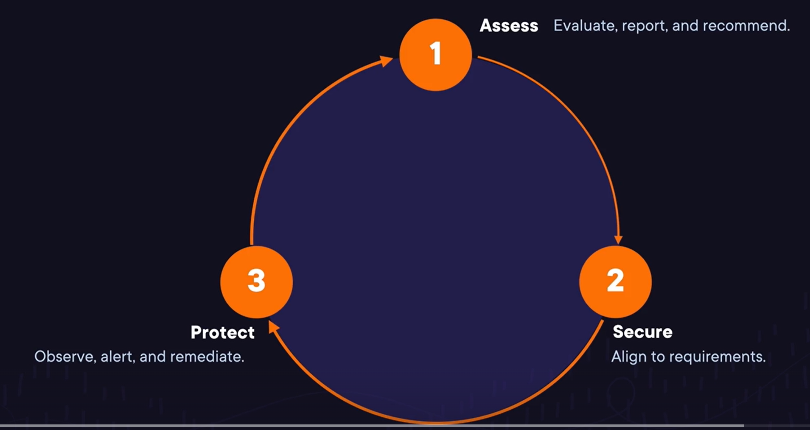
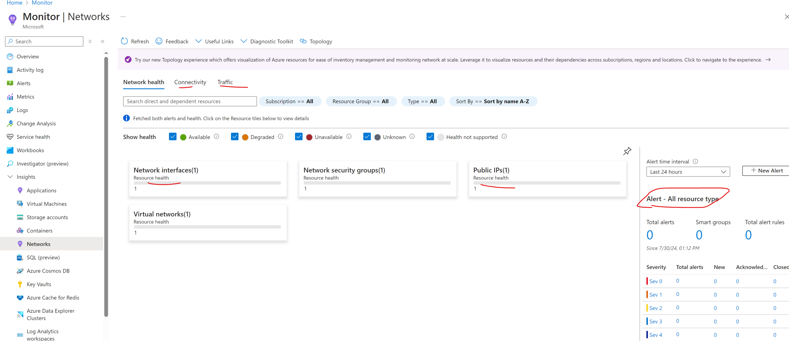
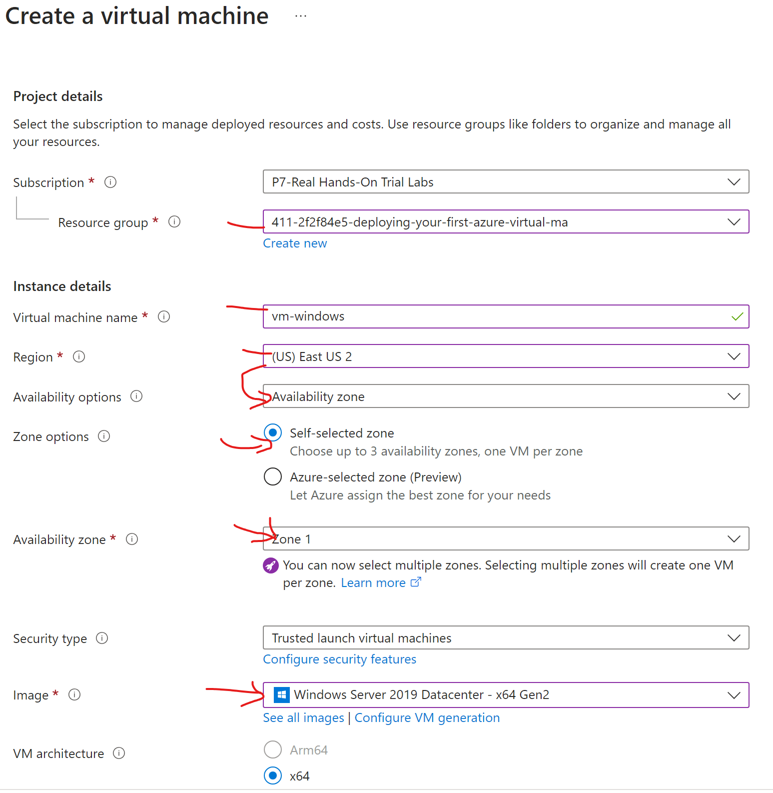
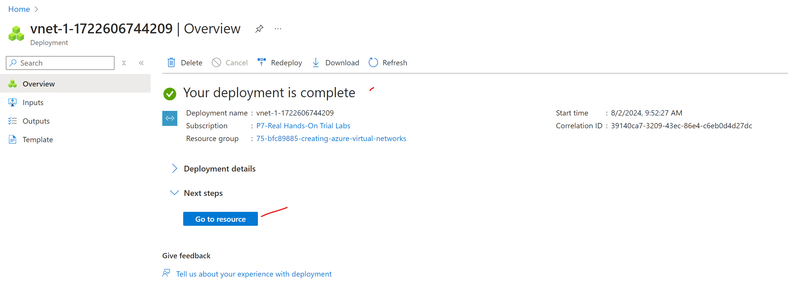

- [Microsoft Azure Fundamentals (AZ-900): Foundational Cloud Concepts](#microsoft-azure-fundamentals-az-900-foundational-cloud-concepts)
- [describing cloud computing](#describing-cloud-computing)
  - [defining cloud computing](#defining-cloud-computing)
    - [misconceptions](#misconceptions)
    - [what is cloud computing](#what-is-cloud-computing)
    - [breaking down cloud computing](#breaking-down-cloud-computing)
  - [shared responsibility model](#shared-responsibility-model)
    - [why shared responsibility matters](#why-shared-responsibility-matters)
    - [division of responsibility](#division-of-responsibility)
  - [understanding cloud models](#understanding-cloud-models)
    - [what are cloud models?](#what-are-cloud-models)
    - [private cloud](#private-cloud)
    - [public cloud](#public-cloud)
    - [hybrid cloud](#hybrid-cloud)
      - [variations of hybrid](#variations-of-hybrid)
  - [the economy of cloud computing](#the-economy-of-cloud-computing)
    - [expense strategies at a glance](#expense-strategies-at-a-glance)
    - [capital expenditures technology costs](#capital-expenditures-technology-costs)
    - [operating expenditures technology costs](#operating-expenditures-technology-costs)
    - [OpEx and cloud computing](#opex-and-cloud-computing)
  - [exam tips: describing cloud computing](#exam-tips-describing-cloud-computing)
- [cloud service types](#cloud-service-types)
  - [infrastructure as a service](#infrastructure-as-a-service)
    - [summary](#summary)
    - [what is IaaS?](#what-is-iaas)
    - [what is a VM](#what-is-a-vm)
    - [what can a VM do](#what-can-a-vm-do)
    - [customer responsibility](#customer-responsibility)
  - [platform as a service](#platform-as-a-service)
    - [what is PaaS?](#what-is-paas)
    - [less management overhead](#less-management-overhead)
    - [examples of PaaS cloud services](#examples-of-paas-cloud-services)
    - [serverless](#serverless)
    - [trade offs of PaaS vs. IaaS](#trade-offs-of-paas-vs-iaas)
  - [software as a service](#software-as-a-service)
    - [what is Saas?](#what-is-saas)
    - [what is customer repsonsibility](#what-is-customer-repsonsibility)
    - [relationship of Saas and IaaS/PaaS](#relationship-of-saas-and-iaaspaas)
    - [SaaS benefits](#saas-benefits)
  - [introducing defense in depth](#introducing-defense-in-depth)
    - [what is defense in depth](#what-is-defense-in-depth)
    - [castle example](#castle-example)
    - [understanding defense in depth layers](#understanding-defense-in-depth-layers)
  - [exam tips: cloud services types](#exam-tips-cloud-services-types)
    - [IaaS](#iaas)
    - [PaaS](#paas)
    - [SaaS](#saas)
    - [defense in depth](#defense-in-depth)
- [cloud benefits](#cloud-benefits)
  - [benefits of cloud computing](#benefits-of-cloud-computing)
    - [revisiting cloud misconceptions](#revisiting-cloud-misconceptions)
    - [cloud benefits at a glance](#cloud-benefits-at-a-glance)
  - [high availability and scanability](#high-availability-and-scanability)
    - [what is high availability](#what-is-high-availability)
    - [what is scaling](#what-is-scaling)
    - [horizontal vs. vertical scaling](#horizontal-vs-vertical-scaling)
  - [reliability and predictability](#reliability-and-predictability)
    - [what is reliability](#what-is-reliability)
    - [what is predictable performance](#what-is-predictable-performance)
    - [what is predictable costs](#what-is-predictable-costs)
  - [security, governance and manageability](#security-governance-and-manageability)
    - [security](#security)
    - [governance](#governance)
    - [manageability](#manageability)
      - [of the cloud](#of-the-cloud)
      - [in the cloud](#in-the-cloud)
  - [exam tips: cloud benefits](#exam-tips-cloud-benefits)
    - [benefits](#benefits)
- [Microsoft Azure Fundamentals (AZ-900): Identity, Deployment, and Management](#microsoft-azure-fundamentals-az-900-identity-deployment-and-management)
- [exam overview](#exam-overview)
- [azure identity, authentication and authorization](#azure-identity-authentication-and-authorization)
  - [defining identity, authentication and authorization](#defining-identity-authentication-and-authorization)
    - [identity:](#identity)
    - [authenticaiton: the process of validating an identity](#authenticaiton-the-process-of-validating-an-identity)
    - [authorization: the process of validating what an identity can do](#authorization-the-process-of-validating-what-an-identity-can-do)
    - [Identity, authentication, authorization management](#identity-authentication-authorization-management)
  - [scope definitions](#scope-definitions)
  - [azure AD (Azure AD)/Entra ID](#azure-ad-azure-adentra-id)
    - [microsoft entra](#microsoft-entra)
    - [directory services](#directory-services)
    - [azure AD vs. AD](#azure-ad-vs-ad)
    - [Entra ID](#entra-id)
    - [Azure AD](#azure-ad)
      - [what is a tenant?](#what-is-a-tenant)
      - [what is a subscription?](#what-is-a-subscription)
  - [Create a group and Add a member in Entra ID](#create-a-group-and-add-a-member-in-entra-id)
  - [Zero Trust Concepts](#zero-trust-concepts)
    - [classic trusted vs untrusted model](#classic-trusted-vs-untrusted-model)
      - [classic](#classic)
    - [challenges with trusted perimeter model](#challenges-with-trusted-perimeter-model)
    - [enter zero trust](#enter-zero-trust)
    - [zero trust in action](#zero-trust-in-action)
    - [summary](#summary-1)
  - [MFA](#mfa)
    - [MFA model](#mfa-model)
    - [MFA example](#mfa-example)
    - [MFA priciple](#mfa-priciple)
  - [Conditional Access](#conditional-access)
    - [conditional access concepts](#conditional-access-concepts)
    - [how does conditional access work](#how-does-conditional-access-work)
    - [conditional access scenarios](#conditional-access-scenarios)
    - [summary](#summary-2)
  - [passwordless Authentication](#passwordless-authentication)
    - [security vs. convenience](#security-vs-convenience)
    - [passwordless auth: one possible solution](#passwordless-auth-one-possible-solution)
    - [passwordless auth methods](#passwordless-auth-methods)
    - [example passwordless login scenario](#example-passwordless-login-scenario)
    - [summary](#summary-3)
  - [External Guest Access](#external-guest-access)
    - [challenge of external guest access](#challenge-of-external-guest-access)
    - [solutions](#solutions)
    - [azure B2B (Entra exteral ID for partners)](#azure-b2b-entra-exteral-id-for-partners)
    - [azure B2C](#azure-b2c)
    - [adding a guest user](#adding-a-guest-user)
    - [inviting an external consultant](#inviting-an-external-consultant)
    - [summary](#summary-4)
  - [Azure AD domain services](#azure-ad-domain-services)
    - [limitations of Entra ID and cloud migrations](#limitations-of-entra-id-and-cloud-migrations)
    - [possible solutions](#possible-solutions)
    - [how Azure AD DS works](#how-azure-ad-ds-works)
    - [Azure AD DS Scenario](#azure-ad-ds-scenario)
    - [summary](#summary-5)
  - [Managing access to resources with RBAC](#managing-access-to-resources-with-rbac)
    - [Azure RBAC](#azure-rbac)
    - [Azure RBAC roles](#azure-rbac-roles)
    - [Azure RBAC role assignment](#azure-rbac-role-assignment)
    - [inheritance](#inheritance)
    - [RBAC best practices](#rbac-best-practices)
    - [summary of RBAC](#summary-of-rbac)
  - [Revisiting defense in depth](#revisiting-defense-in-depth)
    - [overview](#overview)
    - [castle example again](#castle-example-again)
    - [identity example](#identity-example)
    - [understand defense in depth layers and relate to identity](#understand-defense-in-depth-layers-and-relate-to-identity)
    - [summary](#summary-6)
  - [exam tips](#exam-tips)
- [management and deployment tools](#management-and-deployment-tools)
  - [Interacting with Azure Using Azure Resource Manager](#interacting-with-azure-using-azure-resource-manager)
    - [what is ARM?](#what-is-arm)
    - [what is ARM for?](#what-is-arm-for)
    - [who is ARM for?](#who-is-arm-for)
  - [Understanding the Azure Portal](#understanding-the-azure-portal)
    - [description](#description)
    - [Visual Components](#visual-components)
    - [Visual Customizations](#visual-customizations)
    - [Portal Settings](#portal-settings)
    - [Powerful Search](#powerful-search)
    - [Dashboards](#dashboards)
    - [summary](#summary-7)
  - [Lab: Accessing and Using the Azure Portal](#lab-accessing-and-using-the-azure-portal)
  - [Azure CLI](#azure-cli)
    - [basics of Azure CLI](#basics-of-azure-cli)
    - [interacting with Azure CLI](#interacting-with-azure-cli)
    - [Using CLI in deployment](#using-cli-in-deployment)
      - [options for use](#options-for-use)
    - [summary](#summary-8)
  - [azure powershell](#azure-powershell)
    - [components of powershell](#components-of-powershell)
    - [basic module actions](#basic-module-actions)
      - [accessing azure powershell](#accessing-azure-powershell)
    - [comparison to Azure CLI](#comparison-to-azure-cli)
    - [azure powershell scenarios](#azure-powershell-scenarios)
    - [azure CLI scenarios](#azure-cli-scenarios)
    - [summary](#summary-9)
  - [accessing azure cloud shell](#accessing-azure-cloud-shell)
    - [Benefits of azure cloud shell](#benefits-of-azure-cloud-shell)
    - [access methods](#access-methods)
    - [azure portal benefits](#azure-portal-benefits)
    - [local terminal benefits](#local-terminal-benefits)
    - [summary](#summary-10)
  - [LAB: accessing and using the azure cloud shell](#lab-accessing-and-using-the-azure-cloud-shell)
    - [using azcli](#using-azcli)
    - [using powershell](#using-powershell)
  - [Azure ARM Templates](#azure-arm-templates)
  - [description](#description-1)
  - [benefits](#benefits-1)
  - [template examples](#template-examples)
  - [deployment example](#deployment-example)
    - [summary](#summary-11)
  - [exam tips](#exam-tips-1)
    - [interacting with Azure using ARM](#interacting-with-azure-using-arm)
    - [Understanding Azure portal](#understanding-azure-portal)
    - [Azure CLI](#azure-cli-1)
    - [azure powershell](#azure-powershell-1)
    - [Accessing Azure Cloud Shell](#accessing-azure-cloud-shell-1)
    - [Azure ARM templates](#azure-arm-templates-1)
  - [exam](#exam)
  - [summary of course](#summary-of-course)
- [Microsoft Azure Fundamentals (AZ-900): Azure Security Management and Governance](#microsoft-azure-fundamentals-az-900-azure-security-management-and-governance)
- [describing cost management in azure](#describing-cost-management-in-azure)
  - [defining cost management](#defining-cost-management)
    - [why does it matter](#why-does-it-matter)
    - [intro to cost management tools](#intro-to-cost-management-tools)
  - [subscriptions in cost management](#subscriptions-in-cost-management)
  - [factors that influence cost](#factors-that-influence-cost)
  - [azure pricing calulator](#azure-pricing-calulator)
    - [azure pricing calculator demo](#azure-pricing-calculator-demo)
    - [summary](#summary-12)
  - [azure TCO calculator](#azure-tco-calculator)
  - [cost management tools](#cost-management-tools)
  - [azure budgets \& reservations](#azure-budgets--reservations)
  - [azure cost allocation](#azure-cost-allocation)
  - [best practices](#best-practices)
  - [exam tips](#exam-tips-2)
  - [quiz](#quiz)
  - [lab: cost planning and management in azure](#lab-cost-planning-and-management-in-azure)
- [features and tools for governance and compliance](#features-and-tools-for-governance-and-compliance)
  - [defining governance and compliance](#defining-governance-and-compliance)
  - [revisiting azure hierarchy](#revisiting-azure-hierarchy)
  - [azure policy](#azure-policy)
    - [anatomy of a policy](#anatomy-of-a-policy)
  - [restricting resource access with Resource Locks](#restricting-resource-access-with-resource-locks)
    - [resource lock types and their difference](#resource-lock-types-and-their-difference)
    - [resource lock scopes](#resource-lock-scopes)
    - [applying Resource Locks](#applying-resource-locks)
  - [resource locks in practice](#resource-locks-in-practice)
  - [managing resource locks with policeis and automation](#managing-resource-locks-with-policeis-and-automation)
  - [lab: using azure policy and resource locks](#lab-using-azure-policy-and-resource-locks)
    - [policy UI](#policy-ui)
    - [resource lock UI](#resource-lock-ui)
  - [publishing governance and compliance](#publishing-governance-and-compliance)
    - [essential tools for governance reporting](#essential-tools-for-governance-reporting)
  - [Microsoft Purview](#microsoft-purview)
    - [functions of purview](#functions-of-purview)
    - [ensures reg adherence](#ensures-reg-adherence)
    - [integration and extensibility](#integration-and-extensibility)
  - [securing resources with MSFT defender for cloud](#securing-resources-with-msft-defender-for-cloud)
    - [what is microsoft defender for cloud](#what-is-microsoft-defender-for-cloud)
    - [security posture](#security-posture)
    - [cloud security posture management](#cloud-security-posture-management)
    - [cloud workload protection:](#cloud-workload-protection)
    - [CSPM vs CWPP](#cspm-vs-cwpp)
    - [Microsoft Defender for Cloud contains both CSPM and CWPP capabilities](#microsoft-defender-for-cloud-contains-both-cspm-and-cwpp-capabilities)
    - [three vital needs when security envs](#three-vital-needs-when-security-envs)
    - [microsoft defender for cloud key features](#microsoft-defender-for-cloud-key-features)
  - [understanding governance reports in purview and defender for cloud](#understanding-governance-reports-in-purview-and-defender-for-cloud)
  - [exam tips](#exam-tips-3)
- [monitoring and security management tools in azure](#monitoring-and-security-management-tools-in-azure)
  - [monitoring and security management tools in azure](#monitoring-and-security-management-tools-in-azure-1)
    - [fundamentals of monitoring and management in Azure](#fundamentals-of-monitoring-and-management-in-azure)
    - [approaches to monitoring](#approaches-to-monitoring)
    - [effective resource mgmt straetegies](#effective-resource-mgmt-straetegies)
  - [Azure Automation](#azure-automation)
    - [define Azure Automation](#define-azure-automation)
    - [automating security management](#automating-security-management)
    - [compliance monitoring and reporting](#compliance-monitoring-and-reporting)
    - [enhanced governance with automated workflows](#enhanced-governance-with-automated-workflows)
    - [imapct of Azure Automation on Governance](#imapct-of-azure-automation-on-governance)
  - [Azure Advisor](#azure-advisor)
    - [introduction](#introduction)
    - [UI](#ui)
  - [Azure Monitor](#azure-monitor)
    - [monitoring sources](#monitoring-sources)
    - [real world usage](#real-world-usage)
  - [lab: survey resource alerts using Azure Monitor](#lab-survey-resource-alerts-using-azure-monitor)
  - [Azure Log Analytics](#azure-log-analytics)
    - [data collection](#data-collection)
    - [query language: kusto query language (KQL)](#query-language-kusto-query-language-kql)
    - [integration with Azure Services](#integration-with-azure-services)
    - [workspaces in Azure Log Analytics](#workspaces-in-azure-log-analytics)
  - [Azure Monitor Alerts and Alerting](#azure-monitor-alerts-and-alerting)
    - [types of alerts](#types-of-alerts)
    - [components of Azure Monitor Alert](#components-of-azure-monitor-alert)
  - [Application Insights](#application-insights)
    - [components:](#components)
    - [integrations for App Insights to Apps](#integrations-for-app-insights-to-apps)
    - [proactive diag and alerts](#proactive-diag-and-alerts)
    - [visualizatins and reporting](#visualizatins-and-reporting)
  - [Azure Service Health](#azure-service-health)
    - [key features](#key-features)
    - [Azure Service Health Alerts](#azure-service-health-alerts)
    - [integrations for Azure Service Health](#integrations-for-azure-service-health)
  - [LAB: Understanding Azure Monitor Alerting](#lab-understanding-azure-monitor-alerting)
  - [Expanding Management with Azure Arc](#expanding-management-with-azure-arc)
    - [core components](#core-components)
    - [benefits of Azure Arc](#benefits-of-azure-arc)
    - [use cases for Azure Arc](#use-cases-for-azure-arc)
  - [exam tips](#exam-tips-4)
    - [monitoring and management in azure](#monitoring-and-management-in-azure)
    - [Azure Automation](#azure-automation-1)
    - [Azure Advisor](#azure-advisor-1)
    - [Azure Monitor](#azure-monitor-1)
    - [Log Analytics](#log-analytics)
    - [Azure Monitor Alerting](#azure-monitor-alerting)
    - [Application Insights](#application-insights-1)
    - [Azure Service Health](#azure-service-health-1)
    - [Azure Arc](#azure-arc)
  - [exam](#exam-1)
  - [understanding defense in depth layers](#understanding-defense-in-depth-layers-1)
  - [full course summary](#full-course-summary)
- [Microsoft Azure Fundamentals (AZ-900): Azure Architecture and Services](#microsoft-azure-fundamentals-az-900-azure-architecture-and-services)
- [Architectural Components of Azure](#architectural-components-of-azure)
  - [Azure Regions](#azure-regions)
    - [understanding regions](#understanding-regions)
    - [understandign regions: example west US 3](#understandign-regions-example-west-us-3)
    - [how to choose a region](#how-to-choose-a-region)
    - [Region Pairs](#region-pairs)
    - [sovereign regions](#sovereign-regions)
      - [sovereign regions: Azure for US Government](#sovereign-regions-azure-for-us-government)
      - [sovereign regions: Azure China](#sovereign-regions-azure-china)
  - [summery](#summery)
  - [azure Availability Zones](#azure-availability-zones)
    - [what are availability Zones](#what-are-availability-zones)
    - [visual representation](#visual-representation)
    - [regional availability](#regional-availability)
    - [using AZs](#using-azs)
      - [methods of using AZs](#methods-of-using-azs)
    - [summary](#summary-13)
  - [exploring Azure Global Infra](#exploring-azure-global-infra)
  - [resource organization](#resource-organization)
    - [four hierarchical layers of resource organization](#four-hierarchical-layers-of-resource-organization)
    - [resources:](#resources)
    - [resource groups:](#resource-groups)
      - [resource group constraints](#resource-group-constraints)
    - [subscriptions](#subscriptions)
      - [when would you want to use separate subscriptions](#when-would-you-want-to-use-separate-subscriptions)
    - [management groups](#management-groups)
    - [summary](#summary-14)
  - [resource hierachy](#resource-hierachy)
    - [similarities to file system](#similarities-to-file-system)
    - [summary](#summary-15)
  - [exam tips](#exam-tips-5)
  - [quiz](#quiz-1)
- [Azure Compute](#azure-compute)
  - [Azure Compute Concepts](#azure-compute-concepts)
    - [defining Compute](#defining-compute)
    - [azure compute options](#azure-compute-options)
    - [revisiting IaaS vs. PaaS](#revisiting-iaas-vs-paas)
  - [Virtual Machines (VMs)](#virtual-machines-vms)
    - [what is a VM](#what-is-a-vm-1)
    - [VM components](#vm-components)
    - [VMs and Networking](#vms-and-networking)
    - [configuring VMs](#configuring-vms)
    - [description of VM sizes](#description-of-vm-sizes)
    - [VM pricing](#vm-pricing)
    - [use cases for VMs](#use-cases-for-vms)
    - [summary](#summary-16)
  - [demo to create VM](#demo-to-create-vm)
  - [demo connecting to VM](#demo-connecting-to-vm)
  - [lab: deploying your first Azure VM](#lab-deploying-your-first-azure-vm)
  - [VM scale sets](#vm-scale-sets)
    - [use cases for VM scale sets](#use-cases-for-vm-scale-sets)
    - [how VM Scale Sets work](#how-vm-scale-sets-work)
    - [benefits of Scale Sets](#benefits-of-scale-sets)
    - [creating clone VMs](#creating-clone-vms)
    - [summary](#summary-17)
  - [availability sets](#availability-sets)
    - [differences compared to scale sets](#differences-compared-to-scale-sets)
    - [breaking down availability sets](#breaking-down-availability-sets)
    - [Fault Domain](#fault-domain)
    - [Update Domain](#update-domain)
    - [spreading VMs across update and fault domains](#spreading-vms-across-update-and-fault-domains)
    - [visual example of Availability Sets](#visual-example-of-availability-sets)
    - [when would you use an Availability Sets?](#when-would-you-use-an-availability-sets)
    - [summary](#summary-18)
  - [azure virtual desktop](#azure-virtual-desktop)
    - [what is the challenge](#what-is-the-challenge)
    - [how does azure Virtual Desktop (AVD) solves](#how-does-azure-virtual-desktop-avd-solves)
    - [how AVD works](#how-avd-works)
    - [use cases](#use-cases)
    - [summary:](#summary-19)
  - [Azure App Services](#azure-app-services)
    - [things you don't have to manage](#things-you-dont-have-to-manage)
    - [things you should focus on](#things-you-should-focus-on)
    - [app service hosting capabilities](#app-service-hosting-capabilities)
    - [configuring and deployuing app service (web app)](#configuring-and-deployuing-app-service-web-app)
    - [summary](#summary-20)
  - [demo of creating an App Service](#demo-of-creating-an-app-service)
  - [Azure Functions](#azure-functions)
    - [what are Azure Functions](#what-are-azure-functions)
    - [architecture](#architecture)
    - [use cases](#use-cases-1)
    - [Azure Function benefits](#azure-function-benefits)
    - [summary](#summary-21)
  - [Introduction to containers](#introduction-to-containers)
    - [benefits of containers](#benefits-of-containers)
    - [containers vs. VMs](#containers-vs-vms)
    - [container workflow](#container-workflow)
    - [summary](#summary-22)
  - [container deployment options](#container-deployment-options)
    - [summary](#summary-23)
  - [Exam Tips: Azure Compute](#exam-tips-azure-compute)
- [Azure Networking](#azure-networking)
  - [virtual networks (VNet)](#virtual-networks-vnet)
    - [address spaces and subnets](#address-spaces-and-subnets)
      - [subnets](#subnets)
    - [address spaces and subnets in practice](#address-spaces-and-subnets-in-practice)
    - [what is an IP address](#what-is-an-ip-address)
    - [VM IP configs](#vm-ip-configs)
    - [VNet regions and subscriptions:](#vnet-regions-and-subscriptions)
    - [cloud advantages](#cloud-advantages)
    - [summary](#summary-24)
    - [summary part duex](#summary-part-duex)
  - [network security](#network-security)
    - [Network Security Groups (NSG)](#network-security-groups-nsg)
    - [Azure Firewall](#azure-firewall)
    - [Azure Bastion](#azure-bastion)
  - [lab: Creating Azure Virtual Networks](#lab-creating-azure-virtual-networks)
  - [demo: creating a VNet](#demo-creating-a-vnet)
  - [Virtual Networking Peering](#virtual-networking-peering)
    - [solution:](#solution)
    - [key benefits](#key-benefits)
    - [scenario: multiple-national presence](#scenario-multiple-national-presence)
  - [Azure DNS](#azure-dns)
    - [DNS resolution basic](#dns-resolution-basic)
    - [Azure public and private DNS services](#azure-public-and-private-dns-services)
    - [benefits of Azure DNS services](#benefits-of-azure-dns-services)
  - [Hybrid networking](#hybrid-networking)
    - [azure hybrid connection options](#azure-hybrid-connection-options)
    - [Virtual NEtwork Gateway service](#virtual-network-gateway-service)
  - [Azure VPN](#azure-vpn)
    - [Site-to-Site (S2S) VPN](#site-to-site-s2s-vpn)
      - [S2S VPN components](#s2s-vpn-components)
    - [Point-to-Site (P2S) VPN](#point-to-site-p2s-vpn)
    - [VPN Types: policy-based vs. route based](#vpn-types-policy-based-vs-route-based)
    - [VPN and HA](#vpn-and-ha)
      - [active-standby](#active-standby)
      - [active-active](#active-active)
    - [peering vs. VPN to connect Azure VNets](#peering-vs-vpn-to-connect-azure-vnets)
    - [summary](#summary-25)
  - [ExpressRoutes](#expressroutes)
    - [virtual network setup](#virtual-network-setup)
    - [broad view of ExpressRoute Infra](#broad-view-of-expressroute-infra)
    - [ExpressRoute compared to VPN](#expressroute-compared-to-vpn)
  - [public and private endpoints](#public-and-private-endpoints)
    - [private endpoint](#private-endpoint)
    - [scenario](#scenario)
  - [exam tips](#exam-tips-6)
    - [Azure VNets](#azure-vnets)
    - [network peering](#network-peering)
    - [Azure DNS](#azure-dns-1)
    - [Hybrid networking](#hybrid-networking-1)
    - [Azure VPN](#azure-vpn-1)
    - [ExpressRoute](#expressroute)
    - [public and private endpoints:](#public-and-private-endpoints-1)
  - [Quiz:](#quiz-2)
- [Azure Storage](#azure-storage)
  - [introduction to azure storage](#introduction-to-azure-storage)
    - [storage accounts and storage services](#storage-accounts-and-storage-services)
    - [storage services](#storage-services)
    - [unique namespace  for Storage Account](#unique-namespace--for-storage-account)
  - [Azure Blobs](#azure-blobs)
    - [blog storage layers](#blog-storage-layers)
    - [web access for blobs](#web-access-for-blobs)
    - [blob types](#blob-types)
    - [blob storage use cases](#blob-storage-use-cases)
  - [blob storage Tiers](#blob-storage-tiers)
    - [storage Tiers](#storage-tiers)
    - [balance storage costs with usage/retention costs](#balance-storage-costs-with-usageretention-costs)
      - [costs versus usage](#costs-versus-usage)
    - [archive storage tier](#archive-storage-tier)
    - [configuring storage tiers](#configuring-storage-tiers)
    - [Blog Storage Tier use cases](#blog-storage-tier-use-cases)
  - [demo: create a storage account](#demo-create-a-storage-account)
  - [demo: upload files to a blob container](#demo-upload-files-to-a-blob-container)
  - [LAB: creating an azure storage account and blob container](#lab-creating-an-azure-storage-account-and-blob-container)
  - [disks](#disks)
    - [Storage Accounts](#storage-accounts)
    - [Disk Types](#disk-types)
    - [disk comparison](#disk-comparison)
    - [Demo](#demo)
  - [Azure Files](#azure-files)
    - [what is azure files](#what-is-azure-files)
    - [benefits](#benefits-2)
    - [scenarios](#scenarios)
  - [tables and queues](#tables-and-queues)
    - [Azure Tables](#azure-tables)
    - [Azure Queues](#azure-queues)
      - [scenario](#scenario-1)
  - [Storage Redundancy](#storage-redundancy)
    - [redundancy: multiple, repled copies of data](#redundancy-multiple-repled-copies-of-data)
    - [Redundancy options at a glance](#redundancy-options-at-a-glance)
    - [Locally redundant storage (LRS)](#locally-redundant-storage-lrs)
    - [Zone-redundant Storage (ZRS)](#zone-redundant-storage-zrs)
    - [Geo-redundant storage (GRS)](#geo-redundant-storage-grs)
    - [Geo-Zone-Redundant Storage (GZRS)](#geo-zone-redundant-storage-gzrs)
    - [summary](#summary-26)
  - [moving data in azure storage](#moving-data-in-azure-storage)
    - [AzCopy](#azcopy)
    - [Storage Explorer](#storage-explorer)
    - [Azure File Sync](#azure-file-sync)
  - [demo: azure storage explorer and AzCopy](#demo-azure-storage-explorer-and-azcopy)
  - [additional migration options](#additional-migration-options)
    - [Azure Data Box](#azure-data-box)
    - [Azure Migrate](#azure-migrate)
  - [Premium Performance Options for Storage Accounts](#premium-performance-options-for-storage-accounts)
    - [storage account perf options](#storage-account-perf-options)
    - [premium block blobs](#premium-block-blobs)
    - [premium page blobs](#premium-page-blobs)
    - [premium file shares](#premium-file-shares)
  - [exam tips: Azure Storage](#exam-tips-azure-storage)
  - [quiz](#quiz-3)
  - [revisiting defense in depth](#revisiting-defense-in-depth-1)
    - [compute defense](#compute-defense)
    - [networking defense](#networking-defense)
    - [storage defense](#storage-defense)
- [what are you gonna do now?](#what-are-you-gonna-do-now)


# Microsoft Azure Fundamentals (AZ-900): Foundational Cloud Concepts

* https://learn.acloud.guru/course/83b086a9-7a1f-4798-9cc8-ce0ca2fda777/overview
* 2.5 hours

# describing cloud computing

## defining cloud computing

### misconceptions
* no singular cloud, many different providers, many services

### what is cloud computing
* cloud computing is the delivery of computing services over the internet to offer faster innovation, flexible resources and economies of scale.
  * pay only for cloud services you use
  * lowering operating costs

### breaking down cloud computing

* delivery
  * delivery of computer services
    * servers, storage, DBs, etc
    * accessing over the internet ("the cloud")
    * the services are on demand
* advantages
  * do things better and faster
    * server in an instant
    * scale up and down
    * greater flexibility
* cost efficiency
  * pay only what youy need
    * lower operating costs
    * greater efficiency
    * scale as business needs change
* so... what is the cloud:
  * multiple vendors
  * on-demand delivery of compute services over the internet
  * do things better and faster
  * pay only for what you need

## shared responsibility model

### why shared responsibility matters

* clarification of roles and responsibility of cloud provider versus customer
  * efficiency and convenience
  * data privacy
  * flexibility in responsibility
  * defined roles for accountability

### division of responsibility


## understanding cloud models

### what are cloud models?
* each have trade offs

### private cloud
* privately hosted for a single customer / cloud for one
  * self-service model
  * completely private (no outside access)
  * better security and privacy
  * your own hardware means high upfront cost
  * more responsibility in charge of hardware
  * less flexibility compare to public cloud
* refer to shared responsbility... refer to on-prem

### public cloud
* hosted by third party provider
  * available to anyone
  * no upfront investment
  * much more flexibility
  * vendor responsible for hardware
  * shared tenancy with other users (with some exceptions)

### hybrid cloud
* combine private with public cloud
  * private connectivity (VPN, ExpressRoute, etc)
  * run workloads in most appropriate location
  * maintain control in private cloud/on-premises
  * skills needed to maintain both environments

#### variations of hybrid
* public/private
* multi-cloud
* Azure Arc: extend azure management to non-azure resources

## the economy of cloud computing

### expense strategies at a glance
* CapEx: investments in fixed assets
  * investements in long term assets
  * large upfront investments
* OpEx: ongoing expenses for business operations
  * low or no upfront investment
  * pay as you go

### capital expenditures technology costs
* servers, data centers
* requires forecasting long-term needs/values
* tax deduction for upfront costs

### operating expenditures technology costs
* generally accepted as cloud model
* no upfront investments
* pay only for what is needed
* ongoing monthly/annual costs
* no need to forecast long-term needs/value

### OpEx and cloud computing
* cloud model == consumption based
  * pay based on immediate usage
  * low usage == low costs
  * can increase resources if needed

## exam tips: describing cloud computing
* know what the cloud is
  * on demand devlivery of compute services over the internet
  * compute, networking,  storage,
  * flexibility is a key advantage
* shared responsibility
  * ongoing, foundational topic
  * separateion of responsibility between vloud vendor and customers
  * different cloud services have different responsibilities
* cloud models
  * private cloud: single customer, high upfront costs
  * public cloud: available to everyuone, greater flexibility (pay as you go)
  * hybrid cloud: connect public and private workloads, flexible, more complexity
* capex/opex
  * capex: large upfront costs and forecasting expenses over years
  * opex: cloud model, consumption model (pay as you go)... no large upfront costs

# cloud service types

* "as a service" branding
* core cloud service types
  * IaaS... cloud vendor manages:
    * physical data center
    * network/cabling
    * physical servers
  * PaaS... cloud vendor manages:
    * physical data center
    * network/cabling
    * physical servers
    * OS
    * Development tools/database management/business analytics
  * SaaS... cloud vendor manages:
    * physical data center
    * network/cabling
    * physical servers
    * OS
    * Development tools/database management/business analytics
    * Hosted applications
* responsibility and flexibility
  * each type of core cloud service types, depends on the level of control you need

## infrastructure as a service
### summary
* basic computing infra
* greater customization/control
* pay for what you allocate
* more mgmt overhead

### what is IaaS?
* managed IT infrastucture
* cloud vendor responsibility:
  * physical data center, network/cabling, physical servers
* pay-as-you-go managed it infrastructure
  * provisioned an dmanaged over the internet
  * fundamental building block of all other cloud services
  * primarily made up of VMs (networking and OS)

### what is a VM
* virtual version of a physical computer (infrastructure)
  * has CPU/RAM, disk, networking, OS, network controls (firewall)
* behind the scenes:
  * single physical server (hypervisor) hosting multiple VMs
    * Hyper-V and VMware
    * You manage a single VM that is only for you.
    * VMs are completely isolated from each other

### what can a VM do
* same capabilities as a physical computer
  * run any computer software
  * max control and flexibility
  * provision instantly

### customer responsibility
* more control == more responisbilitiy
  * software/OS updates
  * user management
  * network access (firewalls)
* want to manage less stuff?  consider PaaS or SaaS options.

## platform as a service
* prepackaged cloud services
* emphasis on app deployment
* pay for what you use
* less mgmt overhead

### what is PaaS?
* PaaS... cloud vendor manages:
  * same underlyind IaaS: physical data center, network/cabling, physical servers
  * Also: OS, Development tools/database management/business analytics
* Managed development and deployment services
  * develop apps/solutions without managing infra.
  * cloud vendor focuses on infra, you focus on deving solutions
    * ex: software dev tools, managed RDBMS, analytics
* PaaS terms: "fully managed"

### less management overhead
* cloud vendor manages:
  * operating systems (updates, etc)
  * server infrastructure (disk storage)
  * software licenses/middleware
  * DB management
  * auto-scaling
  * more...
* cloud manages different components for different services.

### examples of PaaS cloud services
* managed databases
* software development tools and deployment tools (pipelines)
* web app deployment
* storage services
* business analytics
* security solutions

### serverless
* extreme version of PaaS
* typical PaaS requires some resource management
* serverless, all resource management is not the responsibility of customer
  * just runs code
  * don't worry about where it runs
  * chared only when code is running
* azure functions == serverless

### trade offs of PaaS vs. IaaS
* trade off for less management
  * less control over infra
    * pre packaged configs that fit (most) use cases
  * limited choice of tools
    * pre-defined toolsets/use cases
  * app compatibility for PaaS

## software as a service
* ready-to-use apps
* focus is on end-user experience
* pay for what you subscribe
* minimal mgmt overhead

### what is Saas?
* SaaS... cloud vendor manages:
  * IaaS: physical data center, network/cabling, physical servers
  * PaaS: OS, Development tools/database management/business analytics
  * SaaS: Hosted applications
* cloud based/hosted application
* subscription base pricing
* examples: email, office tools, CRMs, etc.
  * m365, zoom, salesforce, slack

### what is customer repsonsibility
* accounts and identities
  * auth requirements
* device management (which device access)
  * ensure device security
* info and data
  * protecting data access
  * access control

### relationship of Saas and IaaS/PaaS
* SaaS apps are power by IaaS/PaaS services
  * M365 --> Azure
  * Google Drive --> GCP
  * Slack --> AWS

### SaaS benefits
* complete softare solution
  * ready-to-go software
    * easy scaling
    * pre-confed and easy to use
  * accessed over internet (no hosting required)
  * easy licensing
    * subscription model

## introducing defense in depth

### what is defense in depth
* objective: slow or stop unauthorized data access
* acheived by Layered defense
* if one layer is breached, other layers can still stop attacks

### castle example
* multiple layers to protect the king
  * maybe a moat
  * then high walls
  * the gaurds on the walls
  * then pouring hot oil
  * the additional fortifications inside of the castle space

### understanding defense in depth layers
* physical security
  * acts as first line of defense
  * building/hardware access
* identity and access
  * securign identities
  * grant account access to only what's needed
* perimeter
  * protect against network-based attackes
  * perimeter firewalls/DDoS protection
* network:
  * secure connectivity between resources
  * east-west 
  * securely connect to on-prem resources
* computer:
  * secure VMs
  * endpoint protection/OS patching
* application
  * resolving app vulns
  * secure secrets
  * design for security
* data
  * primary target of attackers
  * databases, disks, SaaS apps
  * control and limit access

## exam tips: cloud services types

### IaaS
* managed infra/VMs
* CPU/RAM/OS/networking
* full control, but with more responsibility
  * managing OS (updates)
  * user access

### PaaS
* fully managed cloud solution
* cloud vendor handles infra, you focus on deving solutions
  * don't need to manage infra
* specialized services for different use cases
* serverless = zero resource management
* trace less flexibility/control for less mgmt

### SaaS
* ready to go, cloud-based software
* productivity apps
  * accessed over the internet
  * hosting and scaling provided
* subscription model
* tailored for specilized use cases
* powered by IaaS/PaaS

### defense in depth
* defend data with layers of defense
* data/application/computer/network/permiter/identiy and access/physical security
* cloud vendor handles physical security

# cloud benefits

## benefits of cloud computing

### revisiting cloud misconceptions
* there is no cloud, it's just someone else's computer.
  * benefits beyond using "someone else's computer"

### cloud benefits at a glance
* do things better and faster
  * high availability
  * scalabity
  * reliability
  * predictability
  * security
  * governance
  * manageability

## high availability and scanability

### what is high availability
* redundant against distruptions
  * cloud == instant servers/instant replacements
* what is this important
  * downtime is bad for business! critical business web sites
* introduce redundancy reduces/prevents downtime
  * don't put all your eggs in one backet
* extra servers rquire time & money
  * can't instantly just "add servers"
* cloud provides easy HA
  * add more servers instantly
  * if hardware fails, it is automatically replaced
  * clusters ensure improved HA
    * paired with load balancer
  * cloud vendor provides uptime gaurntees for underlying services
    * SLA

### what is scaling
* scaling is the function of increase resources to meet demand
* challenge of scaling traditional on-prem env
  * load handling isn't easy to resolve
* cloud scaling: instantly and automatically adjust resources
  * front a service with an LB
  * demand up == scale up
  * demand down == scale down (not overpaying)

### horizontal vs. vertical scaling
* horizontal: scaling out
  * add additional VMs
  * LB distro traffic
  * automatic, no downtime
  * typical cloud model
* vertical: scaling up
  * increase computer resources on an existing server/VM
    * add CPU/RAM/disk
    * usually manual, requires downtime/reboot

## reliability and predictability

### what is reliability
* the abilitty to recover from failures and disasters and continue to function
  * accidents happen
  * how does the cloud help?
* resiliency
* no single point of failures
  * decentralized design
  * if one VM goes down, others pick up the load
  * applies to the cloud vendoor's and your own resources
* deploy to multiple locations
  * global scale
  * protect against regional failure/disaster
  * bonus: always be close to your customer, whereever they are

### what is predictable performance
* consistent performance, all the time
  * regardless of demand/customer location
* always have enough resources when needed
  * autoscaling (horizontal scaling)
  * HA
  * load balancing
* plan your deployment around cloud-native best practices
  * multiple regions
  * no SOPs
  * automatically scale
  * "well-architected framework"

### what is predictable costs
* accurately track and forecast costs
  * no surprise bills
  * tools to manage current and future costs
    * real time cost tracking
    * pricing calculators
    * forecast future costs for current usage
    * analytics to optimize usage/costs

## security, governance and manageability

### security
* cloud vendor provided solutions to meet your security needs
  * choose your level of security control
    * IaaS allows full control over OS security
    * PaaS options to let vendor handle more security aspects
  * network controls
    * DDoS protection
    * fine-grained network access (ex: firewalls)

### governance
* standards and compliance enforcement
  * require minimum standards for cloud deployments
    * encryption standards
    * location restrictions
  * meet corporate stanadards and/or compliance requirements
    * ie: GDPR, HIPPA, FISMA
  * cloud vendor-provided tools
    * templates
    * auditing tools
    * automated patching

### manageability
#### of the cloud
* how you automatically control cloud resources
* autoscaling, monitoring, template-based deployments
  * alerting, HA

#### in the cloud
* how you interact with cloud resources
* variety of interaction tools
* control resources via web portal, CLI, APIs

## exam tips: cloud benefits
* broader themes
  * automation & instantly available resources
    * automatically create instantly avialable resources
  * decentralize critical infra
    * global distribution
    * automatic failover
* exam expectaitons
  * describe each benefit
    * the overlap between them
    * name specific advantages

### benefits
* HA
* Scalability: horizontal and vertical, automatically
* reliability: sustain stability and avialablity
* prdictability: perform as expect and knowing costs
* security: full control over cloud sec posture
* governance: cloud deployments can be governed
* managemetnment: tools are available


# Microsoft Azure Fundamentals (AZ-900): Identity, Deployment, and Management

* https://learn.acloud.guru/course/ec7d5dfc-02b4-4808-a691-c28e5a197024/dashboard
* 4 hours

# exam overview
* start point for a career in azure
* entry-level azure exam
* prove knowledge of cloud concepts and azure services
* for both IT experts and business leaders

# azure identity, authentication and authorization

## defining identity, authentication and authorization

### identity:
* who or what a person or object claims to be
* physical world:
  * passport, drivers license
* digital world:
  * Azure AD object

### authenticaiton: the process of validating an identity
* physical
  * house key
  * cert of auth
* digital
  * ssh key
  * ssl certs
  * email acct password

### authorization: the process of validating what an identity can do
* Physical
  * event ticket
  * gate specific key code
  * key card
* digital
  * application secret
  * shared access signature (SAS) token
  * key card

### Identity, authentication, authorization management

* azure: all the resoruces and services avialable in MSFT's cloud offering
* Azure AD/Entra ID: service for managing identity authen and author used to manage those things within Azure

## scope definitions
* identity: unique identifier for any digital object
* authenticaiton: proves identity
* authorization scopes identity
* all of these are needed in order to effectively admin any digital environment
* Azure AD/Entra ID: service provides all three
  

## azure AD (Azure AD)/Entra ID

### microsoft entra
* new product family
* includes all microsoft identity access capabilities including:
  * Azure AD, permissions management, Verified ID

### directory services
* Microsoft Entra
* Azure Active Directory Domain services
* Azure AD (Microsoft Entra ID)

### azure AD vs. AD
* Azure Active Directory
  * modern office solution: designed for cloud-enabled services, services and platforms
  * modern web: azure AD was designed with Web 2.0 in mind and can integrate most complex web applicatiosn now and into the future.
  * modern authenticaiton: AAD auth supports modern authentication methods and will support them into the future
* AD
  * Legacy office solution: AD implemented several older techs to connect devices, like computers and printers
  * legacy web: AD was not designed within the era of Web 2.0 with its social media sites and the advent of compelx web apps in mind
  * legacy auth: AD auth uses services and protocols that are not available on Azure

* Azure Active Directory Domain Services
  * provides domain services

### Entra ID
* requirements
  * automatic/mandatory
    * every azure account automatically has Azure AD instance with it
  * minimum of one user
    * every AAD instance needs at least one user, and this user is created with the initial AAD instance
* optional:
  * custom domain name
  * Azure AD Connect (if on-premises AD present)

### Azure AD

#### what is a tenant?
  * organization: a tenant represents the organization
* dedicated AAD
  * a tenant is a dedicated instance of AAD that an organization receives when signing up for Azure
* separate
  * each tenant is distinct and completely separate from other AAD tenants.
* Maximum of 500 tenants
  * each user in Azure can be a mmember or guest of up to 500 AAD tenants

#### what is a subscription?
* billing entity
  * all resources within a subscription are billed together
* cost separation
  * you can have multiple subscriptions within a tenant to separate costs
* payment
  * if a subscription isn't paid, all the resources and services assocaited with the subscription stop.

## Create a group and Add a member in Entra ID
* this is a cloud guru lab

## Zero Trust Concepts

### classic trusted vs untrusted model

#### classic
* trusted perimeter
  * trusted boundary for secure access
  * restrict private access to secure networks
  * relies on lower level controls

### challenges with trusted perimeter model
* must be on corp network
  * remote work is challenging
    * VPN is extention of trusted perimeter
  * mobile device access even more challenging
  * risk: rogue user/maleware inside trusted permieter network can do evil

### enter zero trust
* what is zero trust?
  * all users assumed untrustworthy unless proven otherwise
  * trusted by identity
  * regardless of location (trusted or untrusted networks)
  * least priv access: just enough perms to perform job
  * simplified, centralized mgmt
* zero trust == trusted identities, not location

### zero trust in action
* access M365 email, docs, resources for remote workforce
  * access from anywhere
  * auth with identity, not over VPN
* centrally control access with Conditional Access policies
* Allow access only from approved managed devices
  * independent from network locaiton

### summary
* zero trust concepts:
  * classic is not well suited for modern envs
  * zero trusted pushes trust to the individual

## MFA

### MFA model
* have or auth user using multiple factors
  * something you know
  * something you have
  * something you are
* one or many requires

### MFA example
* web site requires second step in addition to username + password
  * somethng you know: password
  * something you have: cell phone
  * something you are: username

### MFA priciple
* MFA provides layed security for user identity
* requires at least two components
  * something you know
  * something you have
  * something you are
* MFA is becoming the norm

## Conditional Access

### conditional access concepts
* auth protectsion beyond username + password
  * logic is applied (if/then)
    * if user meets these conditions, then grant/block access to defined apps
  * often paid with MFA
    * centrally applied MFA

### how does conditional access work
* create conditional access policies
  * assign signals (conditions)
  * users/groups
  * app to grant/deny access
  * location (IP)
  * approved devices
* access decisions (grant/block access)
  * grant access
  * block access
  * require MFA

### conditional access scenarios
* enforce MFA for all admins or all users
* block signins using legacy auth protocols
* grant access to specific geo locations
* require organization managed devices for app signin

### summary
* conditional access
  * is a feature that provides additional layer of security to your envs and identity
  * rules are exercised logic (if/then) that permit or deny access depending on whether the rules are met.
* MFA is often implemented with Conditional ACcess as further security.
* Modern best practices encourage the user of Conditional Access.

## passwordless Authentication

### security vs. convenience

* MFA is more secure but less convenient
* more steps required to login
  * password + device/biometrics
  * increased user frustration:
    * if everything is not working as expected
    * overall, less convenient

### passwordless auth: one possible solution
* objective: increase convenience while staying secure
  * password only == convenient, but low security
  * passwords + MFA == less convenient, but high security
  * passwordless == convenient, and high security
* remove password, replace with something you have, are, know

### passwordless auth methods
* Microsoft authenticator app
    * MSFT MFA mobule app
    * configure in AAD
    * authenticate in app with biometrics/PIN
* Windows Hello
    * face recognition in Windows
* FIDO2 security key
    * hardware key

### example passwordless login scenario
* login to M365 and enter username
* instead of a password, you are prompted to check Microsoft Authenticator.
* user the biometric/PIN in the Authenticator app to confirm authentication
* confirm numerical challenge in Authentictor app.

### summary
* MFA is an important security feature with the drawback of reduced convenience.
* Passwordless auth increases convenience and security.
* MFA and passwordless auth can be implemented simultaneously to provide a conveneitn login with more robust security checks and conditional access

## External Guest Access

### challenge of external guest access
* scenario: interacting with third parties in streamlined Azure entra config
* solutions?
  * new IDs for every external user
    * requires external user to juggle two accounts
    * creates complexity with internal IAM
    * more IDs in your IAM lifecycle
  * current IDs for every external user
    * external user can utilize their existing accounts to access organizational resources
    * two problems (customers and consultantS) are best solved with two solutions

### solutions
* Azure AD B2B aka Entra External ID for Partners
  * Designed for interacting with internal resources
  * User has an identity inside of Entra ID that can be managed by your org.
* Azure AD B2C aka Entra External ID for Customers
  * designed for interacting with externally facing resources, like apps, web sites
  * user's identity is managed by whatever their provide is (MSFT, Google, Facebook, etc.)

### azure B2B (Entra exteral ID for partners)
* external user already has an ID with another service or provider
* your organization initiates an invitation to that external user's ID
* External user accepts the invitation, and a user object (ID) is created inside of your org based on that external ID.

### azure B2C
* external user already has an ID with another service provider
* external user is provided the option to use their existing ID.
* external user logs in using their current ID with their provided, and that auth is password into the application via a B2C directory (examples: via Oauth2, or OIDC).

### adding a guest user
* invite a variety of account types (IdP)
  * msft, google, facebook, and others
* assign permissions for guest account
* principle of least priv
* different perms between Entra ID and Azure subscription
* Optional: assign guest user to apps
* Optional: apply cross-tenant Conditional Access policy (reqire MFA or approved managed devices)

### inviting an external consultant
* scenario: invite an external consutlant to collaborate inside of your Azure tenant
* Configure identity provider (if not MSFT)
* invite external party
* after guest user accepts invitation, assign permissions
  * optionally: assign apps, apply conditional access policy

### summary
* external guest access enables ecurity outside of your org boundaries
* provides visibility of external guest activity within your org IT borders
* B2B access provides a federated level of trust for tenants
* B2C access allows for improved intergration with customer systems

## Azure AD domain services

### limitations of Entra ID and cloud migrations
* legacy apps which are unable to use modern authn protocols (oauth 2.0)
* require traditional AD DS management and protocols
  * group policy, LDAP, NTLM, Kerberos

### possible solutions
* continue using on-prem AD and sync to Entra ID with Azure AD Connect
* config AD server on Azure VM
  * also known as "self-managed AD DS"
  * You maintain/config the OS
* Azure Active directory Domain Services (Azure AD DS)
  * Managed AD DS
  * Provides classic AD features in a managed service
    * group policy, LDAP, NTLM, Kerberos

### how Azure AD DS works


* Azure AD DS is a manage
* No need for OS config/mgmt
  * service is backed by two Windows DCs in HA
* Creates a unique name space
  * standalone domain, not an extension of on prem AD domain
* one-way esync from Entra ID to Azure AD DS

### Azure AD DS Scenario
* requirement to lift and shift legacy enterprise app to Azure VM
  * app does not support modern auth protocols
* GOAL: requirement to integrate app with classic, cloud-hosted AD using managed services
* Solution: cloud hosted legazy app auths with Azure AD DS

### summary
* Azure AD DS
  * provides legazy AD features inside Azure.
  * Is a managed service inside of Azure with no infra maintenance required and high availability features.
  * Integrates via one-way sync to Entra ID
  * Helpful when migrating or integrating legazy apps that do not support modern protocols.

## Managing access to resources with RBAC

### Azure RBAC
* Control access to resources and services based on role assigne to user, device, app or service.

### Azure RBAC roles
* built-in roles: based on broad, general use cases
  * variations of: owner, contributor, reader
* custom roles: fine-grained, specific user cases
  * components:
    * role definitions
    * permissions
    * scope
    * inheritance

### Azure RBAC role assignment
* scope scope scope!
* Scope: only the permissions necessary
* Scope: only the resources/services necessary
* Scope: only to individuals when absolutely necessary

### inheritance
* capability of custom or built-in roles to inherit permissions from other roles
* or application of permissions to a lower-level organization construct
  * Capabilities should not be assigned specifically to entities, create a group and then assign the permissions to the group

### RBAC best practices
* least privs: the least amount of permissions as necessary when granting access.
* use of roles: use built-in roles whenever possible, use custom roles with care.
* role segregation: separate duties and responsibilities, avoid combining roles that grant conflicting perms and excessive access.
* resource or service scope: avoid permission sprawl.
* review, audit, and document: check and double check, and document permission structures.

### summary of RBAC
* both built-in roles and custom roles
* set role assign scope
* inheritance
  * using groups to assign roles is more efficient


## Revisiting defense in depth


### overview
* objective: protect data and prevent if from being stolen by folks who aren't prived
* method: layered defence

### castle example again


### identity example


* multiple layers to protect usage of an identity
  * password required
  * MFA 
  * Conditional access policies

### understand defense in depth layers and relate to identity
* defense in depth for identities focuses on a few specific responsibilities in the shared responsibility model:
  * Accounst and identities
  * identity and directory infra
  * apps
  * network controls (conditional access policies)

### summary
* even at the identity level, layed defense is the best practice
* understand how the various layers of identity work and how they work together
* defense in depth at the identity level can even play into app sec

## exam tips
* all are needed to effectively admin env (via Entra ID)
  * identity: unique identitier for any user, computer, app, service, etc
  * authentication: provides identity
  * authorization: scopes identity
* entra ID
  * AD is not the same as Entra ID!
  * every Azure account has an Entra ID service
  * a tenant is dedicated instance of Entra ID (representing the organization in Azure)
  * a user can be a member or guest of up to 500 tenants
  * A subscription is a billing entity, all resource can only belong to a signle subscription.
  * entra ID is the identity, auth/auth service built into azure to admin access to resources
* Zero trust
  * all users are assumed untrustworthy unless proven otherwise
    * trusted by identity 
    * regardless of location (trusted/untrusted networks)
    * least priv access
    * simplified, centralized management
  * zero trust== no presumed trust, but identities can be validated.
* MFA:
  * provides layered security for user identity
  * requires at least two components:
    * something you know
    * something you have 
    * something you are
  * MFA is recommended by MSFT for all MSFT identities
* conditional access:
  * provides logic to validate identities
  * MFA is implemented via conditional access
    * recommended by MSFT
* passwordless auth
  * increase convenience while staying secure
    * remove password
    * and provides:
      * something you know
      * something you have 
      * something you are
* external guest access
  * enables security outside of your organizational boundaries
  * provides visibility of external guest activity within your organalization boundaries
  * B2B access provides a federated level of trust for tenants
  * B2C access allows for improve inte4gration with customer systems (via oauth, etc)
* Azure AD DS
  * legacy AD features within auzre
  * is a managed service
  * integrates with Entra ID
  * Helpful when migrating or integrating legazy apps that don't support modern protocols
* RBAC
  * controls access to resources based on role assigned to user, device, app or service)
    * least priv
    * role segregation
    * Review, audit and document
* defense in depth
  * layered defense around user identity
  * how to the layers of identity work together
  * defense in depth can play into app sec
* "Management groups are an Azure resource management scope that sit above individual subscriptions. They are in fact a grouping, or collection, of multiple subscriptions. Permissions, policies, and compliance settings applied to a management group are automatically inherited by all subscriptions inside that group."

# management and deployment tools

## Interacting with Azure Using Azure Resource Manager

### what is ARM?
* azure resource manager (ARM)
* service used for deployment and mgmt (creation, updating, and deletion) of resources in azure
  * access control, locks tags enable the securing and organzing of resources after deployment.

### what is ARM for?
* provides consistency by providing a consistent method for mgmt
* when managing resources:
  * provides convenience
  * provides control 
  * provides confidences
  * provides capability

### who is ARM for?
* Everyone.
* it's a matter of how, not whether you use it.
  * regardless of method
  * interactive: azure portal or SLI tools
  * non-interactive: SDK and API

## Understanding the Azure Portal

### description
* web based visual interface for interacting with Azure
* Azure portal
  * visual deployment of resources
  * visual representation of resources
  * integrates access to monitoring and alerting
  * enables easy cost estimations and billing

### Visual Components
* the portal
  * has the header with a search bar
* the portal menu can be customized

### Visual Customizations


### Portal Settings


### Powerful Search
* the global search menu provides access to all resources in Azure

### Dashboards
* you can create and share dashboards 

### summary
* provides web access to CLI tools
* learning deployment
* primary place to try out new Azure Tech
* Visual data represented for monitoring, cost/billing and organization.

## Lab: Accessing and Using the Azure Portal
* as per guidance

## Azure CLI

### basics of Azure CLI
* azcli
* compiled, installable available in Azure Cloud Shell
* Uses unix-style command language
* platform agnostic.  Runs on Windows, Linux etc.

### interacting with Azure CLI


* easiest way is through the portal!
* bash or powershell
* bash -> type `az`
* can access azcli through local terminal
  * 
  
### Using CLI in deployment

#### options for use
* option 1: azure cloud shell: accessed through the Azure portal in a web browser.
* option 2: local terminal: phjysical or VM where Azure CLI has been installed.

### summary
* has a concise syntax
* portable/ubiquitous: azure CLI available anywhere and easy to install

## azure powershell

### components of powershell
* command-line shell: interface within a terminal
* scripting language: interpreted language that supports many programming paradigm types
* configuration management framework: ability to implement DSC using the language

### basic module actions
* `verb-noun` syntax for commands
* uses pipeline processing
#### accessing azure powershell
* option 1: azure cloud shell: accessed through the Azure portal in a web browser.
* option 2: local terminal: phjysical or VM where az powershell has been installed.

### comparison to Azure CLI
* Azure PS
  * pwoershell module for powershell 5+
  * verbose syntax
  * shares common language with powershell
  * scriptable within powershell
* Azure CLI
  * executable package
  * can be used in any shell
  * terse syntax
  * new language specific to Azure CLI
  * scriptable within any shell

### azure powershell scenarios
* scenario 1: you have previous powershell experience
* scenario 2: you are in a pre-existing powershell environment (where it is alreayd used by the team)
* scenario 3: object based output in powershell.

### azure CLI scenarios
* scenario 1: may have previous bash/sh experience
* scenario 2: pre-existing scripting env
* scenario 3: diverse shell interaction

### summary
* consistent syntax
* versatile: used anywhere and compatbiel across platforms
* get-help: very easy to understand

## accessing azure cloud shell

### Benefits of azure cloud shell
* automatic authentication
* choice of shell (bash or powershell)
* azure powershell and azcli built in
* direct acess to azure storage

### access methods
* azure portal
* local terminal

### azure portal benefits
* benefits:
  * access from web browser
  * automatic auth

### local terminal benefits
* benefits:
  * choice of terminal app
  * esaier access to local resources
  * native app experience

### summary
* CLI built in to Azure
* accessible through Azure Portal or local terminals
* automatic auth occurs via the Azure Portal
* Azure Powershell and azcli are bother offered
* extensible to pwsh or bash shells.

## LAB: accessing and using the azure cloud shell
* as directed

### using azcli

* list resource groups
```
PS /home/cloud> az group list
[
  {
    "id": "/subscriptions/2377bb0a-1a60-44e4-83c2-188d87fba827/resourceGroups/72-52ca3b3a-accessing-and-using-the-azure-cloud-sh",
    "location": "centralus",
    "managedBy": null,
    "name": "72-52ca3b3a-accessing-and-using-the-azure-cloud-sh",
    "properties": {
      "provisioningState": "Succeeded"
    },
    "tags": null,
    "type": "Microsoft.Resources/resourceGroups"
  }
]
```

* list storage accounts
```
PS /home/cloud> az storage account list
[
  {
    "accessTier": "Hot",
    "accountMigrationInProgress": null,
    "allowBlobPublicAccess": false,
    "allowCrossTenantReplication": false,
    "allowSharedKeyAccess": null,
    "allowedCopyScope": null,
    "azureFilesIdentityBasedAuthentication": null,
    "blobRestoreStatus": null,
    "creationTime": "2024-07-30T17:33:19.360543+00:00",
    "customDomain": null,
    "defaultToOAuthAuthentication": null,
    "dnsEndpointType": null,
    "enableExtendedGroups": null,
    "enableHttpsTrafficOnly": true,
    "enableNfsV3": null,
    "encryption": {
      "encryptionIdentity": null,
      "keySource": "Microsoft.Storage",
      "keyVaultProperties": null,
      "requireInfrastructureEncryption": null,
      "services": {
        "blob": {
          "enabled": true,
          "keyType": "Account",
          "lastEnabledTime": "2024-07-30T17:33:19.766799+00:00"
        },
        "file": {
          "enabled": true,
          "keyType": "Account",
          "lastEnabledTime": "2024-07-30T17:33:19.766799+00:00"
        },
        "queue": null,
        "table": null
      }
    },
    "extendedLocation": null,
    "failoverInProgress": null,
    "geoReplicationStats": null,
    "id": "/subscriptions/2377bb0a-1a60-44e4-83c2-188d87fba827/resourceGroups/72-52ca3b3a-accessing-and-using-the-azure-cloud-sh/providers/Microsoft.Storage/storageAccounts/psdemo2345623254123541",
    "identity": null,
    "immutableStorageWithVersioning": null,
    "isHnsEnabled": null,
    "isLocalUserEnabled": null,
    "isSftpEnabled": null,
    "isSkuConversionBlocked": null,
    "keyCreationTime": {
      "key1": "2024-07-30T17:33:19.469919+00:00",
      "key2": "2024-07-30T17:33:19.469919+00:00"
    },
    "keyPolicy": null,
    "kind": "StorageV2",
    "largeFileSharesState": null,
    "lastGeoFailoverTime": null,
    "location": "eastus",
    "minimumTlsVersion": "TLS1_2",
    "name": "psdemo2345623254123541",
    "networkRuleSet": {
      "bypass": "AzureServices",
      "defaultAction": "Allow",
      "ipRules": [],
      "ipv6Rules": [],
      "resourceAccessRules": null,
      "virtualNetworkRules": []
    },
    "primaryEndpoints": {
      "blob": "https://psdemo2345623254123541.blob.core.windows.net/",
      "dfs": "https://psdemo2345623254123541.dfs.core.windows.net/",
      "file": "https://psdemo2345623254123541.file.core.windows.net/",
      "internetEndpoints": null,
      "microsoftEndpoints": null,
      "queue": "https://psdemo2345623254123541.queue.core.windows.net/",
      "table": "https://psdemo2345623254123541.table.core.windows.net/",
      "web": "https://psdemo2345623254123541.z13.web.core.windows.net/"
    },
    "primaryLocation": "eastus",
    "privateEndpointConnections": [],
    "provisioningState": "Succeeded",
    "publicNetworkAccess": null,
    "resourceGroup": "72-52ca3b3a-accessing-and-using-the-azure-cloud-sh",
    "routingPreference": null,
    "sasPolicy": null,
    "secondaryEndpoints": null,
    "secondaryLocation": null,
    "sku": {
      "name": "Standard_LRS",
      "tier": "Standard"
    },
    "statusOfPrimary": "available",
    "statusOfSecondary": null,
    "storageAccountSkuConversionStatus": null,
    "tags": {
      "ms-resource-usage": "azure-cloud-shell"
    },
    "type": "Microsoft.Storage/storageAccounts"
  }
]
```

* list virtual machines
```
PS /home/cloud> az vm list                                                  
[]
```

* create a VM
```
PS /home/cloud> az vm create --resource-group "72-52ca3b3a-accessing-and-using-the-azure-cloud-sh" --name LabVM --image Debian11 --size Standard_B1ms --admin-username azureuser --generate-ssh-keys --public-ip-sku Standard
SSH key files '/home/cloud/.ssh/id_rsa' and '/home/cloud/.ssh/id_rsa.pub' have been generated under ~/.ssh to allow SSH access to the VM. If using machines without permanent storage, back up your keys to a safe location.
{
  "fqdns": "",
  "id": "/subscriptions/2377bb0a-1a60-44e4-83c2-188d87fba827/resourceGroups/72-52ca3b3a-accessing-and-using-the-azure-cloud-sh/providers/Microsoft.Compute/virtualMachines/LabVM",
  "location": "centralus",
  "macAddress": "00-0D-3A-96-5D-69",
  "powerState": "VM running",
  "privateIpAddress": "10.0.0.4",
  "publicIpAddress": "52.176.201.174",
  "resourceGroup": "72-52ca3b3a-accessing-and-using-the-azure-cloud-sh",
  "zones": ""
}
```

### using powershell
* list resource groups
```
PS /home/cloud> Get-AzResourceGroup

ResourceGroupName : 72-52ca3b3a-accessing-and-using-the-azure-cloud-sh
Location          : centralus
ProvisioningState : Succeeded
Tags              : 
ResourceId        : /subscriptions/2377bb0a-1a60-44e4-83c2-188d87fba827/resourceGroups/72-52ca3b3a-accessing-and-using-the-azure-cloud-sh
```
* list storage accounts
```
PS /home/cloud> get-azstorageAccount                                                                                                                                                                                           
    
StorageAccountName     ResourceGroupName                                  PrimaryLocation SkuName      Kind      AccessTier CreationTime         ProvisioningState EnableHttpsTrafficOnly LargeFileShares
------------------     -----------------                                  --------------- -------      ----      ---------- ------------         ----------------- ---------------------- ---------------
psdemo2345623254123541 72-52ca3b3a-accessing-and-using-the-azure-cloud-sh eastus          Standard_LRS StorageV2 Hot        7/30/2024 5:33:19 PM Succeeded         True
```
* list virtual machines
```
PS /home/cloud> get-azvm

ResourceGroupName                                   Name  Location        VmSize OsType        NIC ProvisioningState Zone
-----------------                                   ----  --------        ------ ------        --- ----------------- ----
72-52CA3B3A-ACCESSING-AND-USING-THE-AZURE-CLOUD-SH LabVM centralus Standard_B1ms  Linux LabVMVMNic         Succeeded
```
* list all resources
```
PS /home/cloud> Get-AzResource

Name              : psdemo2345623254123541
ResourceGroupName : 72-52ca3b3a-accessing-and-using-the-azure-cloud-sh
ResourceType      : Microsoft.Storage/storageAccounts
Location          : eastus
ResourceId        : /subscriptions/2377bb0a-1a60-44e4-83c2-188d87fba827/resourceGroups/72-52ca3b3a-accessing-and-using-the-azure-cloud-sh/providers/Microsoft.Storage/storageAccounts/psdemo2345623254123541
Tags              : 
                    Name               Value            
                    =================  =================
                    ms-resource-usage  azure-cloud-shell
                    

Name              : LabVMPublicIP
ResourceGroupName : 72-52ca3b3a-accessing-and-using-the-azure-cloud-sh
ResourceType      : Microsoft.Network/publicIPAddresses
Location          : centralus
ResourceId        : /subscriptions/2377bb0a-1a60-44e4-83c2-188d87fba827/resourceGroups/72-52ca3b3a-accessing-and-using-the-azure-cloud-sh/providers/Microsoft.Network/publicIPAddresses/LabVMPublicIP
Tags              : 

Name              : LabVMVNET
ResourceGroupName : 72-52ca3b3a-accessing-and-using-the-azure-cloud-sh
ResourceType      : Microsoft.Network/virtualNetworks
Location          : centralus
ResourceId        : /subscriptions/2377bb0a-1a60-44e4-83c2-188d87fba827/resourceGroups/72-52ca3b3a-accessing-and-using-the-azure-cloud-sh/providers/Microsoft.Network/virtualNetworks/LabVMVNET
Tags              : 

Name              : LabVMNSG
ResourceGroupName : 72-52ca3b3a-accessing-and-using-the-azure-cloud-sh
ResourceType      : Microsoft.Network/networkSecurityGroups
Location          : centralus
ResourceId        : /subscriptions/2377bb0a-1a60-44e4-83c2-188d87fba827/resourceGroups/72-52ca3b3a-accessing-and-using-the-azure-cloud-sh/providers/Microsoft.Network/networkSecurityGroups/LabVMNSG
Tags              : 

Name              : LabVMVMNic
ResourceGroupName : 72-52ca3b3a-accessing-and-using-the-azure-cloud-sh
ResourceType      : Microsoft.Network/networkInterfaces
Location          : centralus
ResourceId        : /subscriptions/2377bb0a-1a60-44e4-83c2-188d87fba827/resourceGroups/72-52ca3b3a-accessing-and-using-the-azure-cloud-sh/providers/Microsoft.Network/networkInterfaces/LabVMVMNic
Tags              : 

Name              : LabVM
ResourceGroupName : 72-52ca3b3a-accessing-and-using-the-azure-cloud-sh
ResourceType      : Microsoft.Compute/virtualMachines
Location          : centralus
ResourceId        : /subscriptions/2377bb0a-1a60-44e4-83c2-188d87fba827/resourceGroups/72-52ca3b3a-accessing-and-using-the-azure-cloud-sh/providers/Microsoft.Compute/virtualMachines/LabVM
Tags              : 

Name              : LabVM_disk1_6f5f0e4f00114549858a91e5d1479dfc
ResourceGroupName : 72-52CA3B3A-ACCESSING-AND-USING-THE-AZURE-CLOUD-SH
ResourceType      : Microsoft.Compute/disks
Location          : centralus
ResourceId        : /subscriptions/2377bb0a-1a60-44e4-83c2-188d87fba827/resourceGroups/72-52CA3B3A-ACCESSING-AND-USING-THE-AZURE-CLOUD-SH/providers/Microsoft.Compute/disks/LabVM_disk1_6f5f0e4f00114549858a91e5d1479dfc
Tags              :
```

* destroy the VM
```
PS /home/cloud> remove-azvm -name LabVM -resourceGroupName 72-52ca3b3a-accessing-and-using-the-azure-cloud-sh -Force        

OperationId : ab65db12-171a-48c8-95dd-1dc27cf1bacc
Status      : Succeeded
StartTime   : 7/30/2024 5:47:19 PM
EndTime     : 7/30/2024 5:48:01 PM
Error       :
```

* verify
```
PS /home/cloud> if (!($(get-azvm).count)) { write-output "no VMs"}
no VMs
```

## Azure ARM Templates

## description
* files written in JSON that define the infrastructure and config of resources in Azure
  * important for provisioning resources

## benefits
* declarative: tell azure what needs to be deploy, not how it should be done.
* repeatable: a template deploys the same thing every time.
* modular: break large deployments down into smaller components
* testable: test your ARM deployment before pushing to Azure
* exportable: take an existing deployment and export the template

## template examples

* JSON:
  


* BICEP:


## deployment example
* if you deploy the following example:
  * stoarge account:
    * name: pssa01
    * region: centralus
    * availability: LRS (locally redundant)
* if you try to deploy again, it compares the template to running state and does nothing.
  * if a change occurs, then just the change is affected.

### summary
* azure ARM templates are definitions for resources in azure
* JSON or BICEP
* Azure ARM Templates are: declarative, repeatable, modular, testable, and exportable.
* able to not have to redeploy, but affect state

## exam tips

### interacting with Azure using ARM
* Azure Resource Manager (ARM) is the service for deploying and managing resources in Azure.
* Azure Resource Manager (ArM) provides consistency, convenience, control, confidence and capability for Azure resource deployment.
* Azure Resource Manager (ARM) is the bridge between user and Azure resources.

### Understanding Azure portal
* visual interface for:
  * deploying
  * configuring and auditing resources/services in Azure
* PRovides web based access to CLI tools
* First place to go when learning deployment and configuration
* Primary place to try out new Azure tech
* Visual data represented for:
  * monitoring
  * cost/billing
  * organization

### Azure CLI
* compiled, installable availabe in Azure Cloud Shell and on a workstation.
* Uses unix-style command langauge
* Platform agnostic.

### azure powershell
* consistent syntax (verb-noun)
* Versatile: can be used anywhere pwsh is installed.
* documentation is available via the `get-help` function

### Accessing Azure Cloud Shell
* automatic auth
* choice of shell (bash or powershell)
* azure powershell and azure CLI built in
* Direct access to Azure Storage

### Azure ARM templates
* key tool when provisioning resources in Azure and they allow us to define the infrastructure and config of those resources.
* Written in JSON (or BICEP).
* Are:
  * declarative: tell azure what needs to be deploy, not how it should be done.
  * repeatable: a template deploys the same thing every time.
  * modular: break large deployments down into smaller components
  * testable: test your ARM deployment before pushing to Azure
  * exportable: take an existing deployment and export the template
* allow for many config changes to be implemented without redeploying.

## exam
* how many free trials per account: Microsoft accounts can have only a single free trial subscription to Azure.

## summary of course
* Identity
  * Entra ID is the fundamental service that manages all identity in Azure
* Deployment
  * deployment of resources can be done through a GUI, CLI, or prgrammatically.
* Management
  * Azure provides hierarchy, role and customization to allow for granular management of resources.
* additional courses:
  * AZ-900 Azure Architecture and Services
  * Azure Cost Management
  * Azure Security and Governance


# Microsoft Azure Fundamentals (AZ-900): Azure Security Management and Governance

* https://learn.acloud.guru/course/31eb93c3-1f48-4906-b657-211eb44fba34/overview
* 6.4 hours
* YOU SHOULD DEFINITELY TAKE THE COURSE "Microsoft Azure Fundamentals (AZ-900): Azure Architecture and Services" before taking this.

# describing cost management in azure

## defining cost management
* set a financial tools available to anyone with access to a billing account, subscription, resource group or management group
* theprocesses involved in planning evaling and controlling the budget of a project or business
* In azure, it involves understanding and controlling where and how resources are being used and billed.

### why does it matter
* unmonitred cloud expenses can lead to sginioficant unplanned costs
* cost mgmt ensures
  * predictable monthly bills
  * efficient use of resources
  * reduction of waste
  * improved financial forecasting

### intro to cost management tools
* Azure CMB: azure cost management and billing allows viewing, analyzing and optimizing costs
* azure advisor: provides personalized best practices to reduce costs.
* azure budgets: set budgets and creates alerts to monitor spending.

## subscriptions in cost management
* what are subscriptions: an agreement with MSFT enabling access to its cloud services.
* the highest logical billing object.
  * a boundary that delineates resource usage, access and billing.
* how subscriptions relate to cost managmeent
  * every azure service consumed is billed to its associated subscription.
  * ant the end of the billing cycle (variable), the bill is due.
* Azure hierarchy review
  * management group: many subscriptions inside of it
    * ie: "engineering"
  * subscriptions
    * ie: "software engineering", "mechanical engineering", "electrical engineering"
  * resource groups
  * resources
* subscription offerings
  * pay as you go: pay for what is used without upfront costs
  * enterprise agreement: commit to a certain level fo usage in exchange for discounted rate.
  * azure dev/test: discounted rates for dev and test envs.
  * free account: incldues a limited number of free services for a limited time and continuously free up to a usage threshold.
* subscription pricing models
  * reserved instances: discounts offered by committing to certain services for one or three years.
  * spot pricing: use spare capacity at a discounted rate but can be preempted by azure at any time
  * hybrid use benefits: on-prem windows service licenses can offer savings when migrating to azure
* bringing it all together
  * subscriptions and their various components are intricately tired to cost management
  * by understanding the different oferrs and their cost structures, orgs can make informed decisions,e ffectively manage their cloud expenses and optimize their cloud investments.

## factors that influence cost
* resources types
  * VM: billed base on compure, memory, storage OS and time
  * storage accounts: bileld based on type (blobk, file, fdisk, etc) and redundancy
  * data transfers: inbound data is usually free, outbound often costs.
  * databases: billed based on traxnactiosn and/or dedicated resources
* location/region:
  * azure is a global offering, and the decision to place resources within location/region is generally influenced by the following:
    * local regulations
    * energy costs
    * demand within region or data center
  * consider deployign to lower cost regions but always consider latency and data residency.
* service tiers: balance between cost and functionality decided by requirements.
  * VMs
    * basic vs standard
    * optmization (graphics, memory)
    * stanard HDD, standard SSD, premium SSD
  * storage accounts:
    * blog (standard, premium)
    * files (premium, ghot, cold)
    * data lake (standard, premium)
    * HDD vs SSD (standard, premium, ultra)
  * databases:
    * single vs. elastic pool
    * vCore vs DTU
    * GP, BC, Hyper
    * Provisioned vs. serverless
* reserved instances: committment == savings; predictable/steady state workloads are good candidates.
  * certain az services for a duration (1 or 3 years) in exchange for discounted rates.
  * significant savings compared to pay-as-you-go.
  * requires an upfront commitment, so assess your long-term needs carefully.
* azure hybrid benefits: hardness on-prem benefits
  * azure Hybrid Benefits: allows leveraging existing on-prem licesenes (ie: windows server, desktop, etc).
  * different support tiers come at different costs.
  * add-ons, extensions, or third-party services may have separate costs.
* summary
  * cloud resource cost involes many factors
  * know the context of cost-saving measures
  * commit where it makes sense
  * leverag ethe tools available to forecast.

## azure pricing calulator
* what is the azure pricing calculator

  * purpose: forecasting your cloud expenditures
* building your azure financial plan
  * consider the type and scale of your deployment requirements and input them into calc
  * experiment with flexible requirements (tiers, instances types, etc)
  * be aware of yoru hard requirements (regarding: regions, data transfer needs, etc)
* deciphering the calc's output
  * cost breakdown:
    * cost categories: detailed breakdown of costs, categorized by services used
    * visualization: charts and graphs to make analysis easier
    * time period: to view by daily, yearly, etc
  * monthly cost estimate
    * fixed vs. variable: undersatnd which costs of fixed or if they're variable
    * peak costs: potential peak costs... ie: if your workload has seasonal changes or high use periods
    * reservations/discount: analyzes the reservation/discounts that can benefit you.
  * other costs
    * data transfer: some level of outbound transfer may be included in base pricing, excessive may incur additional costs.
    * bundled pricing: some services might offer bundled pricing (a set of resources have cost benefits)
    * licensing: some services may have licenses, some may not
    * support: premium support offerings
    * add-ons: some services have additional features/services (ie: additional analytics)
* refining your financial forecast
  * export results in formats to integrate data into additional tools
  * adjust various parameters to discover cost-savings (Scaling, regions, instances, hybrid benefit, etc)
  * use the estaimte in larger cost mgmt strategy
  * set budget, monitor costs, and continually optimize
    * Azure Advisor will analyze usage
* common mistakes when using Azure Pricing Calc
  * overestimating resource needs: scale up from small
  * forgetting data transfer costs: inbound are typically free, outbound tranfers cost
  * ignoring price variations by region: make sure you track your deployment region!
  * not factoring in or assuming discount: take advantage of discounts
* tips for more accurate estimates
  * regularly update usage patterns
  * factor in growth
  * use azure's pricing examples (ie: for web apps, iot, etc)
  * stay up to date with pricing changes.

### azure pricing calculator demo
* as directed


* click on VMs
* scroll down, and review "Your Estimate"
  * at various times MSFT will have offers to scale VMs into new data centers in various regions, etc.

    

  * review the region, as it will default to a region which may not be cost beneficial.
  * If you are using Windows as your OS, make sure to review the Azure Hybrid Benefit as it can greatly decrease pricing
* click on storage accounts
  * scroll down and review "your estimates"
  * adjust, etc.
* remember to review "estimate upfront costs" at the bottom

### summary
* Azure Pricing Calculator is great for estimating what your cloud costs count look like
* an excellent way to explore the question, "what if I deployed a..." and identifies dependency costs
* BUT should not be taken as a quote for costs!

## azure TCO calculator
* undestanding Azure TCO calc
  * the TCO Calculator is a tool provided by MSFT to help busiensses determine the cost benefits of migrating to Azure by comparing the costs of their on-prem infrastructure with Azure's services ( the financial cost of the cloud)
  * provide a comprehensive cost estimate that considers not just direct costs, but also indirect costs such as labor, utilities and licensing.
  * goal: develop a complete financial picture by factoring in potential downtime costs, scalability benefits, and the opportunity costs of keeping infra on prem versus in Azure.
* how tht TCO calcator works
  * input: create a workload that resmbles your on prem env as closely as possible
    
  * adjust: config your potential cloud resources with region, discounts, reservations, and other ways to save
    
  * access: view the report to see what is predicted and how it lines up with your own predictions and data
    
    * you can make adjustments to region, pricing, etc
* what you need to know before you start using TCO calc
  * accurate data gathering (of the on prem env)
  * leveraging inventory tools and methods
  * ensuring accurate assessments
* common pitfalls
  * incomplete inventory
  * ancillary costs: electricity, floor space, insurance, etc.
  * overlooking growth
  * licensing oversights: remember to use Azure Hybrid Benefit

## cost management tools
* azure cost management and billing
  * comprehensive dsahboard to monitor allocate and optimize costs in Azure
  * management components
    * cost analysis: breaks down costs to understand spending patterns
    * budgets: set spending limits and monitor expenditures against the set thresholds
    * cost alerts: be notified when spending exceeds predefined limits
* azure advisor
  * analyzes your deployed services and usage patterns to provide personalized recommendations
  * offers suggestions design to reduce costs (ie: identifying idle resources or recommending served instances)
  * provides recommendations for: security, reliability, operational excellence, and performance
* azure billign within cost management
  * allows you to see where your costs are coming fgrom usign various logical groupings within Azure
  * only available for Billing Accounts, billing profiles and pay-as-you-go subscriptions
    * they are not avialable for: enterprise agreements and special agreements (ie: non profit)

## azure budgets & reservations
* mastering financial mgmt in azure
  * effective cost mgmt ensures optimial utilization of resources and financial efficiency
  * Budgets and Reservations are two key ways to mitigate cost sprawl and provide cost efficiency.
* tagging in cost management
  * name/value pairs applied to azure resources
  * use tags to categorize resoruces by purpose, owner, env, or other criteria
  * tags allow filtering of resources in cost analysis reports
* setting up and managing azure budgets
  * set spending limits before deploying proactively manages costs
  * set budgets at various levels, depending on where you want to set specific limits targeting: subscription, resource group, resources.
* budget alerts and actions
  * alert criteria: 70% of the budget
  * notification channels: email, azure portal, other integration (ie: slack, teams)
  * automated actions: azure logic apps can be triggered to perform action on alert (ie: shutdown a VM, scale a web app)
  * use case:
    * set an alert to see how long a resource cost accumulates
* understanding azure reservations
  * prepaying for one or three years of specific azure resources
  * significant cost savings compares to pay-as-you-go pricing
  * can be applied to VMs, DBs, cosmos DB, and more
* managing and optomize azure reservations
  * monitor your reservation with Azure Cost Management
  * modify reservations based on evolving needs
  * review and adjust based on newly discovered usage patterns

## azure cost allocation
* tagging resources for cost allocaiton
  * organizing your Azure Resources
    * name/value pairs assigned to azure resources
    * use tags to categorize resources by purpose, owner, env, project
    * tags allow filtering of resources in cost analysis reports
  * consistent tagigng strategy across resoruces assists accurate cost allocation
* cost allocation reports
  * detailed breakdowns of azure costs based on specific criteria
  * reports can use various visuals like pie charts and cost trend lines
  * use Power BI for additional data manipulation and ceven export to other tools
  * main function: shows cost accountability across resources
* azure advisor
  * tool that provides personalized best practices to optimize Azure deployment
  * four areas of recommendation: cost, security, reliability and performance
  * continuously analyzes resource fongis and usage telemetry to make these recommendations.
  * this tool is free
  * implementing cost-saving recommendations uses:
    * identifies idle resources, suggests served instances and more
    * provides actionable steps to resolve potential issues and/or implement new efficiencies
    * continuously analyzes resource configs and usage telemetry
* how tags and Advisor work together
  * tags:
    * granular categorization
    * consistent framework
    * extensive flexibility (key/value, 50 tags supported per resource)
  * advisor
    * real-time recommendations on optimization
    * holistic view (security, reliability, performance, and financials)
    * tailored advice
  * together they provide: informed decision making, automated workflows, continuous refinement

## best practices
* organizing azure resources
  * tags are key/value pairs to categorize resources
  * tags facilitate organization, identification and management of resources
  * assist in cost tracking and analysis.
* effective tagging strategies
  * consistency in tagging (naming convention, formats)
  * tagging for cost management (how to assign)
  * regular review and clean up (monitor and fix)
* maximizing the benefits of tags
  * integrate with Azure Tools
    * azure cost management
    * azure policy
  * effective tagging
    * by project
    * by department and owner

## exam tips
* defining cost management
  * cost managment in auzre is understanding and controllign where and how resources are being used and billed
  * unmonitored cloud expenses can lead to sgnificant unplanned costs
  * azure offers several tools for cost managment that includes: azure cost management & billing, azure advisor and azure budgets
* subscriptions in cost management
  * a subscription is an agreemenet with MSFT enabling access to its cloud services
    * also a boundary that delineates resource usage, access and billing
  * every azure service consumed is billed to its associated subscription
  * azure Hierarchy includes Management Groups to help manage subscriptions.
  * multipel types of subscription offers to git spending budgets and patterns
  * pricing models to help conserve cost when applicable (ie: hybrid benefit, reserved instances)
* factors that influence costs
  * resource type
  * location
  * service tiers (ie: faster SSD, etc)
  * hybrid benefit (on prem license)
  * reserved instance
* azure pricing calculator
  * used to estimate cost of azure resources and services
    * forecast: calculate estimates as a baseline from which your azure costs will likely grow
    * plan: plan your deployment by exploring the different options for resources.
    * refine: adjust by using Azure Pricing Calculator regularly
* azure Total Cost of Ownership (TCO) calculator
  * the financial cost of the cloud: assessing when it makes sense
    * full assessment: provide a comprehensive cost estimate of direct and indirect costs
    * plan: plan your deployment by assessing the biggest cost picture possible
    * prioritize: make adjustments to prioritze deployments and migrations
* cost management tools
  * cost analysis
  * budgets
  * cost alerting
  * Advisor
* azure budgets and reservations
  * monitor your servation with Azure Cost Management
  * modify reservations based on evolving needs
  * review and adjust based on newly discovered usage patterns
* azure cost allocation and recommendations
  * tags
  * Advisor
* best practices:
  * integrate with Azure tools (via tagging)
    * Azure Cost Management
    * Azure Policy
  * Effective tagging strategy
    * project
    * department/owner

## quiz
* Which Azure feature helps in predicting and managing future cloud spending? Azure Budgets
* tags are used for attributing cost allocation

## lab: cost planning and management in azure
* do the thing

# features and tools for governance and compliance

## defining governance and compliance 
* governance in Azure: structuring azure environments
  * the decision making model around how azure resources are managed and access.
  * involves implementing policeis and initiatives to enforce organizational requirements
  * applied to the various organizational groupings in azure
  * RBAC assigned
* compliance in azure: regulatory and organizational adherence
  * ensuring azure services and operatiosn meeting required trust commitments and adhere to regulations.
  * regulations are usually internationaly, regionally or industry-based.
* balancing structure and adherence in azure
  * governance as a foundation: provides the framework and boundaries for operating within Azure.
  * compliance as a checkpoint: ensures that services and products meet external and internal standards.
* azure offers tools that cover both governance and compliance

## revisiting azure hierarchy


* effective organization promotes effective governance
  * provides granular control over resources
  * maintains an organized structure
  * layered approach to governance
* hierachy structure recap
  * management groups
    * subscriptions
      * resource groups
        * resources
* inheriting governance:
  * within `Management Group` interface, there is a `tenant Root level` is for organization-wide appliance
  * the `Management Group` level is for broad level application
    * by default applies to... 
      * all `subscriptions` within the `Management Group`
      * all `resources groups` within all in-scope `subscriptions`
      * all `resources` within all in-scope `resource groups`
  * at the `subscription` level is often for department, customer or project level applications
* hierarchy principles
  * azure hierarchy structure provides granular governance managemenet
  * resources inherit what is applied at higher levels
  * target regulartory compliance that refers to environments

## azure policy
* Azure Policy is an azure service that enables the creation, assignment and mgmt of policies to enforce rules and effectes over Azure resources and services.
* without Azure Policy, there is no governance or compliance within Azure.
### anatomy of a policy
* conditions
    * `parameters` that define what the policy is performing
    * `assignment` that defines where the policy is performing.
* effects
    * `audit`: check to see if something is true or false
    * `enforce`: you've checked, and you are setting state (preventative control)
* policy json structure

  * how to identify an azure policy json versus ARM template or other json
    * review the displayName and descriptionvalue for an explanation
    * review `policyRule` parameter, `id` and `type`

## restricting resource access with Resource Locks
* purpose: Preventing unintended changes
  * resource locks are used to prevent accidental deletion or modification of critical Azure resources.

### resource lock types and their difference
* read only: allows vieweing of a resource but not modification
  * use where changes could be distruptive (like a prod DB)
* delete: prevents the resource from being deleted but allows modification
  * use where resources should not be deleted, but may need to be changed (like a vnet)
* no lock

### resource lock scopes
* locks are inherited by scope
* `subscription` level
* `resource group` level
* `resource` level

### applying Resource Locks
* azure portal
* azcli
* azpwsh

## resource locks in practice
* scenarios:
  * protecting prod envs
  * maintenance windows: apply read only locks temporarily
* impact on operations:
  * deployment considerations: may fail on locked resource
  * disaster recovery: can be helpful to use locks

## managing resource locks with policeis and automation
* integration with Azure Policies
  * use Azure Policy to apply locks
  * can audit and report on presence/absense
* Automated Lock Management
  * based on triggers or schedules
  * ex: lock during peak business hours or for security threats
* audit and compliance:
  * maintaining integrity
  * audit logs for lock sets and changes

## lab: using azure policy and resource locks

### policy UI
1. policy UI
   
2. complaince section: has the policies listed and their scopes
3. remediation section: shows the policies, where they're enforce, and any drift from the policies
4. events: shows state changes
5. authoring/definitions:
   * definitions: you can create your own definitions
   * initiative: groups of policy definitions
6. authoring/assignments: where the policeis and initiatives are assigned
7. authoring/exemptions: where the policies are exempt and why

### resource lock UI
1. go to subscriptions, click subscription name, expand settings, and click Resources
   
2. you can create locks here, on resource group or on resources
   
3. creating a lock on an app service by going to that app service, settings, locks
   
4. creating a lock on a VM by going to that VM, settings, locks
   

## publishing governance and compliance
* robust reporting helps to ensure governance and meet compliance requirements
* compliance status, resource utilization and audit logs are all reports relevant to governance
* knowing azure's reporting capabilities for governance and compliances is important.

### essential tools for governance reporting
* azure monitor: collect, analyze and act on telemetry data
* azure activity log: audit operation and changes in/to azure resources
* azure security center: provide unified security management
* azure policy: enforcement and report of enforcement

## Microsoft Purview
* comprehensive data governance solution that extends across all data sources, whether on Azure, other cloud envs or on-prem.
* provides centralized visibility, data discovery and governance.

### functions of purview
* data discovery and classificaiton
* data mapping and cataloging: centralized inventory and metadata management
* data lineage: traces and compiles flows of data.

### ensures reg adherence
* compliance tools: provides robust compliance framework.
* risk assessment: identify and mitigate risks in data.  captures how the data is stored.
* reporting and insights: generate compliance reports and actionable insights.

### integration and extensibility
* seamless integration: integrates a wide rang eof data sources across cloud ecosystems, platforms and on prem.
* leveraging AI and automation: data discovery and governance capabilities enhanced with AI and ML.

## securing resources with MSFT defender for cloud

### what is microsoft defender for cloud
* service that allows you to assess, eval and actualize the security posture of your environment
* works with Azure, AWS and GCP
* extends into private and hybrid data centers
* action flow: discover, collect, evaluate, recommend, remediate

### security posture


### cloud security posture management
* visibility
* asessment
* recommendations

### cloud workload protection:
* monitoring
* alerting
* remediation

### CSPM vs CWPP
* CSPM
  * connect resources
  * eval against best practices
  * comply with industry requirements
  * initiate plan for alignment
* CWPP
  * inspect resources
  * eval cost
  * point-in-time remediation
  * real-time assessment

### Microsoft Defender for Cloud contains both CSPM and CWPP capabilities
* connceted platform: multiple clouds conencted together and on-prem.
* unified security: security capabilities that span similar products across platform types.
* consistent action: alerting and remediation both point-in-time and real-time.

### three vital needs when security envs


* assess: eval, report, recommend
* secure: align to requirements (regulatory, etc.)
* protect: observe, alert and remediate.

### microsoft defender for cloud key features
* assess and strengthen: see your assets and know what their current posture is
* manage compliance: compare your posture to industry standards.
* enable threat protection: use tools to send critical info from resources.
* detect vulns: automated response to security issues that arise.

## understanding governance reports in purview and defender for cloud

* purview config:
  * add data sources
  * purview then scans
  * data is then classified
  * review monitoring
  * review shares
  * review shared sources
  * review scan rule sets
  * review classify and classification rules
  * data map
  * data insights
* microsoft defender for cloud
  * configure assessment
  * verify and solve any issues with inventory
  * regulatory compliance
  * capabilitiy to gain security posture on: azure, AWs, GCP, Github, Gitlab, AzureDevOps
  * go to cloud security/security posture and you can begin to remediate

## exam tips
* defining governance and compliance
  * structuring azure env:
    * decision makign model around how azure resources are managed and accessed.
    * involves implementing policies and initiatives to enforce org requirements
    * applied to various organizational groupings in Azure
  * governance as a foundation
    * provides the framework and boundaries for operating within Azure
  * compliance as a checkpoint
    * ensures that services and products meet external and internal standards
* effective organization promotes effective governance
  * provides granular control over resources
  * maintain an organized structure
  * layered appraoch to governance
* Azure Hierarchy
  * provides granular governance management
  * `resources` inherit what is applied at a higher level 
  * target regulatory compliance that refers to environments
* Azure Policy
  * azure service that enables the creation, assignment, and management of policies to enforce rules and effects over Azure resources and services.
  * without `Azure Policy` there is no governance or compliance in Azure
* restricting resource access with resource locks: SCOPE APPROPRIATELY
  * read only: allows vieweing of a resource but not modification (use when changes are disruptive).
  * delete: prevents the resource from being deleted but allows modification (regular updates).
* publishing governance and complaince
  * robust reporting helps to ensure governance and meet compliance requirements
  * compliance status, resource utilization and audit logs are all reports relevant to governance
  * knowing azure's reporting capabilities for governance and compliance is the starting point.
* Microsoft Purview
  * comprehensive data governance solution that extends across all data sources, whether on Azure, other cloud envs or on-prem.
  * provides centralized visibility, data discovery and governance.
* Defender for cloud
  * assess and strengthen: see your assets and know what their current posture is.
  * manage compliance: compare your posture to industry standards
  * enable threat protection: use tools to send critical info from resources
  * detect vulns: automated response to security issues that arise.

# monitoring and security management tools in azure

## monitoring and security management tools in azure

### fundamentals of monitoring and management in Azure


### approaches to monitoring
* proactive: predicting problems via trend analysis and other telemetry. before they occur.
* reactive: tshooting, RCA, implementing fixes.  after they occur.

### effective resource mgmt straetegies
* resource organization and governance
  * structured apporach: organize resource logically in management groups, resource groups to allow for control.
  * policy and compliance: implementing policies and compliance measures to maintain org standards and reg requirements
* automation and efficiency
  * reduce manual tasks: utilize automation to minimize risk around operational tasks.
  * consistent management: consistent deployment and config across env... processes, strategies and principles (ie: IaC) can help.
* compliance and security management
  * continuous monitoring: ongoing compliance monitorign and security management against evolving threats.
  * integrated security: IAM, threat and data protection should be integrated to better manage the security and that you are compliance with regs.
* significance of monitoring and management in Azure
  * integrated appraoch to monitoring and management, combined with proactive straetgies and responsive actions is necessary for a robust and reliable cloud env.
  * continuous learning and adaption is also necessary as both threas and tools evolve.

## Azure Automation

### define Azure Automation
* a set of tools to automate complex and repetitive tasks
* capable of integrating with Azure and non-azure tooling

### automating security management
* possible uses of `Azure Automation`:
  * perform automated security response
  * enforce policy
  * report configuration sprawl
  * implement DSC

### compliance monitoring and reporting
* automated compliance checks: against internal standards and regulatory standards.
* reporting automation: automatically generate and distrubte compliances reports for increase transparency.

### enhanced governance with automated workflows
* resource lifecycle mgmt: automate tasks related to lifecycle of resources (scaling, backups, updates) which provides tighter compliance.
* workflow standardization: standardize workflows, which reduces human error.

### imapct of Azure Automation on Governance
* optimizing governance in cloud
  * automated patching
    * enhances security management
  * automated reporting
    * aids in governance
  * automated security response
    * mitigates threats
  * standardized workflows
    * provide consistent approach

## Azure Advisor

### introduction
* provides guidance around best practices
* offers suggestsions on cost optimization
* recommends performance improvements
* brings attention to possible reliability concerns
* notifies of potential security vulns
* proactive monitoring

### UI


## Azure Monitor


* integrated and centralized monitoring
* service to collect, monitor and remediate telemetry from cloud and on-prem envs to ensure reliability of apps and services
  * monitor, respond, and underatnd the big picture

### monitoring sources
* on prem and cloud
* applications
* subscriptions
* OS instances
* Entra ID tenant
* Azure Resources
* custom sources

### real world usage
* Metrics Explorer: view and graph small, time-based data
* Azure Monitor Logs: analyze and explore verbose logging info, can be queried with KQL
* Activity Logs: logs of REST API write actions performance on Azure resources (90 day retention time by default)
* Application Insights: intelligent analytics of apps (client and server side)
* Monitoring Insights: resource-specific monitoring (ie: Azure Monitor for Containers)
* Alerts and Action Groups: respond to monitoring data with an alert management system including automation.

## lab: survey resource alerts using Azure Monitor
* UI overview


* navigate to VMs to include Insight monitoring


* navigate to storage accounts


  * navigate into storage account
  

* navigate to networks


  * flow logs aren't configured
  

* go to all resources on the main screen, then go to app, then on the app screen, go to Application Insights, and enable App Insights


## Azure Log Analytics

* definition: a tool within Azure Monitor that collects and analyzes telemetry data (ie: event logs, perf data) from cloud and on-prem envs, and is used for ops tshooting and monitoring for **performance** metrics

### data collection
* sources from Azure resources and services (ie: VMs, storage, database, logs, azure activity logs)
* gather event logs, perf metric, app logs, error logs
* agent-based and agentless collection depending on the source
* data consolidation and storage via Log Analytics Workspaces
* configurable to specific sources, frequency, retention, etc

### query language: kusto query language (KQL)
* designed to be easy to read and understand
* perform compelx data analysis tasks (filter, sort, aggregation), handles large vols of data, time series, pattern recognition, and anomaly detection
* analyze both real time and historic data
* create customer dashboards with visualizations (identifying patterns/anomalies)
* KQL is also used in Azure Monitor and Azure Sentinel

### integration with Azure Services
* integrates seamlessly into other Azure Services
  * works in tandem with `Azure Monitor`
  * also feeds detailed log data to `Azure Sentinel`
  * automation and workflow with `Azure Automation`

### workspaces in Azure Log Analytics
* fundamental container
  * dedicated and unique env where data is collected, aggregated, and stored.
  * acts as the primary container for all the data that `Log Analytics` processes
  * Provides a discrete scope for data collection, analysis, and storage.
* data segregation and managemnet
  * enable the segreagation of data for better mgmt and security (logical separation)
  * enables alignment with specific requirements and policies
  * beneficial in scenarios where data access needs to be controlled or limited
* customization and scalability
  * can be customized in terms of data retention policies
  * scalable and can handle varying volumes of data
  * can be adjusted accordingly without impacting existing configurations and data.

## Azure Monitor Alerts and Alerting

* Alerts are mechanisms for automatically notifying users or triggering actions based on specified metrics or log data conditions in Azure resources.
* alerting is the process of runnign those mechanisms as intended
* enables proactive management of health and perf

### types of alerts
* Metric: alert on real-time metric for Azure services (ie: VM CPU > 80%)
* Log: trigger based on the results on a log query run at regular intervals (ie: failed login threshold breach on DB)
* Activity: alert on Azure subscription-level event (ie: new resource deployed or changed)

### components of Azure Monitor Alert
* target resource: azure resource you wish to monitor
  * ie: choose a resource group or single resource
* signal: the criteria of the alert
  * ie: CPU usage, etc.
* threshold: the condition when met or exceeded triggers the alert
  * ie: CPU usage over 85% for over 5 mins
* action group: a collection of actions to be executed when the alert is triggered
  * ie: send an email + azure function + calling a webhook
* severity level: the urgency + criticality of the alert
  * ie: classifying alerts
* alert rule state: 
  * ie: disable an alert during scheduled maintenance

## Application Insights
* featurein Azure Monitor: that offers app perf management and monitor
* insights into perf availability and use of web app

### components:
* telemetry data collectiion: page views, user sessions, perf metrics
* Analytics tools: KQL, app map, user flows, live stream metrics, more

### integrations for App Insights to Apps
* SDKs: web, desktop, mobile
* Performance: real-time monitoring, and live metrics streaming

### proactive diag and alerts
* automated alerting: create alerts for perf and availability
* smart detection feature: automatic identification of perf anomalies

### visualizatins and reporting
* dashboards: interacive
* analytics integration: power BI integrations

## Azure Service Health
* health tracking in Azure via personalized health dsahboard for real-time and historical

### key features
* Azure Status: global health of Azure services
* Service Health: personalized alerts and guidance
* Resource Health: deeper look into individual resource health.

### Azure Service Health Alerts
* proactive incident and maintenance Notifications
  * incidents, maintenance, advisories
  * stay informed to respond quickly

### integrations for Azure Service Health
* Azure Monitor: can get alerts
* Azure Advisor: can get recommendations

## LAB: Understanding Azure Monitor Alerting

* Create an Azure Monitor Alert rule


* select storage account as the scope


* set the condition:


* create a new action group:


* create an action group notification policy


* create an action


* creating a webhook causes an error


* create the alert

* create an alert processing rule
  * select the VM
  * suppress notifications
  * as a recurring rule
  * scheduling... 3-5am sundays

## Expanding Management with Azure Arc
* Azure Arc is a management platform that extends azure management structure to any infrastructure (across cloud and on-prem), can handle Hybrid and Edge

### core components
* servers: windows and linux OS, physical and VM
* k8s: clusters running just about anywhere
* azure data services: cloud, on-prem, hybrid and edge
* sql server: extend Azure services to SQL servers, even outside of Azure
* VMs: provisioning and management

### benefits of Azure Arc
* unified mgmt
  * consistent mgmt and governance across all infra
  * flexibility in deploying azure services anywhere

### use cases for Azure Arc
* managing servers on prem and multi cloud
* implementing Azure data services in hybrid env

## exam tips

### monitoring and management in azure
* robust azure env
  * integrated approach to monitoring and manageent combined with proactive strategies and responsive actions, is necessary for a robust and reliable cloud env.
* continuous learning and adaptoaton is also necessary

### Azure Automation
* optimizing governance in the cloud
  * automated patching
  * automated reporting
  * automated sec response
  * standarding workflows

### Azure Advisor
* provides guidnace around best practices
* offers suggestons on cost optimization
* recommends performance improvements
* brings attention to possible reliability concerns
* notifies of potential security vulns

### Azure Monitor
* metrics explorer
* Azure Monitor Logs
* Acticity logs
* App Insights
* Monitoring Insights
* Alerts and Action Groups

### Log Analytics
* a tool within Azure Monitor
* It collects and analyzes telemetry data (ie: event logs, perf data) from cloud and on-prem envs.
* IT ops, tshooting, and monitoring perf metrics

### Azure Monitor Alerting
* Alerts are mechanism for automatically notifying users or triggering actions based on specified metrics or log data conditions in Azure resources
* alerting is the process of running those mechanisms as intended
* Enables proactive mangement of health and perf

### Application Insights
* telemetry data collectiion: page views, user sessions, perf metrics
* Analytics tools: KQL, app map, user flows, live stream metrics, more

### Azure Service Health
* health tracking in Azure via personalized health dsahboard for real-time and historical
* should frequently visit
* proactive incident and maintenance Notifications
  * incidents, maintenance, advisories
  * stay informed to respond quickly

### Azure Arc
* Azure mgmt extend to multicloud, on-prem, hybrid, edge, and allows for unified management across all services

## exam
* log analytics workspace: To provide a centralized repository for Azure service logs

## understanding defense in depth layers
* physical security
  * acts as first line of defense
  * building/hardware access
* identity and access
  * securign identities
  * grant account access to only what's needed
* perimeter
  * protect against network-based attackes
  * perimeter firewalls/DDoS protection
* network:
  * secure connectivity between resources
  * east-west 
  * securely connect to on-prem resources
* computer:
  * secure VMs
  * endpoint protection/OS patching
* application
  * resolving app vulns
  * secure secrets
  * design for security
* data
  * primary target of attackers
  * databases, disks, SaaS apps
  * control and limit access

## full course summary
* cost management:
  * tools avialable:
    * azure cost management and billing
    * azure budgets
    * azure reservations
    * azure pricing calc
    * azure TCO
* governance and compliance
  * Azure policy
* monitorign and security management
  * Azure monitor integrates with other tools


# Microsoft Azure Fundamentals (AZ-900): Azure Architecture and Services

* https://learn.acloud.guru/course/1e528a07-f8b1-414a-9e75-604ef030f3cd/overview
* 8.2 hours
* focus:
  * physical and organizational structure
  * compute/networking/storage

# Architectural Components of Azure

## Azure Regions

### understanding regions


* where is Azure? how is it physically organized?
* "a region is a set of datacenterse deployed within a latency-defined perimeter and connection through a dedicated regional low-latency network." - MSFT
  * geographically distributed groups of datacenters
  * region = one or more data centers that are close by and connected with low latency
  * multiple regions strategically located worldwide
* 60+ regions
* Private global fiber network
  

### understandign regions: example west US 3
* multiple dat centers
* each datacenter is independent from each other (power, cooling, networking)


### how to choose a region
* you can select a region for deploying azure resources
* location: choose a region closest to your users to minimize latency
* features: some features aren't in all regions.  If you need a specific feature, some regions might be unavailable.
* price: the price of services varies from region to region.
* you will often have to choose which is the most important: location, features, or price

### Region Pairs


* two closely linked regions for redundancy
  * each region is paried: all (except Brazil South) are paired within the same geographic area, at least 300 miles apart.
  * outage failover: if the primary region has an outage, you can failover to the secondary region
  * planned updates: only one region is a pair is updated at any one time.
  * replication: some services use paired regions for repl.

### sovereign regions
* isolated regions ensuring government compliance within specific jurisdictions
  * not part of azure public cloud and fibre backgbone
  * approval required to join
  * not all services available.
  * two examples:
    * Azure for US government
    * Azure China

#### sovereign regions: Azure for US Government


* meets higher compliance requirements: a cloud for mission across data classifications
* eligibility: US goverment entity or solutions provider:
  * federal, state, local, or tribal governments
  * government contractors

#### sovereign regions: Azure China
* isolated regions required for Azure workloads in Chine
  * operated by third party provider (21vianet)
  * data stays in China's datacenter to ensure compliance
  * requires business presence in China

## summery
* regions:
  * geographically distributed physical infra
  * multiple nearby datacenters in each region
* region pairs:
  * linked regions in same geographic area
  * redundancy/repl
* sovereign regions
  * isolated/private regions in US/China
  * requirements to join
  * meet compliance requirements

## azure Availability Zones

### what are availability Zones
* physically separate datacenters within an azure region
  * physical location: each AZ is a physical location within a reagion, which caontains at least one DC per zone
  * independant: each zone has its own power, cooling and networking for HA.
  * an Availability Zone: has a minimum of three zones, not avialable in all regions.

### visual representation


* maintain 2ms latency round trip between zones

### regional availability


* not all regions have availability Zones
* at least one zone-enabled region per country with Azure presence
  * Azure recommends that the nearest region with zones available if there are in local AZ available.

### using AZs


* goal: redundancy **within** a region
  * solution/service repled across multiple zones
* if one zone goes down, service is still operational
* essential for adding redundancy to your app

#### methods of using AZs
* zonal services: you associate a resource with a specific AZ/zones
* Zone-redundant services: service automatically repls across zones (ie: zone redundant storage (ZRS))
* duplicating services and/or data across zones has additional costs.

### summary
* availability Zones: isolated, independent datacenters in a single Azure region
* focus on redundancy: if one zone is unavailable, others still available, design apps/service to take advantage of multiple zones.

## exploring Azure Global Infra
* https://datacenters.microsoft.com
  * check out microsoft datacenter virtual tour
  * check out Azure Global Infrastructure
    * this will help with planning which regions to use

## resource organization
* management infrastructure
* how do we manage and organize all azure resources?

### four hierarchical layers of resource organization
* `Management Groups`
  * `Subscriptions`
    * `Resource Groups`
      * `Resources`

### resources:
* basic building block
* anything you create is a `resource`
* assigned to a `region` (usually, some are global)
* every `resource` has a name (some need to have a global unique name)
* most `resources` have a cost (except networks)

### resource groups:
* groupings of `resources`
* all `resources` must be in a `resource group`
* MSFT recommendation is to group `resources` with the same lifecycle/access control needs
* flexible/no hard rules but... you may want to group by: access control or lifecycle needs.

#### resource group constraints
* one `resource`: each `resource` can only exist in a sinhle `resource group`
* add/remove: you can add or remove `resources` to any `resource group` at any time
* move `resources` easily: you can move a `resource` from one `resource group` to another
* can span multiple regions: `resources` from multiple regions can be in one `resource group`
* is not an access control boundary: you can give users access to a `resource group` and everything in it.
* interact: `resources` can interact with other `resources` in different `resource groups`
* location bound: a `resource group` is bound to a region as it stores metadata about the `resources` in it

### subscriptions
* management: all `resource groups` (hence `resources`) belong in a `subscription`
* access control: user accounts/perms granted to `subscriptions`
* billing boundary: payment method associated with `subscriptions`
* a single Azure Account can have multiple `subscriptions`

#### when would you want to use separate subscriptions


* separate billing centers: per department for example
* separate access control boundaries: separate access to resources

### management groups
* centralized management for multiple `subscriptions`, hence ideal for larger organizations with multiple subscriptions
* can contain `management groups` and `subscriptions` itself!
* does not have `resources` assigned directly
* this is an optional object group used to easily management multiple `subscriptions`
  * policies applied to a `management group` are applied to all child objects

### summary
* management group (optional): contains other management groups or subscriptions (is used to manage subscription management)
* subscriptions: high level billing and access control boundary
* resource group: groups of resources with same lifecycle/access control needs
* resources: everything you create in azure

## resource hierachy
* policies and permissions are applied downward
* organization and hiearchy is parent-child relationship
* goal: unified policy access management

### similarities to file system


* child objects have one parent only
* child objects automatically inherit policies/access from parent

### summary
* policies and permissiosn are applied from parent to child objects
* each child object can have exactly one parent object
* each parent can have multiple child objects

## exam tips
* Azure regions: globally distributed groups of datacenters
  * each region is several nearby datacenters
    * resources are assigned to a region
    * location/features/price key factors to consider when creating resources
  * region pairs:
    * each region paried with another one in country (except brazil)
    * redudancy/failover location
  * Sovereign regions:
    * isolated regions for govt compliance
    * azure for us govt
      * govt agency or contractors only
    * azure china
      * must have to do business in China
      * managed by a third party
* Availability Zones
  * fault isolation intra-region
    * independant DCs within a region
    * plan to add redundancy to your app/soluition
    * if one fails, antoehr in the regions till works
  * Using AZs
    * zonal: ping resource to specific zone
    * zone redundant: service automatically repls across multiple zones
* resource organization
  * `Management Groups`: centrally manage multiple subscriptions, is an optional component
    * `Subscriptions`: contains multiple resource groups, can act as an access control boundary, act as billing boundary
      * `Resource Groups`: hold resources with same access/lifecycle needs
        * `Resources`: every object created in Azure
* resource hierarchy: top down application of access/policies

## quiz
* What can be managed through the lifecycle management of Azure resource groups? Individual resources within the group
* Which of the following is NOT a characteristic of Azure availability zones? Data residency

# Azure Compute

## Azure Compute Concepts

### defining Compute
* azure compute is an on-demand computing service that provides computing resource such as disk, processors, RAM, networking and OSes.

### azure compute options
* differente options for different options
* IaaS
  * VMs
* PaaS
  * Azure App Service
  * Azure Functaions
  * Azure Container Instances
  * Azure Kubernetes Services

### revisiting IaaS vs. PaaS


* trade-offs of flexibility vs. mgmt overhead
  * IaaS has more flexibility but requires more mgmt
  * PaaS has less flexibility but requires less mgmt.

## Virtual Machines (VMs)

### what is a VM
* customizable, scalable and on demand server
* IaaS
* Virtualized server
  * hosted on underlying hypervisor
  * you have full control over VM
  * run almost any app
* windows or linux OSes are offered

### VM components
* CPU/RAM
* Disk
* Networking
* OS
* Network access controls (firewall)

### VMs and Networking
* VMs must be deployed to a network
  * On azure, these networks are called Virtual Network (VNet)
  * VNets includes on or more subnets
* VM assigned privde and public IP address
  * must have private IP addr assigned, public optional
  * Attacked to NIC

### configuring VMs
* choose CPU, RAM and Disk
* VM size = preconfiged CPU/RAM combos (these are given as options when creating a new VM)
  * optionally, CPU and Disk types
* VM sizes group into "series" (A series, B series, D series...)
  * difference series for different use cases
* Configure Disk
  * various sizes and speeds

### description of VM sizes


### VM pricing
* different pricing for different components
* CPU/RAM (compute)
  * priced by the minute
  * more compute == higher costs
  * deallocated (stopped) VMs not charged for compute
* Disk
  * changed whether VM is running or not
* licensed OSes
  * Windows, RHEL, etc
  * pay-as-you-go license charged same as Compute
* public IP addr
  * chaged by the hour
  * Pricing model depends on SKU
    * dynamic public IP addr SKU: no change when VM deallocated
    * static public IP addr SKU: charged regardless of VM state

### use cases for VMs
* pros
  * control: use VMs when you need to control all aspects of an env or machine.
  * app compatbility: install specific apps on Windows or Linux Machines.  Better legacy support
  * migrating existing infra: you can move existing resources and VMs to Azure from on-prem or another cloud
  * Testing and dev: quickly and easily test apps and configs, when done destroy.
  * Extend your data center: extend on prem servers to work with Azure VMs to support a hybrid cloud, which is useful for DR.
* cons
  * more stuff to manage: more mgmt overhead, OS updates, patches, user control, software envs, database configs, etc
  * higher costs: specialized services for bloud-native apps often cost less
  * complexity in scaling: scaling is often a more manual process.  Scale sets help, but still not as automated as PaaS services

### summary
* what is a VM
  * on demand server
  * IaaS
* pricing
  * compute/licensed OS: only when running
  * disk: always charged regardless of state of VM
  * IP addr: dynamic are not charged when released, static are charged
* use cases:
  * full control
  * run any software
  * extend data center
  * much more to manage

## demo to create VM
* watch it
* VM names do not need to be globally unique
* D and B series are general purpose VM sizes
* set admin account when creating
* inbound port rules can be set
* Must assign:
  * region
  * resource group
  * VNet
* creating a VM will create:
  * VM
  * network interface
  * public IP (if requested)
  * vnet (if requested)
  * network security policy (if requested)

## demo connecting to VM
* watch it
* yarp.

## lab: deploying your first Azure VM

* navigate to VMs
  

* Create a VM with specs:
  
  
* modify the network settings
  
  
* After creation, the deployment occurs
  
* Go to resource
  * review the stuff
  * Click Connect> Connect
  * download Native RDP file
  * open and connect to the RDP
  * logoff
* delete the VM
  
  

## VM scale sets
* what are VM Scale Sets
  * auto scaling groups of identical VMs
  * create and manage multiple, load-balanced, identical VMs

### use cases for VM scale sets
* too much load/traffic for server to handle
* manually creating new VMs is time-intensive process, want to automatically create copies **when needed**.

### how VM Scale Sets work
* multiple identical VMs
  * identically configed
  * all managed from the same place
* behind a load balancer
  * directs traffic to available VMs
  * single frontend for users (ie: a single website address)
* increase/decrease VM count
  * can automatically or manually adjust count
  * horizontal scaling

### benefits of Scale Sets
* multiple VMs: simple to manage multiple identical VMs using an LB
* high availability: if one VM fails or stops, the others in scale set wil keep working.  VMs can be deployed across multiple zones in a single region (they are zone redundant).
* auto scaling: automatically match demand by adding or remoiving VMs from the scale set
* large scal: run up to 1000 VMs in a single scale set
* no extra cost: no added cost for using scale sets (VMs all cost money).

### creating clone VMs
* from a baseline image:
  * capture image from baseline/reference VM image
  * Scale Set VMs created from captured image
* configuration script at startup
  * new clone VM runs config script on first boot
* combo of both
  * reference image + additional configs

### summary
* scale sets = identical VMs
  * create and remove as needed
  * centrally managed
* purpose
  * handle increased/decreased load as usage grows/shriks
  * automatically or manually adjust counts
  * paired with load balancer
* creating clones
  * baseline image
  * config script

## availability sets
* purpose of availability sets
  * high availability for static VMs in single datacenter or Zone
### differences compared to scale sets
* Availability Sets are:
  * non-identical VMs
  * no auto-scaling
  * single datacenter/zone

### breaking down availability sets
* logical grouping of VMs with separate fault and update domains for HA

### Fault Domain
* single fault domain: hypervisor host instances with common power source and network switch
  * azure will automatically place the VMs onto the hypervisor based on availability, therefore it's possible to have two VMs on the same fault domain.

### Update Domain
* single Update Domain: groups of hypervisors that can be rebooted at the same time.
  * supports for MSFT to admin their hypervisors
  * not dependant on physical rack/location
  * two VMs in same update domain may both be temporarily unavailable at the same time

### spreading VMs across update and fault domains
* adding static VMs to an avaialbility set ensures VMs are place:
  * on hypervisors with separate maintenance windows
  * on hypervisors on different server racks
* result: high availability in case of power supply failure, network switch failure and/or rolling hypervisor updates

### visual example of Availability Sets


* max limits for Availability Sets:
  * 20 update domains
  * 3 fault domains

### when would you use an Availability Sets?
* High Availability for multiple unique VMs that don't need auto-scaling
* example: ecommerse site with multiple servers
  * payment processing, inventory management, user auth, data analytics
  * VMs can't easily be cloned
  * no auto-scaling needed

### summary
* what are availability sets:
  * high availability within a single zone/data center
  * non-identical VMs
* fault domains: server rack with shared power/networking
* Update domains: hypervisor groups on same maintenance schedule

## azure virtual desktop
* virtualized Widnows Desktops and apps hosted on Azure
  * VDI, powered by IaaS (VMs)
  * access from any device
  * separates OS, data,, and apps from local hardware
  * centrally managed and secured

### what is the challenge
* data security: secure data caccess from many locations
* it overhead: manage multiple user desktops can be difficult
* software consistenccy:: making sure all users have consistent software updates
* scalability:

### how does azure Virtual Desktop (AVD) solves
* security: all data centrally stored in Azure, includes desktop and apps
* centrally manageed:
  * apps, updates, and settings centrally managed
  * use existing Windows 10/11 licenses
* instantly scale with VMs:
  * easily add more VMs to host pool
  * multi-session envs
* access from any device
  * windows, mac, mobile devices, web browser

### how AVD works


### use cases
* remote workforce enablement:
  * remove work enabled via Windows desktops from anywhere
  * no need for company hardware, BYOD friendly
* Secure data handling for healthcare
  * secure, controlled access to sensitive patient data
  * reduced risk of data breaches

### summary:
* AVD:
  * virtual desktop env
  * access windows app anywhere, but centrally managed and secured
* use cases:
  * modile workforce
  * data access control and security

## Azure App Services
* fully managed app hosting with minimal mgmt overhead
  * you bring your code and azure handldes the rest
  * no infra management!

### things you don't have to manage
* OS: config + updates
* web server apps
* networks
* HA
* Disk mgmt
* Load balances
* Scaling:
  * OS images
  * config scripts

### things you should focus on
* Business value of apps
* Your code
* MSFT manages: servers, network, storage

### app service hosting capabilities
* web apps
  * supports most languages: .net, python, node.js, java and more (but not all languages)
  * deploy static web apps
  * deploy containers (more on this later)
  * no need to install/config web server software
  * accessible via Azure portal
* WebJobs
  * background tasks for app logic
* API Apps
  * hosts REST based web API
* Mobile Apps
  * backend for mobile apps
  * auth, mobile app data, and push notifications

### configuring and deployuing app service (web app)
* choose a globally unique name (across all azure)
* choose a publish method: code, docker container, static web app
* choose a service plan
  * performance, scaling, disk space, and more
* deploy your code
  * tight integration with GitHub
  * other methods work as well: bitbucket, local git, azure reports, external git
  * support for continuous deployment for rapid iterations

### summary
* what is app service
  * app hosting with minimal mgmt overhead
  * focus on your code, MSFt handles the rest
  * dev focused product
* setting up
  * choose plan/publish method
  * deploy your code!

## demo of creating an App Service
* service plan options
  * "Explore pricing plan" when creating the App Service
    
* importing the code
    
    
* what we don't have to do versus working with VMs

## Azure Functions
* serverless event-driven code execution
* extreme version of PaaS
  * practically zero mgmt overhead
* no VMs to manage
* Apps only run when triggered and then they are shut down until they are needed

### what are Azure Functions
* IaaS/PaaS
  * install your own apps
  * access to the OS
  * resource visibility
  * an app service has no OS access but has resource access
* Azure Functions:
  * smallest compute service on Azure
  * a single function of compute
  * called, or invoked, via a standard web address (URL)
  * runs once and then stops

### architecture
* VM is underlying compute
  * no maintenance
  * no worrying about proceses
  * just focuse on functionality

### use cases
* example: autoamted Image resizing upon upload
  * Azure Function:
    * watches for file drops, then resizes the image

### Azure Function benefits
* only runs when needed
  * event-driven
  * the azure Function only runs when there is data to process.  No traffic == no resource usage
* Saves money: no resources running means you do't pay for th function when it isn't used
* resilience: if your function fails, it doesn't affect other function instances
* scalability: no config required (no plans to choose from), auto-scales based on demand (including down to 0 and up to your determined cap)
* no infra mgmt: just deploy your code and that's it

### summary
* Azure Functions are:
  * event driven compute
  * only runs when triggered
  * no infra to manage, just deploy code

## Introduction to containers
* lightweight, standalone package for apps
* builded app + depdencies
  * portable, self-contained unit
  * isolated from host OS

### benefits of containers
* manage app dependencies: all dependencies for apps are include din container image. you can manage the app and its dependencies with confidence.
* less overhead: VMs require a lot more maintenance and updates.  Containers don't have any components relating to the OS that require maintenance.
* Increased portability: apps running in containers can be deployed easily to multiple different OSs and hardware platforms.
* Efficiency: dev, deployment and maintenance are all more efficient when using contains.  Scaling and patching is much simpler
* Consistency: ops teams can rely on containers being the same every time, no matter which target they are being deployed to.

### containers vs. VMs


* containers: additional layer of virtualization
  * VMs: virtualized hardware
  * Containers: virtualized OS
    * built on top of host OS's kernel
    * can contain only services needed for app

### container workflow
* dev the app
* build a container image (ie: docker)
* deploy the container

### summary
* lightweight, standalone package for apps
* builded app + depdencies
  * portable, self-contained unit
  * isolated from host OS

## container deployment options
* Azure Container Instances (ACI)
  * lowest cost
  * on demand (save money): use containerized apps to process data on demand, by only creating the container image when you need it.  Save some cash in the process
  * simplicity: minimum setup/overhead required.  Ideal for short-lived simple workloads
  * Not as scalable: single containers only.  No LB/auto-scaling (these are supported in AKS).
* Azure Kubernetes Service (AKS)
  * kubernetes: open soruce container orchestration
  * orchestra many containers: manage large-scale, high volume, high complexity containered workloads.  More control and customization.
  * Scalability: automatic scaling, LB and failover
  * more complexity + higher costs: persistent VM nodes, sits between IaaS and PaaS
* Azure Container Apps:
  * in between ACI and AKS: rich kubernetes features, but more fully managed (simplied mgmt)
  * serverless and scalable: ideal for serverless microservices, auto-scaling enabled
  * not quite as powerful as AKS: no access to k8s APIs, less customization
* other deployment options:
  * can deploy anything on VMs
  * Azure App Service: can run containers, ideal for long-running web apps, use any programming language
  * Azure Functions: containerized event-driven apps.  like App Service, use any programming language

### summary
* ACI:
  * fastest/easiest way to deploy a single container
  * limited power/flexibility7
* AKS:
  * greatest amount of control/scaling/flexibility
  * higher cost and complexity
* Azure Container Apps:
  * best of both worlds
  * not quite as much customization as AKS

## Exam Tips: Azure Compute
* compute options: flexibility vs. easy management
  * IaaS:
    * Greater customization/control, more mgmt overhead
    * Ex: VMs
  * PaaS:
    * less customization/control, less mgmt overhead
    * examples: most of what we covered here
* VM Scale Sets
  * auto-scaling groups of identical VMs
  * centrally managed
  * auto-scaling based on load/metrics
  * behind an LB
  * can deploy across zones in a single region
* Availability Sets
  * HA for unique VMs in a single Zone/datacenter
  * spread assigned VMs across update and fault domains
    * fault domains: server rack with shared power and networking
    * update domains: hypervsor groups on same maintenance schedule
* Azure VDI
  * Virtualized windows desktops and apps, hosted on Azure
  * ideal for remote work and/or secure data handling
  * centrally managed and secured
  * data stays in azure
* PaaS compure Services
  * know each service's use case
  * Azure App Service: long running web apps
  * Azure Functions: short-life, event driven apps
  * Azure container instances: easily deploy a single container
  * AKS: many containers, more control + complexity

# Azure Networking

## virtual networks (VNet)
* the core of azure networking
* private, isolated network in Azure
  * home for all VMs
  * VM isolation/comms boundary
  * private and public networking
  * one or more address spaces
    * each address space contains one or more subnets

### address spaces and subnets
* address space: VNet's overall IP range
  * ex: vnet-1: 10.0.0.1-10.0.256.256, subnet-a 10.0.1.0-10.0.1.256, etc
* subnets: segmented/smaller IP ranges within the address space

#### subnets
* resource grouping: group resources onto the same subnet tomake it easier to keep an overview
* address allocation: more efficienct to allocate addresses to resources on a smaller subnet
* subnet security: use network security groups to secure individual subnets

### address spaces and subnets in practice
* with vnet...
  * address space is created (10.0.0.0/16),
  * subnet-a (10.0.1.0/24), subnet-b (10.0.2.0/24), subnet-c (10.0.3.0/24)

### what is an IP address
* unique identifier for network devices
* private IP: local network identifier, invisible to the outside world (RFC1918 ranges)
* public IP: global network identifier, visible to the outside world

### VM IP configs
* public vs. private
  * every VM must have a private IP, public is optional
* static vs. dynamic public IPs:
  * dynamic: public IP changes upon VM deallocation/reallocation.
  * static: public IP remains upon VM deallocaiton/reallocation.

### VNet regions and subscriptions:
* regions: a VNet belonds to a single region.  Every resource on the VNet must be in the same region too.
* Subscriptions: a VNet belongs to just one subscription, but a subscription can have multiple VNets.

### cloud advantages
* cloud uses software defined networking
  * network components are software configs, no physical constraints, network is virtualized
* scaling: adding more VNets or more addresses to one is simple
* HA: peering VNets, using LBs, or using a VPN gateway all increase availability
* Isolation: manage and organize resources with subnets and NSGs (network security groups)

### summary
* enables public networking: ipv4 or ipv6
* intra-VNet: communicate privately with other VNet resources
* Managed services: public and private netowrk comms
* Peering: private pereing betwen Azure VNETs
* Hybrid networking: private networking with on-prem or other clouds
* Security: all comms can be filtered via NSGs

### summary part duex
* VNet: core networking bullding block, central construct for private and public comms
* VNet structure:
  * VNets are bound to region
    * one or more address space
    * subnets are contained in address space
* IP addressing
  * VMs must have a private IP, public IPs are optional
  * Dynamic IPs: are released when the VM is shutdown.
  * Static IPs: are always available for the VM and have an extra cost
* multiple comm options:
  * public
  * within vNET
  * Hybrid
  * peering to other VNets
  * managed services

## network security
* Exam scope of AZ900: security topics not on current version of AZ900 exam

### Network Security Groups (NSG)
* primary traffic filter for subnets/VMs
  * applied to subnet or individual VM
  * free service
  * granular rules for fine network control
    * inbound/outbound filters
    * traffic type (TCP/UDP ports, ICMP)
    * allowed src/dst
    * allow or deny multiple types of traffic
    * prioritize rules
* example: only allow RDP access from corporate office

### Azure Firewall
* similar to NSG
* Advanced Firewall Services for Multiple Networks
  * centralized traffic control for multiple VNets
  * paid service (~$900/month)
  *  more advanced than NSGs
     * threat intel
     * advanced filtering rules
     * URL filtering
     * DNS proxy
     * on-prem network integration

### Azure Bastion
* Secure SSH/RDP access for private VMs with only a private IPs
* connect to VMs with no public IP
  * managed jump server
* fully managed service (no VM or servers)
* Deployed to a single VNet
  * specific subnet name required
* Connect via RDP/SSH via web browser or native client

## lab: Creating Azure Virtual Networks

* create VNet
  
* create network range and subnet
  
* Deployment succeeds
  
* create a second subnet
  
* note the region where the VNet is located because NSG must be in the same region
  
* create NSG
  
* deployment succeeds
  
* assign NSG to subnets via the NSG interface
  
* assign NSG to subnet via the subnet interface
  

## demo: creating a VNet
* create VNet
* two subnets
* VM add to VNet
* subnet spaces inside address space
* regional requirements for adding VM to VNet
  * VNets and VMs are region bound

## Virtual Networking Peering
* connect multiple VNets to act as a single network
* extend private networking to other Azure regions (remember VNets are region bound)
* keep all traffic on MSFT backbone

### solution:
* private connectivity across Azure VNets
* expand Azure network private connectivity: extend connectivity across multiple VNets
* Secure traffic: all traffic stayus on MSFt's private backbone
* Extend reach: peer across regions, subscriptions and tenants

### key benefits
* greater speed than VPN, lowest latency, highest bandwidth
* traffic privacy: traffic stays on MSFT backbone, not exposed to public internet
* control traffic between VNets: NSGs, custom routes

### scenario: multiple-national presence
* ecommerse company expansion
  * regional data centers: UK south, East US, Japan East
  * needs to syn data between regions
  * Virtual Network Peering allows access effectively and efficiently between regions

## Azure DNS
* DNS: translates domain names to IP addr

### DNS resolution basic
* connection request resolved by DNS host/server
  * who can tell me the ip addr of microsoft.com? - DNS client
  * microsoft is x.x.x.x - DNS server
* public domain registrar: SOA/NS records
* private: SOA/NS records

### Azure public and private DNS services
* public:
  * Azure DNS Zones: point public registration to Azure, for public
  * Azure Private DNS Zones: custom DNS resolution within VNet
* These resources are Global services, not regions

### benefits of Azure DNS services
* uses the same tools/creds/billing as other Azure resources
* RBAC for access mgmt
* activity monitoring (including alerting)
* resource locks can prevent changes to DNS records

## Hybrid networking
* connect trusted external networks over private IP networking (VPN)
  * on prem
  * other clouds
  * other Azure VNets
* Hybrid connectivity benefits:
  * extend private networking beyond your VNet
  * encrypt traffic between networks

### azure hybrid connection options
* site-to-site (S2S) VPN
  * network-to-network: requires remote public-facing router
  * connect over IPsec/IKE
  * uses public internet
  * can conncet to other Azure VNets
* Point-to-Site (P2S) VPN
  * azure network to individual computer
  * Ideal for telecommuters
  * also over public internet
* ExpressRoute
  * direct, private connection to MSFT services (inc Azure)
    * not over public internet
  * lease dedicated line from carrier

### Virtual NEtwork Gateway service


* core component of all Azure hybrid connectivity
  * managed service hosted within VNet
  * dedicated subnet with specific name
  * endpoint conncting VNet and hybrd connection option
  * One Network Gateway per VNet

## Azure VPN
### Site-to-Site (S2S) VPN
* encrypted network-to-network connection over public internet
  * ie: Azure VNet to On-prem network
* VNet Gateway + VPN becomes a "VPN Gateway"

#### S2S VPN components
* VPN Gateway
* local network gateway: remote network configuration (indicates remote target VPN server IP addr)

### Point-to-Site (P2S) VPN
* Encrypted Network-to-device conenction over public internet
  * ie: Azure VNet to remote worker
* VNet Gateway + VPN becomes a "VPN Gateway"

### VPN Types: policy-based vs. route based

* policy based
  * most backwards compatible, less capabilities
  * static routing
  * no point-to-site VPN
  * connect to a single site
* route based
  * not as backwards compatible, more capabilities
  * dynamic routing
  * supports point-to-site VPN
  * connect to multipel sites
* summary: route-based is always the better option if supported, policy-based is more backwards compatible.

### VPN and HA
* behind the scenes: gateway == two managed VMs running connection

#### active-standby
* default config 
* one VM running one tunnel at a time
* if VM dies, then secondary VM spins up and reconnects

#### active-active
* two VMs each running an active tunnel
* additional config requirements
  * two separate public IPs with VPN Gateway

### peering vs. VPN to connect Azure VNets
* peering: faster less expensive
  * no encryption between networks
  * traffic stayso on MSFT backbone
  * low latency
  * max bandwidth between networks
  * 
* VPN:
  * provides encryption between networks
  * involves public internet
  * network gateway manages traffic
  * bandwidth limited, more hops
  * Ideal for security and compliance scenarios
  * network gateway == additional costs

### summary
* VPN Options:
  * S2S: network to network
  * P2S: network to computer
* S2S:
  * Virtual NEtwork Gateway
  * Gateway Subnet
  * Local network gateway (remote IP for VPN server)
* VPN Types:
  * route-based: more capabilities
  * policy-bsed: more backwards compatbiel
* HA:
  * Active-standby: one active tunnel
  * Active-active: two active tunnels
* Peering Vs. VPN for VNets
  * peering: faster, cheaper and stays on MSFT backbone
  * VPN: encrypted, slower and more expensive

## ExpressRoutes
* private, fast connection to MSFT cloud
  * private, leased lines into MSFT network
  * not over public internet
  * on prem connections only (no other cloud or VNet)
* often partner with connectivity provider
* privately conncet to VNets and other MSFT cloud services
* benefits:
  * reliable and fast
  * built in redudancy (active-active)
  * high speed options avialable

### virtual network setup
* remember, not just for VNets
* sme Virtual Network Gateway as VPN
  * same subnet naming requirement
  * However, configed as ExpressRoute Gateway vs. VPN Gateway
* Gateway connects to ExpressRoute Circuit: azure resource connecting to private connect

### broad view of ExpressRoute Infra


* partner edge: service provider routeers that connect to your network
* Microsoft Edge: Edge routers on MSFT's side of ExpressRoute circuit
  * Expressroute's point of entry to MSFT's network

### ExpressRoute compared to VPN
* ExpressRoute:
  * faster
  * costs more
  * more permanent/stable
  * private

## public and private endpoints
* public endpoints: publicly reachable PaaS services
  * default: managed PaaS services reachable over the public internet
    * virtual network: PaaS over public internet
      * Also exposed to the public (remember auth is in place!)
      * problem with sensitive resources
  * what do we do to limit public exposure
* remove public endpoint/enable private networking via Private Endpoint

### private endpoint
* private connection to PaaS Service
  * managed network interface: private connection to specific instance of a service (provides access to single source instance)
* avaialble over conencted networks
  * hybrid/on prem entworks
  * peered VNets
* Can completely disable public access to a connect service
  * truly private
  * public endpoint disabled

### scenario
* existing VPN connection from corp office to an Azure VNet named hub-net
* must privately access sensitive storage account from corporate office: disable public internet exposure
* solution: create a private endpoint that conncts hub-vnet to storage account, private access from corp office and can disable public access

## exam tips

### Azure VNets
* privacy and isolation boundary for networks in Azure
* required for all VMs: VMs must be in the same region as the VNet
* requires `address space` and `subnets`: subnet address must fit into `Address Space`
* IP addresses: static vs. dynamic addr.  VMs must have private IP, public optional

### network peering
* private connectivity across Azure VNets: extends connectivity across multiple VNets, across regions
* all traffic stays on MSFT backbone
* works across subscriptions and tenants
* faster than VPN for VNet-VNet connection

### Azure DNS
* DNS: domain to IP translation
* azure has both public and private DNS zone hosting
* advantages of using azure: use existing tools, RBAC access mgmt, lock down changes

### Hybrid networking
* virtual Network Gatway for all hybrid solutions
* subnet requirements: dedicated subnet with specific name "GatewaySubnet"
* one network gateway per VNet

### Azure VPN
* Site-to-Site (S2S): network-to-network
* Point-to-Site (P2S): network-to-device
* VPN Connction methods:
  * excrypted IPsec tuinnel over public internet
* S2S VPN components:
  * dedicated/named subnet
  * Network Gateway
  * Local Gateway (destination IP of VPN peer)
* VPN Types: 
  * route based: all modern capabilities
  * policy based: more backward compatibility
* HA:
  * active-standby
  * active-active

### ExpressRoute
* connection format:
  * private, leased lines into MSFT's network
  * not over public internet
  * on prem connections only
* partner with third party to use ExpressRoute
* Compared to VPN
  * faster
  * private
  * more expensive
  * more permanent

### public and private endpoints:
* public/private exposure for PaaS services
  * default: public exposure for public and VNets
* Private Endpoint: private access via VNet
  * public endpoint removed
  * Private Endpoint integrated into VNet
  * shareable via connected networks

## Quiz:
* What component is created in the infrastructure setup when you configure an Azure private endpoint?  Managed network interface inside of a virtual network
* What is a primary difference between route-based and policy-based VPN types in Azure? Route-based VPNs support more features than policy-based VPNs.
* What are some key features of Azure private endpoints? Provides a private IP address for Azure PaaS services

# Azure Storage

## introduction to azure storage
* storage account: management layer for azure storage services
  * configures perf, security and access settings
  * home to multiple storage service types (ie: blobs, files, data lake, etc)
    * you can have multiple instances of each storage service type
  * provides a unique namespace to all storage objects

### storage accounts and storage services
* storage account: management layer
  * storage services (can have multiple instances of...)
    * blog container
    * files
    * queues
    * table

### storage services
* different storage solutions within a Storage Account
* Azure Blobs: object store, any file type
* Azure Files: managed file share (file server)
* Azure Queues: messaging store between app componentns
* Azure Tables: NoSQL tables
* Azure Disks: manged VM disks, not managed in Storage Account

### unique namespace  for Storage Account
* Storage Account name must be globally unique
* namespace given for all endpoints/storage services
* lowercase and numbers only
* every storage service has its own address
  * blob: https://[storage account name].blob.core.windows.net
  * azure files: https://[storage account name].file.core.windows.net

## Azure Blobs
* unstructed data storage, no relational data
  * blob: binary large object
  * any file
* can store massive amount so data (petabyte support)
* blobs stored in "containers"
* muiltipel storage tiers to balance perf/cost
* don't need to pre-provision space. Charged by actual space used

### blog storage layers
* storage accounts
  * blob container
    * files
* Storage Accounts can contain multiple blob containers

### web access for blobs


* each blob container has a dedicated web address
* blobs are private for default, but can be opened to public
  * blob: https://[storage account name].blob.core.windows.net/[container name]/[folder (optional)]/[blob itself]

### blob types
* block: text and binary storage up to about 4TB. made up of individually managed blocks of data.
* Append: made up of block blobs, but optimized for append operations.  Works well for logging where data is constantly appended.
* page: storage random access files up to 8TB.  For VHD files.

### blob storage use cases
* images for public website: single image storage location for all sizes and formats
* file storage: through not a file server, can still act as a file storage location
* streaming: strema audio and vidoe directly from your blob storage.
* Log files: write to log files regardless of size and frequency
* data store: store any kind of data at scale, such as for archiving, backup, restore and DR.
* data analysis: data storage for Azure or other data analysis products

## blob storage Tiers
* problem:
  * expanding storage needs == higher costs
  * not all stored data needs frequent, instant access
  * data access less frequently = wasted money
* solution: optimize costs with tier storage based on access needs

### storage Tiers
* online tiers:
  * hot: frequently accessed data
  * cool: less frequently accessed
  * cold: even less frequently accessed
* offline tier:
  * archive: rarely accessed, if ever

### balance storage costs with usage/retention costs
* cheaper storage tiers have higher minimum retention + higher usage costs
  * minimum retention: how long data must exist before deletion
* accessing cheaper storage tier data has extra cost
  * frequently accessed data needs to be hot tier

#### costs versus usage
* hot: frequently accessed data
  * highest cost per unit
  * very low usage fees
* cool: less frequently accessed
  * minimum retention period of 30 days
  * you don't want to access the data once every 30 days to break even on costs
* cold: even less frequently accessed
  * minimum retention period of 90 days
  * you don't want to access the data once every 90 days to break even on costs
* archive: rarely accessed, if ever
  * lowest cost per unit
  * higher usage fees
  * minimum retention period of 180 days

### archive storage tier
* only not isntantly accessible option
* offline data for very rare access needs
* archive data must be rehydrated: must request data to be brought back online, has hours long SLA, has a specific cost.
* Archive scenario: long term comploiance archiving (legal hold)

### configuring storage tiers
* Storage Account vs blob-level Storage Tier
  * If you assign a `Storage Tier` to the `Storage Account`, then any `Blob container` is set to that `Storage Tier` automatically.
* Storage Account Storage Tier settings avialable: Hot, Cool
* Blob level Storage Tier settings available: Hot, Cool, Cold, Archive.
  * you can change existing blobs' Storage Tier

### Blog Storage Tier use cases
* Hot: real time analytics data, website images/videos
* Cool/Cold: short term backups, seasonal data
* archive: medical records, historical data

## demo: create a storage account
* create a storage account
* pay attention to:
  * naming requirements: must be globally unique, lower case only, letters and numbers only
  * default storage tier options: 
  * redundancy and premium options
  * data protection and encryption options

## demo: upload files to a blob container
* pay attention
  * object URL
  * setting storage tiers
  * enabling public access
    

## LAB: creating an azure storage account and blob container

* create storage account
  
* Review the blob storage options
  
* review and create
  
* create a blob container
  
* each file is a "blob" the container is the thing that holds "blobs"
  

## disks

### Storage Accounts
* Managed Disks for VMs
  * VM Disks backed by Azure Storage
  * Storage Account management is abstracted away
    * no Storage Account interaction
    * Provision your disk, and Azure handles the rest
* "unmanaged" disks are being removed
* can important VHD files from on prem

### Disk Types
* least to most expensive
  * HDD: spinnign HDD, low cost and suitable for backups (up to 32TB)
  * Standard SSD: standard for prod. Higher reliability, scalability and lower latency over HDD (up to 32TB)
  * Premium SSD/v2: super fast and high performance. Very low latency, use for critical worksloads (up to 64TB)
  * Ultra Disk: for the most demanding, data intensive workloads (up to 64TB).

### disk comparison


### Demo
* create a disk
  * not via storage account interface
* attach disk to VM
  * disk and VM must be in same region
* can change storage type within disk size when create a Disk via the Disk UI in Azure Resource Manager

## Azure Files
* Problem: on prem storage, file server stores files
  * constraints: you only have a limited amount of storage
  * backups: time and resources spent on maintaining backups
  * security: hard to maintain and requires specialists
  * file sharing: can be difficult to share files across teams and orgs

### what is azure files
* fully managed cloud based file share/server solution
* support for SMB/NFS
* Available on Windows/Mac/Linux
* flexible deployments: cloud only or synced to on prem fiel servers with Azure File Sync (faster access by users )

### benefits
* replace/sync file servers while maintaining app compatibility
* managed: you don't hve to worry about hardware or OS
* scripting and tool: create and manage files
* HA: repl data across zones/regions
* infinite space: no hard drive hardware constraights, backup with Azure Backup
* Authentication: integrated with on prem AD or Azure AD DS

### scenarios
* hybrid: supplement or replace your existing on-prem file storage solution
* lift and shift: move youe xsting file storage and related services to Azure

## tables and queues
* exam scope:
  * not currently part of the AZ900 exam

### Azure Tables
* noSQL storage for structured, scalable data
* large volumes of NoSQL/non-relational data
  * NoSQL: more flexible data structure than relational format
  * relational: columnss/rows
* support hybrid and multiple cloud setups
* cost-effective, lightweight DB solutions
* in transition to migirate to CosmosDB

### Azure Queues
* Message storage for async task processing
* store large volume of messages
  * messages are data sent from/to different apps for processing
  * delivered/retrieved via http
* async processing
  * app components aren't directly linked
  * can allow backlog of messages to be processed later

#### scenario
* order processing pipeline
* order is place, order details are placed in message in Azure Queue
* Azure Function may watch queue function and takes message to additional processing

## Storage Redundancy
* importantce of data redundancy
  * hardware failure
  * zone/regional outage
  * data redundancy protects against fialures

### redundancy: multiple, repled copies of data
* if one data copy fails/is inaccessible, data is still available
* Azure Storage always creatse multiple copies of data:
  * automatic
  * minimum of three copies
  * invisible to you
* multiple redudancy options
  
  * different locations scopes: single zone, multiple zones, multiple regions
  * higher availability == higher cost

### Redundancy options at a glance
* Single Region redundancy
  * Locally redundant storage (LRS)
  * Zone-redundant Storage (ZRS)
* Multiple Region redundancy
  * Geo-redundant storage (GRS)
  * Geo-Zone-Redundant Storage (GZRS)
* All options include: three copies in primary region; for muilt-region options, three copies in secondary region as well.

### Locally redundant storage (LRS)
* three copies in a single location (data center/ zone)
* lowest-cost option
* protect against single disk failure (distributed across Fault Domains)
* does not protect against zone or regional outage

### Zone-redundant Storage (ZRS)
* three copies across three availability zones
* one copy in each zone
* protect against zone outage but not regional outage

### Geo-redundant storage (GRS)
* three copies of data distribute as one copy of data to two different regions (six copies total)
* Three copies in primary regional physical location (as LRS)
* three copies in secondary (paired) region physical location (as LRS)
* protects against region failure, but no zone redundancy in primary region
* Can config read access from secondary region for HA

### Geo-Zone-Redundant Storage (GZRS)
* three copies of data distribute as one copy of data to two different regions (six copies total)
* Three copies in primary regional physical location (as ZRS)
* three copies in secondary (paired) region physical location (as LRS)
* protect against primary region failure and primary region zone failure
* can also config read access from secondary region for HA

### summary
* Azure Storage automatically repls data for redundancy
* three copies in single region
* six copies acorss two paired regions
  * three in each region
* redundancy options vary by availability and cost
  * single zone
  * multiple zone in single region
  * across region
    * single/multi-zone in primary region

## moving data in azure storage
* concept: moving data into and out of Azure Storage
* different solutons based on:
  * transfer frequency (occasional or continuous)
  * data size
  * network bandwidth
* AZ-900 focus for smaller, occasional transfers:
  * AzCopy
  * Azure Storage Explorer
  * Azure File Sync

### AzCopy


* CLI utility for occasional data transfers
* tranfers blob and Azure Files
* useful for scripting data transfers

### Storage Explorer
* GUI, thick client
* user friend graphical interface with drag and drop UI
* move all storage account formats

### Azure File Sync
* synchronize Azure Files with on-prem file servers
* local file server perf + cloud availability
* use cases:
  * DR/back up of local files
  * sync files between multiple on-prem locations
  * remote users access Azure Files
  * transition to only Azure Files for file server

## demo: azure storage explorer and AzCopy
* Azure Storage Explorer and AzCopy require authenticatation to azure
* Azure Storage Explorer
  * download via storage browser> other ways to manage data, download Azure Storage Explorer
  * you can auth directly to storage account or to Azure as your Entra ID user
  
* AzCopy
  * `azcopy login` to auth
  

## additional migration options
### Azure Data Box
* use case: a lot of data and/or limited bandwidth
  * too much to transfer over the internet
  * relative to available network bandwidht
  * initial bulk data migration
  * DR: restore azure backup to on-prem location
  * Security requirements: sensitive data that cannot be sent over the internet
* offline data transfer to/from azure
* Copy data to phyiscal data storage device (Data Box)
  * encrypted
  * rugged
* ship Data Box to/from Azure
  * To Azure: Data Box data transferred to storage account
  * From Azure: Data Box delivered to on-prem location for on-site transfer

### Azure Migrate
* migate non-azure resources into azure (servers, DBs, apps)
* includes but not limited to migration to storage accounts
* migrating data center to Azure
  * discover dependent resources to migrate
  * migrate VMs
  * migrate DBs to managed database services (Azure SQL)
  * migrate on-prem apps and depdencies
  * Migrate bulk data with Data Box

## Premium Performance Options for Storage Accounts
* premium perf optiosn for low latency requirements:
  * storage on SSDs
  * key considerations
    * available storage types for each perf option
    * redundancy options (less than regular storage accounts), only LRS/ZRS
      * less redundancy for perf
    * has a higher cost

### storage account perf options
* Standard: general purpose v2
  * the default: supports all storage types
  * all redundancy options
* Premium:
  * premium block blobs
  * premium page blobs
  * premium file shares

### premium block blobs
* support storage type: blog storage (container)
* ideal for low-latency blob storage workloads
  * AI apps, IoT analytics (large number of small files)

### premium page blobs
* support storage type: page blobs
* unmanaged virtual disk (currently being retired)
* standalone API access
  
### premium file shares
* support storage type: Azure Files
* ideal for high perf enterprise (file server) apps
* supports SMB and NFS


## exam tips: Azure Storage
* storage accounts and services
  * storage accoutns are a management layer <-- must have a globally unique name
  * within the storage accounts create: blob containers, files, queues, tables, etc
* azure blobs
  * unstructured data storage: any file type
  * blobs stored in containers
  * blob types: block (loose files), append, page: VHD storage
* Blob storage tiers:
  * cheaper storage with restirctions
    * hot/bool/cold/archive
      * each tier down cheaper, longer retention periods, higher access costs
    * archive = offline data with huge storage discount, SLA on rehydration
    * settings storage tiers:
      * account level: hot/cool (this is the default setting for all blobs)
      * blog-level: all tiers can be deleted
* disks:
  * managed disks for Azure VMs (VHD)
  * no storage account info
  * multiple perf options: HDD, Standard SSD, Premium SSD, Premium SSD v2, Ultra
  * VM must b ein the same region as disk
* azure Files
  * fully manage cloud-based file share/server solution
    * file server in the cloud
    * sync or replace on prem servers
    * compatible with existing file server tools
* Storage redundancy
  * minimum three copies of data
  * single/multiple zones/regions
  * understand the acronyms
    * Single Region redundancy
      * Locally redundant storage (LRS)
      * Zone-redundant Storage (ZRS)
    * Multiple Region redundancy
      * Geo-redundant storage (GRS)
      * Geo-Zone-Redundant Storage (GZRS)
* moving data in Azure Storage
  * know which tool works with which storage
    * AzCopy: blobs and Azure Files only
      * is CLI
    * Storage Explorer: all file types
      * is GUI
    * Azure File Sync: Sync with Azure Files
  * Data Box: encrypted harddrive, shipped to Azure
  * Azure Migrate: migrate on-prem resources into Azure, not just for storage accounts, but also servers, DBs, etc
* Premium Performance Azure Storage
  * Standard: general purpose v2
    * the default: supports all storage types
    * all redundancy options
  * Premium: liminted to single region
    * premium block blobs
    * premium page blobs
    * premium file shares

## quiz
* Which type of blob is not supported by Azure Storage? File blob

## revisiting defense in depth


* relate compute, network, and storage
* Objective of defense-in-depth: mitigate unauthed data access via a layered defense

### compute defense
* azure VMs and managed service
* compute: patch OS, endpoint monitoring
* Identity and access: secure logins/access keys, Entra ID auth (fine grained access via RBAC)
* App: SSO, SSL encryption
* data: disk encryption, default or custom

### networking defense
* secure virtual netwokr resources
* perimeter and network
  * usig NSGs and Azure Firewall
  * Private IPs (no public exposure)
* Hybrid Networking
* DDoS Protection
* subnets for isolation
* NSGs for traffic between subnets/connected networks
* network peering
* Azure Bastion

### storage defense
* secure storage accounts
* Identity and access: manage public access to data, RBAC for fine-grained access, access keys for other access methods
* Perimeter and network
  * private endpoint: remove public exposure (provide private network link)
* data: encryption, immutable blog storage (to prevent changes)


# what are you gonna do now?
* watch live exam walkthrough
  * https://learn.acloud.guru/series/certification-success-hub/view/azure-az-900-live-exam-walkthrough
* practice exams:
  * https://practice-exam.acloud.guru/az-900-microsoft-azure-fundamentals
  * https://practice-exam.acloud.guru/ce1166f5-5873-4328-8e42-3790d15454f1
  * https://practice-exam.acloud.guru/37e2cff6-698e-4dad-9a6f-91cf155f44cf
  * https://practice-exam.acloud.guru/0daf2229-83a0-4d4e-a7ef-e779514f5dc8
  * https://practice-exam.acloud.guru/ae16b468-8d58-4139-8bb5-0282d816c200
  * https://practice-exam.acloud.guru/ff9f57b5-8de8-4962-84ce-53de18ab5e6c
* Pearson Vue offers at home test.
  * I took contractor paper and covered any posters I have and my white board.
  * I completely and totally cleared my desk, and my floor around my desk.
  * I cleaned up anything that look like it had writing on it on other desks in my office.
  * I also turned around my desk so that I and **the door to the room** were in full view of the camera.
  * The protector may also want to see that any monitors are physically unplugged from power and/or turned completely around as you can only use a single monitor.
  * I still got bothered by a proctor for software
    * I had even created a "testinguser" user on my machine.
    * There should be only one user logged in to the machine at a time (meaning, you must log off your primary user account)
    * uninstall any screensharing apps (TeamViewer, etc)
    * I also had to remove: WSL, Greenshot, InputDirector, vmware Workstation.
* the AZ900 cert lasts a year, you can re-cert easily in a non-proctored, open book, free online test.
  * https://learn.microsoft.com/en-us/credentials/certifications/renew-your-microsoft-certification